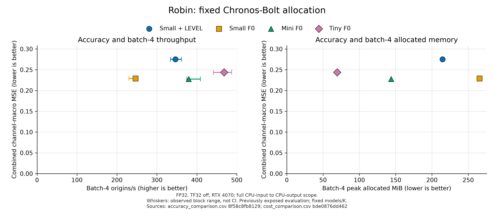
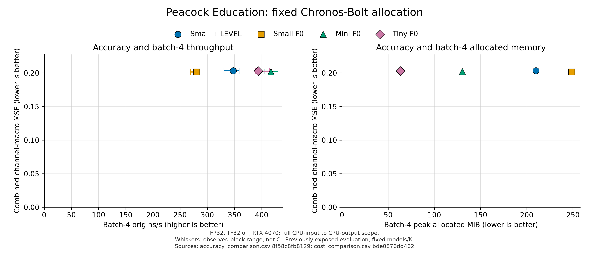
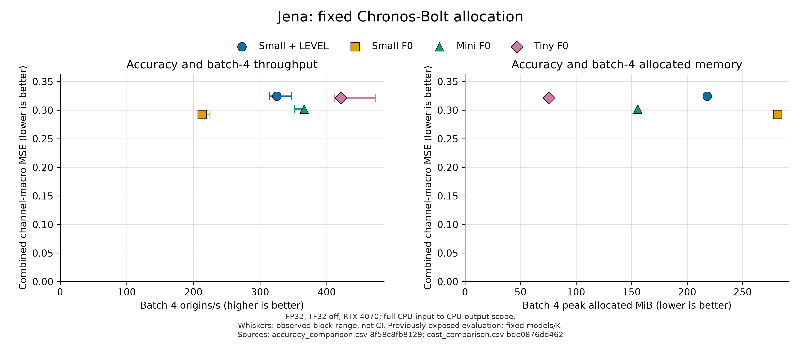

# Chronos-Bolt same-family allocation control

This campaign compares BOLT_SMALL_LEVEL, BOLT_SMALL_F0, BOLT_MINI_F0, and BOLT_TINY_F0 under the existing Robin/Peacock/Jena L512/H48 contracts. It is a post-exposure practical allocation comparison, not a method ablation or independent confirmation.

- [Question and limits](PURPOSE.md), [fixed plan](PLAN.md), [execution contract](REQUEST.txt), and [actual current status](STATUS.md).
- [Fairness before conclusions](FAIRNESS_TABLE.md), [Korean report](FINAL_REPORT_KO.md), and [presentation suggestions](PRESENTATION_PATCH.md).
- Accuracy: `accuracy_comparison.csv`, `accuracy_channels.csv`, `accuracy_origins.csv`, and all six paired comparisons in `paired_comparisons.csv`.
- Costs: `cost_comparison.csv` retains 24 summaries and all 108 raw blocks/sentinels. `cost_cuda_rows.json` retains pass times, allocated/reserved/resident memory, deployment state, CPU memory, and telemetry. Block ranges are not confidence intervals.
- Provenance: `model_manifest.json`, `input_contract.json`, `reuse_manifest.json`, `preflight_checks.json`, `prediction_manifest.json`, `cost_binding.json`, and `evaluation_seal.json`.
- Figures: `figures/allocation_robin.png`, `figures/allocation_peacock_education.png`, and `figures/allocation_jena.png`, with matching SVG exports. `figures/manifest.json` binds exact CSV record/line keys and source SHA256 hashes.
- Final verification/publication state belongs to `final_checks.json`, `ledger.json`, and `STATUS.md`. Generated reports do not themselves certify PASS, independent reproduction, or a remote commit.

`report_controls.py` only reads completed sealed CSV/JSON artifacts and renders reports/Matplotlib figures. It performs no fitting, model forwards, downloads, or new bootstrap draws. Use the existing project Python environment after evaluation and matched cost tables have completed. Large predictions and checkpoints remain in the campaign cache and are not public artifacts. Original PPT/PDF files are unchanged.

공정성 표를 먼저 읽고 아래 값을 해석합니다. 같은 회차의 combined MSE / B4 origins per second / B4 peak allocated MiB이며, LEVEL은 기존 선택 seed의 손실과 비용 요약을 각각 평균합니다. 모든 지표의 지배나 자료 간 평균 총점은 주장하지 않습니다.

| Dataset | Small + LEVEL: MSE / origins/s / MiB | Mini F0: MSE / origins/s / MiB | Tiny F0: MSE / origins/s / MiB |
| --- | --- | --- | --- |
| Robin | 0.275196 / 346.51 / 214.49 | 0.227636 / 379.55 / 143.83 | 0.243654 / 468.11 / 69.44 |
| Peacock Education | 0.203266 / 347.76 / 210.02 | 0.202057 / 417.01 / 130.11 | 0.202745 / 393.60 / 63.40 |
| Jena | 0.324359 / 325.01 / 217.90 | 0.302064 / 366.22 / 155.41 | 0.321409 / 421.34 / 75.86 |

Robin의 Mini/Tiny와 Jena의 Mini 비교는 `CHANNEL_COMPRESSION_DEPLOYMENT_ADVANTAGE_REJECTED_FOR_TESTED_SETTING`입니다. Peacock 두 비교와 Jena/Tiny는 대응 MSE 구간이 0을 포함하여 `NO_SINGLE_DOMINANT_ALLOCATION`입니다. 0 포함은 동등성의 증거가 아닙니다. Small F0 anchor와 기간별 MAE·bias·전체 블록·메모리 구분은 [최종 보고](FINAL_REPORT_KO.md)를 따릅니다.

시각검토에서 발견한 마커 잘림은 [표시 보정 코드](report_layout_fix.py)로 같은 CSV를 다시 그려 상단 여백만 늘렸습니다. 평가·비용 코드와 TEST 전 봉인은 그대로 유지했습니다. [보정 receipt](figures/layout_correction.json)는 동일 plotted values와 전후 출처를 연결합니다. [실행 안내](REPRODUCE.md), [그림 manifest](figures/manifest.json)의 전체 SHA와 행 번호를 확인할 수 있습니다.
