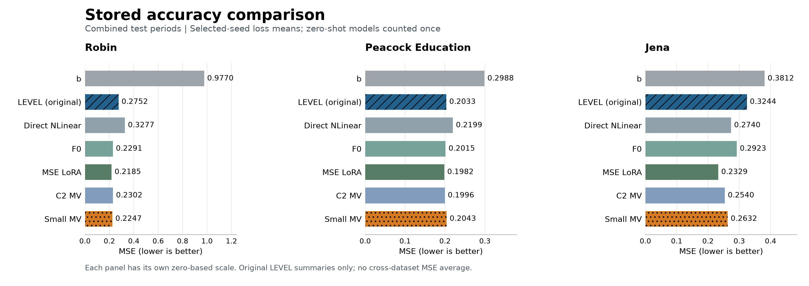
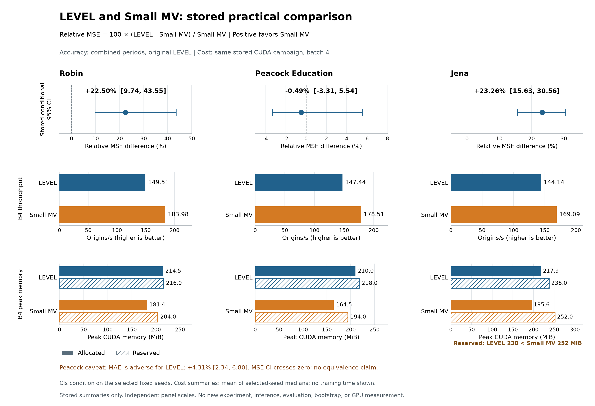

# 원래 고정 PCA LEVEL — 증거 감사 (2026-10-06)

**판정: 압축 경로 보완과 Robin·Peacock의 잔차 입력 효과는 조건부 유지합니다. 일반 실용 우위는 축소하고, 독립 방법론 기여 확보·최적 PCA 배분·학습 E/D 대비 우위는 보류합니다.** Jena는 잔차 입력 효과의 반례이며, 현재 세 자료의 직접 학습 E/D-only 비교는 문서화한 검색 범위에서 미확인입니다.

- [최종 비판 보고서](public/CRITICAL_REVIEW_KO.md): 이미 답한 질문, 미해결 질문, 가장 강한 반론, 반론을 뒤집을 증거, 유지·축소·보류할 주장.
- [주장별 증거 색인](public/evidence_index.csv): 계획 → 실제 적합 → 선택 → 예측 → 평가 → 검산의 연결과 재사용·step0 구분.
- [완료 상태와 검증 범위](public/STATUS.md), [다음 결정과 재실행 금지](public/NEXT_ACTIONS.md).
- [Chronos-2 상세 결과](public/source_snapshots/research/level_chronos2_controls_v1/FINAL_REPORT_KO.md), [Peacock matched PCA RAW](public/source_snapshots/research/tsfm_peft_peacock_matched_raw_v17_20261002/REPORT.md).
- [공개 근거 안내](public/README.md), [원본·공개 사본 해시](public/publication_manifest.json), [게시 파일 검증](public/publication_validation.json).

이번 감사와 게시의 신규 적합·추론·재평가·bootstrap·GPU 측정은 모두 0회입니다. 이미 완료된 현재 LEVEL 계약의 Chronos-2/Small 비교를 재사용했습니다. 내부 LoRA A 등 후속 변형을 기본 LEVEL의 새 성과로 합치지 않았고, 실험 횟수나 검산 PASS를 신규성의 근거로 쓰지 않았습니다.

## 저장된 정확도

각 자료의 TEST-A/B를 기존 관측 mask와 채널-macro 계약으로 합산한 MSE입니다. 학습형 모델은 선택된 두 seed의 **손실** 평균, zero-shot은 한 번만 계상합니다. 자료 간 MSE를 평균하지 않습니다. `b`는 압축만 한 주경로, F0·MSE LoRA는 원채널 Chronos-Bolt, C2 MV·Small MV는 원점 내부 다채널 Chronos-2 비교입니다. 기본 LEVEL의 출처는 Robin v6, Jena v7, Peacock v12입니다.

## 같은 회차의 실용 비교

Robin/Jena에서 Small MV는 더 낮은 MSE·peak allocated와 더 높은 B4 처리량을 보였습니다. Peacock의 작은 LEVEL MSE 점추정 이점은 조건부 구간이 0을 포함하고 MAE는 불리합니다. Jena의 **reserved는 LEVEL 238 MiB < Small 252 MiB**로 역전하므로 모든 메모리 지표의 지배를 주장하지 않습니다. 구간은 선택된 고정 seed와 시간 블록에 조건부이며 동등성·독립 확증이 아닙니다. 비용은 동일한 저장 CUDA 캠페인의 VAL24·예열10·전체 pass10·3블록 요약이며 적합 시간은 포함하지 않습니다.

[그림에 사용한 정확한 값·CSV 행·원본 SHA](figures/figure_values.json) · [그림 생성 코드](figures/build_figures.py) · [정확도 SVG](figures/accuracy_summary.svg) · [실용 비교 SVG](figures/practical_tradeoffs.svg).

## 공개 범위

로컬 원본 감사가 끝난 뒤 사용자가 정보와 이미지 게시를 요청했습니다. 공개 사본은 개인 절대경로·채팅 식별자를 정리하고 GitHub 링크를 연결한 별도 산출물입니다. 원본 감사 receipt의 해시는 당시 로컬 원본에 대한 기록이며, 정리된 사본의 해시와 구분합니다. 점수와 연구 판정은 바꾸지 않았습니다. 원자료·가중치·체크포인트·예측 배열과 무관한 미게시 파일은 포함하지 않습니다.
