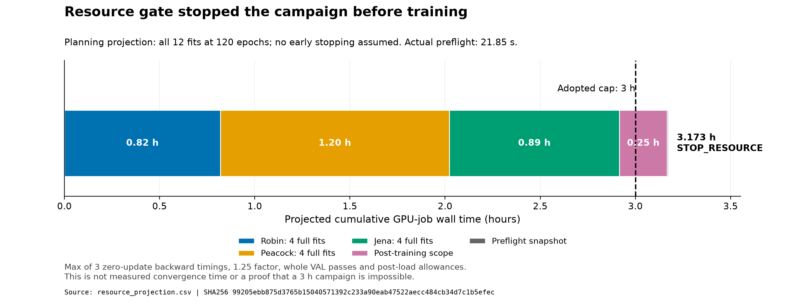
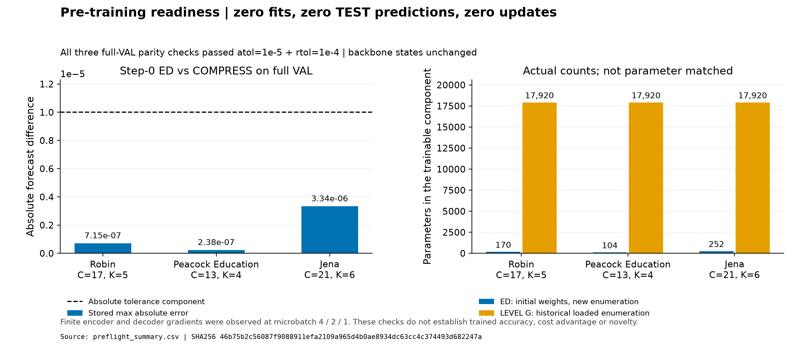

# LEVEL vs matched learned E/D — v18 resource stop

Execution: **BLOCKED_STOP_RESOURCE**. Full campaign complete: **false**. New fits / TEST model predictions / optimizer updates: **0 / 0 / 0**. Scientific verdict unavailable.

Read [FINAL_REPORT_KO.md](FINAL_REPORT_KO.md) and [FAIRNESS_TABLE.md](FAIRNESS_TABLE.md) first. [PRIOR_ART.md](PRIOR_ART.md) and `source_binding.json` bind official AdaPTS sources and the bias difference. `REQUEST.txt` is the literal adopted contract. Original results, decks, failed attempts and unrelated files are preserved.

The later [source contract review](SOURCE_REVIEW_KO.md) corrects unexecuted cost/evaluation paths and records isolated synthetic CPU checks in `source_review_checks.json`. It adds no trained accuracy or measured cost result; the original stop, preflight sources, ledger, projection and four figure files remain byte-identical.





`preflight.json`, `preflight_attempt01.json`, `preflight_initial_models.json`, `ledger.json`, `resource_stop.json` contain executed zero-update evidence and the resource failure. The planning projection is 11,421.533 s against 10,800 s; actual preflight GPU-job wall time is 21.847596 s. Three timed zero-update backward samples and a 1.25 factor do not measure convergence time or prove 3 h infeasibility. All 12 full 120-epoch fits and 121 full VAL passes per fit were assumed; no early stopping or scope reduction.

`report_v18.py` reads receipts and historical LEVEL CSV rows, writes the four reports, `report_summary.json`, `preflight_summary.csv`, `resource_projection.csv` and two PNG/SVG figures plus exact source/row/hash manifest. It performs no model calls, training, TEST, rescore or bootstrap. `verify_v18.py` audits this stopped attempt, including stored step0 VAL math; a future completed campaign requires a full result verifier.

CPU-only commands from repository root (no new fitting):

```powershell
.venv/Scripts/python.exe research/level_matched_learned_ed_v18_20261006/report_v18.py
.venv/Scripts/python.exe research/level_matched_learned_ed_v18_20261006/verify_v18.py
```

`final_checks.json` PASS means an honest-stop saved-artifact self-check, not full completion, independent reproduction, full AdaPTS reproduction or novelty. Missing selection, ED accuracy, paired CIs, matched costs and selected-checkpoint diagnostics are gate prevented and intentionally absent; no dummy scientific files were created. Static source review is not executed training evidence. The original `train_v18.py` rejects this STOP_RESOURCE preflight.

Minimum next plan: preserve the failed attempt; review a resource-only amendment and continuation gate/source binding, retaining the same 12-fit grid, 6 selected TEST models and scientific recipe. A 4 h cap is an unapproved example. No automatic follow-up experiment.
