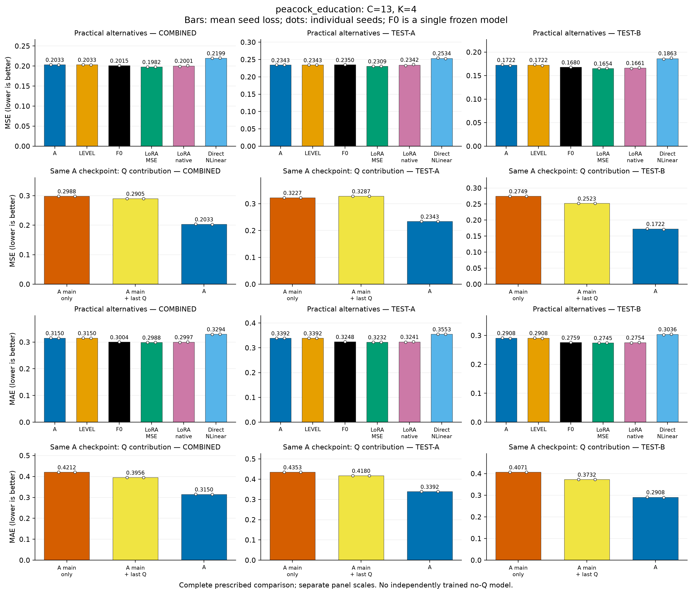
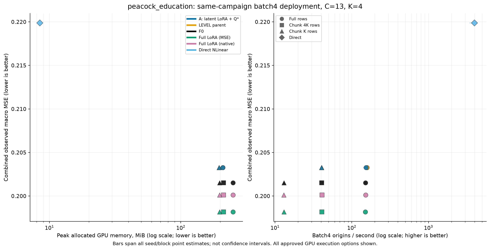

# 고정 A의 Q 보완: 현재 판단

**학습된 Q의 추가 가치는 기존 세 자료에 이어 새 Peacock Education 집단에서도 확인됐다. 그러나 새 집단에서 내부 LoRA의 추가 효과는 선택에 남지 않았고, 미압축 MSE-LoRA 대비 정확도 손해도 남았다.**

## 새 집단의 고정 확인

사용자가 판단과 계속 실행을 위임한 뒤(AUTHORIZATION_SUPPLEMENT.txt), 결과와 무관한 메타데이터·조회한 노출 기록·TRAIN 적격성으로 BDG2 Peacock Education13계열/K4를 고정했다. 같은 전력 분야의 새 건물/용도 집단이며 새 도메인 전체 검증이 아니다. 조회한 로컬 기록에서 선택한 계열의 예측 성능을 방법 선택에 사용한 흔적은 찾지 못했으나, 전체 역사나 백본 사전학습 비중복은 입증하지 않았다. Jena2018–2024는 기존 사용 기록 때문에 새 확인에 포함하지 않았다. 출처·제외·정확한 계열은 confirmation_exposure_search.md와 data_contract_confirmation_peacock_education.json에 연결된다.

새 TRAIN으로 통계/PCA와 LEVEL의 G를 적합한 뒤 고정하고, A의 LoRA만 적응했다. 미압축 MSE-LoRA/native-LoRA/원채널 직접 NLinear도 새 TRAIN에서 각각 적합했다. 과거 site 학습 가중치는 복사하지 않았다.18개 기본 설정에 기술 복구1건을 더해 총19attempt를 사용했다. 모든 체크포인트와 두-seed 평균 VAL 기반 LR 선택을 봉인한 다음 TEST-A/B 각40원점을 함께 평가했다. 불리한 결과를 보고 모델·채널·기간을 바꾸지 않았다.

```text
새 집단 비교                 전체 MSE    전체 MAE    TEST-A MSE  TEST-B MSE
A = 선택 LEVEL                0.203266    0.315004      0.234300    0.172223
같은 A의 MAIN_ONLY            0.298832    0.421165      0.322713    0.274944
같은 A의 MAIN_LAST            0.290492    0.395623      0.328676    0.252302
미압축 F0                     0.201521    0.300358      0.235011    0.168020
미압축 MSE-LoRA               0.198176    0.298839      0.230911    0.165429
미압축 native-LoRA            0.200123    0.299731      0.234181    0.166050
직접 NLinear                  0.219884    0.329450      0.253442    0.186316
```

주 지표는 TRAIN 표준화 좌표에서 관측 target만의 채널 동일 가중 MSE다. 전체값은 기간별 채널 SSE/관측수를 합쳐 채널 평균을 내고 마지막에 seed 손실을 평균했다. 결측 수가 다른 기간 MSE의 단순 평균이나 예측 앙상블이 아니다. 정확한 MAE·편향·기간·seed·채널값은 confirmation_evaluation01.json과 CSV에 있다.

새 확인에서 FULL−LAST의 전체 MSE 차이는−0.087226(상대−30.027%), 조건부7원점 블록95% 구간은[−0.096148,−0.077954]다. MAE도−20.378%다. FULL−MAIN은 전체 Q의 효과이고, FULL−LAST가 마지막 잔차 수준을 넘는 학습 G의 출력 기여다. 반면 LAST−MAIN의 MSE 차이는−0.008339이며 구간[−0.022372,+0.005228]은0을 포함한다. 이 집단에서 마지막 수준만의 안정적 MSE 이득까지 확인됐다고 쓰지 않는다. 모든 구간은 선택된 두 seed/모델 및 시간 블록에 조건부이고 모델 선택 불확실성 전체를 포함하지 않는다.

이번 새 집단에는 별도 RAW 적합이나 독립 no-Q 적합을 추가하지 않았다. 따라서 새로 확인한 것은 같은 주경로에서 Q 출력 보완의 기여이며, RAW 대비 잔차 입력의 고유성이 이 집단에서도 확인됐다는 주장으로 바꾸지 않는다. 이전 회차의 matched controls는 원래 자료/조건의 근거로만 유지한다.

A의 모든 LR/seed 설정은 step0을 선택했고, 최종 두 모델의 TEST 예측도 부모 LEVEL과 같았다. 정상 gradient/실갱신/저장·복원 검사를 통과했지만, **내부 LoRA 적응의 새 집단 추가 가치는 확인되지 않았다.** LR1e-4의 고정 TRAIN probe MSE는 seed92601에서0.331147→0.291538, seed92602에서0.325981→0.283779로 줄었고 각768 update에서245,760개 scalar가 바뀌었다. 따라서 이번 음성을 영구 gradient 단절이라고 해석하지 않는다. 이 기록이 완전 수렴이나 유일한 실패 원인을 증명하지도 않는다. Q의 양성 결과를 내부 LoRA의 성공으로 합치지 않는다. 독립적으로 최적화한 no-Q 압축 LoRA는 E1 범위 밖이며 실행하지 않았다.

외부 기준 대비 A의 전체 MSE는 MSE-LoRA보다+2.568%, native-LoRA보다+1.571%, F0보다+0.866%다. MAE 손해는 각각+5.409%,+5.096%,+4.876%다. MSE-LoRA 대비 MSE 차이의 조건부 구간은[+0.000155,+0.015748]이고, native/F0 대비 MSE 구간은0을 포함한다. 넓은 구간을 동등성으로 해석하지 않는다. 직접 NLinear 대비 MSE−7.557%, MAE−4.385%는 남았지만, 이 비교만으로 TSFM의 비용을 정당화했다고 결론내리지 않는다.

## 기존 노출 자료에서의 근거

같은 v11 A 주경로를 고정했을 때, 학습된 Q는 Q 없음과 마지막 잔차 수준만 유지하는 두 대조보다 MSE/MAE가 낮았다. 이는 고정된 주경로에서의 출력 기여다. 별도로 학습·선택한 no-Q 모델을 이겼다는 증거가 아니다. A의 수식이나 가중치는 바꾸지 않았다.

```text
자료      MAIN MSE   LAST MSE   FULL MSE   FULL MAE   MSE-LoRA MSE
robin      0.974891   0.346912   0.273071   0.323059     0.218517
jena       0.309920   0.284454   0.253093   0.275047     0.232892
hog        4.583044   3.123909   2.658552   0.796149     2.625304
```

주 지표는 기존 관측 마스크의 채널 동일 가중 MSE다. A/B 기간의 채널별 오차합/관측수를 합친 뒤 채널 평균, 마지막으로 seed 손실 평균을 냈다. 앙상블이나 자료 간 점수 평균은 아니다. 모든 기간·seed·채널은 q_contribution02 JSON/CSV에 보존했다.

Q 전체와 학습된 G를 구분하면, 마지막 잔차 수준만으로도 큰 부분이 회복되지만 G를 더한 이득도 세 자료에 남았다. FULL−LAST의 전체 MSE 차이/조건부 95% 구간은 Robin −0.073841 [−0.106690,−0.035032], Jena −0.031360 [−0.037307,−0.024378], Hog −0.465357 [−0.745320,−0.322985]다. 이는 시간 블록 재표집과 두 선택 seed에 조건부이며 반복 선택의 불확실성 전체를 포함하지 않는다. Jena test_a의 LAST−MAIN MSE 구간은 0을 포함하므로 모든 세부 대조가 일관되게 확정됐다고 쓰지 않는다.

외부 기준선의 반례도 유지한다. 세 자료 모두 미압축 MSE-LoRA의 MSE가 더 낮다. Robin에서는 F0/native LoRA도 더 정확하고, Jena/Hog에서는 A의 MAE 손해가 남는다. 내부 대조의 큰 개선을 외부 정확도 우위로 바꾸지 않는다.

## 남은 오차의 해석

공통 완전관측 target vector에서 Jena의 A–MSE-LoRA 차이는 P 오차 약 +0.016923, Q 오차 약 +0.003279다. Q 보완이 유효해도 P 주경로의 손해가 남는다는 단서다. 원인이나 새로운 수정의 성공을 입증하지는 않는다.

Robin에서는 P/Q 양쪽에 손해가 남는다. Hog의 완전관측 subset coverage는 약 84.17%이며 그 subset에서는 A의 오차가 MSE-LoRA보다 낮아 전체 masked 주 지표와 순위가 다르다. 따라서 완전관측 P/Q 진단을 전체 평가의 원인 설명이나 대체 점수로 사용하지 않는다. 이 차이를 근거로 채널·기간·모델을 재선택하지 않았다.

## no-Q 재적합 판단

24쌍의 실제 TRAIN backward에서 완전관측은 작은 FP32 차이, 결측 배치는 유의미한 수치 차이를 보였다. 모든 TRAIN에 결측이 있어 전체 학습이 대수적으로 중복이라고 선언할 수 없다. 실제 저장 LR 12개는 replay와 일치했다. 완전관측 VAL인 Robin/Hog의 실제 부모 기반 조건부 offset replay에서는 8개 모두 LR가 달라지지 않았다. 상대 scheduler가 달라질 수 있다는 합성 반례와 이번 실제 replay 결과를 구분한다. Jena VAL은 결측이 있어 상수 offset 적용을 생략했다.

승인된 E1의 두 번째 분기에 따라 **same-checkpoint 출력 기여로 주장 범위를 제한**하고 기존 세 자료의 독립 no-Q 적합은 생략했다. 이는 gradient/전체 정책 동등성이나 no-Q 재학습 무용성의 증명이 아니다. 독립 최적화된 압축 LoRA와의 우위를 주장하려면 그 대조는 여전히 필요하다. 결정 코드에는 TEST 성능 입력이 없다.

## 비용과 새 확인의 상태

처음 게시한 부분 결과는 새 계약 미복구로 대기했으며 CONFIRMATION_PROTOCOL.md에 그 이력이 남아 있다. 이후 사용자의 명시적 위임으로 PLAN_SUPPLEMENT.md/confirmation_protocol.json을 새 적합 전에 고정했다. 이는 과거 승인을 소급해서 만들어 낸 것이 아니다. 새 집단 정확도 비교와 동일 회차135 GPU/12 CPU 비용 측정을 모두 완료했다.

기존 동일 A의 v11 비용은 원래 캠페인 표기로만 참조한다(cost_reference.json). Jena/Hog의 batch4 메모리–처리량 절충과 Robin의 처리량 열위/측정 drift, 미압축 소배치 대안, 직접 NLinear의 낮은 비용은 기존 그대로다. 아래는 새 Peacock 동일 회차의 대표 batch4 구성이다. 전체23 GPU/2 CPU 구성의 모든 seed·3블록·원반복은 confirmation_cost_summary.json과 원시 행에 있다. 새 timing과 과거 timing의 비율은 만들지 않았다.

```text
배포 구성                    TSFM chunk M   할당 MiB   예약 MiB   원점/초
A, full                            16        208.812     220       153.39
LEVEL, full                        16        208.802     218       157.68
F0, full                           52        249.581     268       150.60
MSE-LoRA, full                     52        249.581     268       150.14
native-LoRA, full                  52        249.581     268       151.82
MSE-LoRA, chunk4K                  16        211.496     222        40.64
MSE-LoRA, chunkK                    4        197.360     222        13.10
A, chunkK                          4        195.665     220        40.39
Direct NLinear, GPU                —          8.433      22      3953.78
Direct NLinear, CPU 4threads        —           N/A      N/A     16456.30
```

값은 seed별3블록 중앙값을 구한 뒤 seed 평균한 값이다. 메모리는 추론 peak allocated/reserved이며 장치 전체 VRAM이나 배포 가중치 크기가 아니다. 입력은 같은 표준화 CPU tensor이고, H2D·모든 온라인 forward/소배치 조합·원채널 H48 CPU 반환을 시간에 포함했다. CPU 행은 별도 실용 배포이며 같은 GPU kernel 비교로 합치지 않는다.

A full의 할당 메모리는 미압축 MSE-LoRA full보다 약16.34% 작다. 처리량 점추정은 약2.16% 높지만, 범위가 겹치고 F0 batch4 앞뒤 sentinel 지연 변화도−1.66%~+3.96%여서 **안정적인 처리량 우위를 주장하지 않는다.** A와 LEVEL은 같은 선택 함수이므로 둘의 작은 timing 차이도 내부 LoRA의 효과가 아니다. batch1 지연도 A25.133ms, MSE-LoRA25.112ms로 우위가 없다. 원인을 Windows/온도/clock 중 하나로 확정하지 않았다.

더 작은 MSE-LoRA chunkK는 A full보다 메모리와 MSE가 모두 낮지만 처리량은13.10 대153.39원점/초다. chunk4K는211.496MiB/40.64원점/초다. 따라서 압축이 유일한 메모리 절감법은 아니며, 남는 가치는 **정확도 손해를 수반한 메모리–처리량 공동 절충**이다. 고정 K와 이 실행 grid에서의 관찰이지 전체 Pareto frontier나 특정 메모리 제한에서의 배포 추천은 아니다. Direct NLinear는 더 낮은 비용과 더 큰 오차의 대안으로 남는다. 실제 OOM 조건을 만들어 필요성을 과장하지 않았다.

전체 배포 tensor는 A/LEVEL190,944,404bytes(47,736,040parameters), 병합 미압축 LoRA190,872,308bytes(47,718,016parameters)다. 압축 경로가 백본 파일을 작게 만드는 것은 아니다. A의 등록 적응 변수는 부모 G17,920+LoRA294,912로 단계합312,832이며 미압축 LoRA294,912보다 작지 않다. Direct는24,624parameters/98,704tensor bytes다. 실제 갱신 수·선택 epoch·학습 peak/time·모든 탐색 비용은 실행별 result와 원장에 별도로 남았다. 선택된 A의 LoRA update가0이라고 소비한 적합4건을 없애지 않는다.

예정18설정과 기술 복구1건, 총19attempt로 끝냈다. 누적 GPU 작업은4,554.384초(75.91분)/28,800초이며 이전 분석, 학습·실패·복구·추론·정합성·비용을 포함한다. 합성 optimizer 세션0, 다운로드0이다. 최초 LEVEL 실패의32개 반복/폐기 update도 사용량에 포함했다. finalconfirmationchecks.json의8개 검산 항목이 통과했고 새 모델 실행 없이 저장 예측의 MSE/MAE·기간/seed 집계와 원점을 대조했다. Bootstrap 구간/PQ 에너지 자체까지 별도 재계산했다고 주장하지 않는다. 최종 CPU/저장 사용량과 게시 상태는 STATUS/원장을 따른다.

## 유지할 것과 다음 결정

고정 A/LEVEL의 Q 출력 보완과 마지막 수준을 넘는 G의 효과는 새 동일 도메인 집단까지 근거가 늘었다. 이 공백은 해소됐다고 인정한다. 다만 새 집단의 내부 LoRA 개선·미압축 기준선 대비 정확도 회복·새 도메인 일반화·독립 no-Q 학습 우위는 확보되지 않았다. v11 B와 불리한 과거 결과도 보존한다.

**판단:** Q 보완과 제한된 정확도–메모리–처리량 절충은 조건부 유지한다. Peacock에서는 선택된 A가 LEVEL과 같으므로 내부 LoRA를 기본 필수 구성으로 권하는 주장은 축소한다. 최고 정확도나 안정적인 처리량 우위, 범용성 문제가 해결됐다고 하지 않는다. 새 동일 도메인 집단의 고정 확인은 완료됐으며, 이를 계속 미실행으로 남기지도 않는다.

**다음 결정 하나:** 확인 범위를 다시 늘리기보다, 단순 LEVEL을 포함한 가까운 대조를 유지하면서 미압축 기준선 대비 정확도 손해를 줄이는 개발을 다음 연구 우선순위로 둔다. 구체적인 새 구조·loss·자료를 이번 잔여 예산으로 실행하지 않는다. 이번 결과는 유지/축소할 구성을 고르는 근거이며 신규성 검증이나 논문 채택 보장이 아니다.





A는 두 seed 모두 step0을 선택했다. 그림의 A/LEVEL 중복은 독립적인 두 양성 근거가 아니다. GPU 비용 그림의 가로 범위는 seed/block 점추정 범위이며 신뢰구간이 아니다. 수치 원본: report_confirmation_values.json 및 연결 CSV/receipt.


수치 원본: report_values.json, q_contribution02.json, q_uncertainty01.json. 자체 검산은 독립 재현이 아니다.
