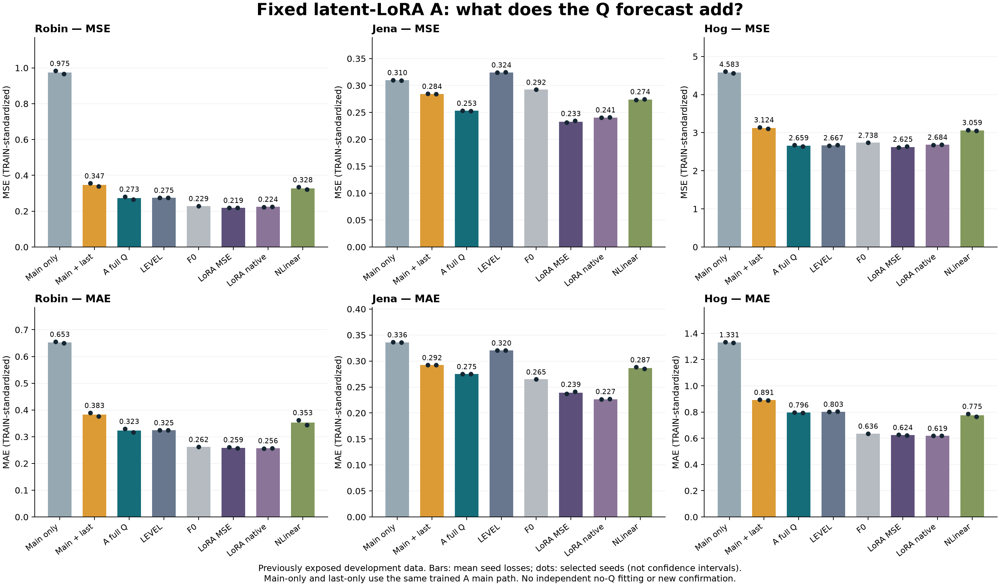

# 고정 A의 Q 보완: 현재 판단

**기존 세 자료에서 학습된 Q의 추가 가치가 확인됐다. 미압축 LoRA 대비 정확도 손해와 새 평가에서의 일반화는 해결됐다고 할 수 없다.**

같은 v11 A 주경로를 고정했을 때, 학습된 Q는 Q 없음과 마지막 잔차 수준만 유지하는 두 대조보다 MSE/MAE가 낮았다. 이는 고정된 주경로에서의 출력 기여다. 별도로 학습·선택한 no-Q 모델을 이겼다는 증거가 아니다. A의 수식이나 가중치는 바꾸지 않았다.

```text
자료      MAIN MSE   LAST MSE   FULL MSE   FULL MAE   MSE-LoRA MSE
robin      0.974891   0.346912   0.273071   0.323059     0.218517
jena       0.309920   0.284454   0.253093   0.275047     0.232892
hog        4.583044   3.123909   2.658552   0.796149     2.625304
```

주 지표는 기존 관측 마스크의 채널 동일 가중 MSE다. A/B 기간의 채널별 오차합/관측수를 합친 뒤 채널 평균, 마지막으로 seed 손실 평균을 냈다. 앙상블이나 자료 간 점수 평균은 아니다. 모든 기간·seed·채널은 q_contribution02 JSON/CSV에 보존했다.

Q 전체와 학습된 G를 구분하면, 마지막 잔차 수준만으로도 큰 부분이 회복되지만 G를 더한 이득도 세 자료에 남았다. FULL−LAST의 전체 MSE 차이/조건부 95% 구간은 Robin −0.073841 [−0.106690,−0.035032], Jena −0.031360 [−0.037307,−0.024378], Hog −0.465357 [−0.745320,−0.322985]다. 이는 시간 블록 재표집과 두 선택 seed에 조건부이며 반복 선택의 불확실성 전체를 포함하지 않는다. Jena test_a의 LAST−MAIN MSE 구간은 0을 포함하므로 모든 세부 대조가 일관되게 확정됐다고 쓰지 않는다.

외부 기준선의 반례도 유지한다. 세 자료 모두 미압축 MSE-LoRA의 MSE가 더 낮다. Robin에서는 F0/native LoRA도 더 정확하고, Jena/Hog에서는 A의 MAE 손해가 남는다. 내부 대조의 큰 개선을 외부 정확도 우위로 바꾸지 않는다.

## 남은 오차의 해석

공통 완전관측 target vector에서 Jena의 A–MSE-LoRA 차이는 P 오차 약 +0.016923, Q 오차 약 +0.003279다. Q 보완이 유효해도 P 주경로의 손해가 남는다는 단서다. 원인이나 새로운 수정의 성공을 입증하지는 않는다.

Robin에서는 P/Q 양쪽에 손해가 남는다. Hog의 완전관측 subset coverage는 약 84.17%이며 그 subset에서는 A의 오차가 MSE-LoRA보다 낮아 전체 masked 주 지표와 순위가 다르다. 따라서 완전관측 P/Q 진단을 전체 평가의 원인 설명이나 대체 점수로 사용하지 않는다. 이 차이를 근거로 채널·기간·모델을 재선택하지 않았다.

## no-Q 재적합 판단

24쌍의 실제 TRAIN backward에서 완전관측은 작은 FP32 차이, 결측 배치는 유의미한 수치 차이를 보였다. 모든 TRAIN에 결측이 있어 전체 학습이 대수적으로 중복이라고 선언할 수 없다. 실제 저장 LR 12개는 replay와 일치했다. 완전관측 VAL인 Robin/Hog의 실제 부모 기반 조건부 offset replay에서는 8개 모두 LR가 달라지지 않았다. 상대 scheduler가 달라질 수 있다는 합성 반례와 이번 실제 replay 결과를 구분한다. Jena VAL은 결측이 있어 상수 offset 적용을 생략했다.

승인된 E1의 두 번째 분기에 따라 **same-checkpoint 출력 기여로 주장 범위를 제한**하고 기존 세 자료의 독립 no-Q 적합은 생략했다. 이는 gradient/전체 정책 동등성이나 no-Q 재학습 무용성의 증명이 아니다. 독립 최적화된 압축 LoRA와의 우위를 주장하려면 그 대조는 여전히 필요하다. 결정 코드에는 TEST 성능 입력이 없다.

## 비용과 새 확인의 상태

새 확인 대상·분할을 정한 실제 PLAN을 복구하지 못해 새 자료 적합/평가/비용은 진행하지 않았다. 승인문은 이미 고정한 단위만 허용하므로 대체 집단을 임의로 고르지 않았다. CONFIRMATION_PROTOCOL.md에 누락 계약과 요청 사항을 남겼다. 이 회차 전체의 선택 후 확인은 미완료다.

기존 동일 A의 v11 비용은 원래 캠페인 표기로만 참조한다(cost_reference.json). Jena/Hog의 batch4 메모리–처리량 절충과 Robin의 처리량 열위/측정 drift, 미압축 소배치 대안, 직접 NLinear의 낮은 비용은 기존 그대로다. 새 timing과 과거 timing의 비율을 만들지 않았고 v12 benchmark를 했다고 쓰지 않는다.

## 유지할 것과 다음 결정

고정 A의 Q 출력 보완과 마지막 수준을 넘는 G의 효과는 기존 개발 자료에서 유지할 근거가 강화됐다. Jena 중심의 기존 조건부 정확도–비용 해석은 유지하되 범용 정확도 회복·독립 no-Q 학습 우위·새 확인 완료는 주장하지 않는다. v11 B의 결과도 보존한다.

**남은 결정 하나:** 승인문이 참조한 새 평가 단위·분할의 실제 계약을 제공/복구한다. 그 전까지 새 집단을 만들어 실행하거나 기존 분석을 확인 완료로 재명명하지 않는다.



수치 원본: report_values.json, q_contribution02.json, q_uncertainty01.json. 자체 검산은 독립 재현이 아니다.
