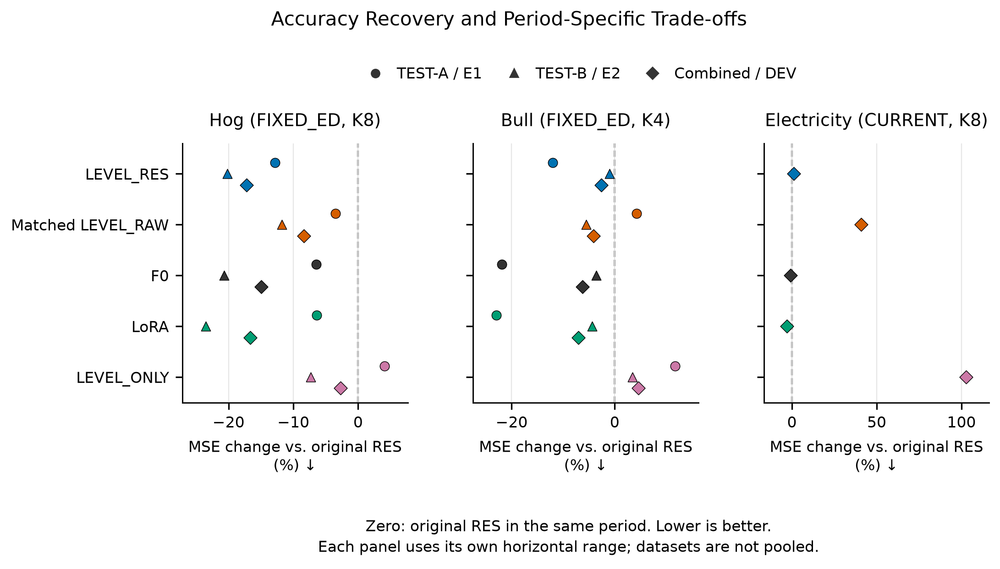
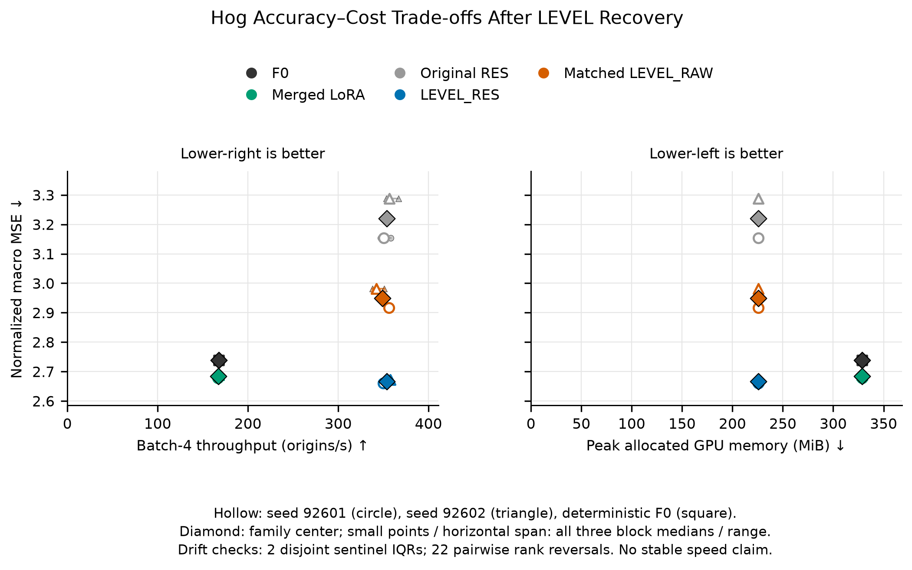

# v5 판단: LEVEL의 Hog 정확도 회복을 조건부 유지

[확인] 이번 회차는 Hog에서 기존 압축 RES의 MSE 손해를 줄였다. LEVEL RES의 전체 MSE는 3.220290에서 2.666809로 낮아졌고, 같은 수준 복원항을 쓰는 matched RAW(2.949584)와 무학습 LEVEL_ONLY(3.132837)보다 낮았다. **LEVEL을 Hog의 개발 구성으로 조건부 유지한다.** 잔차 입력의 유용성을 다시 보인 것에 더해, 요청한 정확도 회복을 확인했다.

그러나 LoRA 대비 전체 MSE 점추정 차이는 −0.624%에 불과하고 조건부 구간은 0을 포함한다. Hog TEST-B와 MAE 손해도 남는다. Bull은 기간별 손익이 다르고 Electricity는 기존 RES보다 소폭 나빠졌다. 모든 자료에 LEVEL을 교체 적용하거나 주력 논문의 독립 확증·신규성 확보로 결론내리지 않는다. 같은 회차에서 batch4 처리량·할당 메모리 절충을 관찰했고 저장 결과 검산을 완료했다.

## 무엇을 바꾸고 비교했나

\(b=D(F_0(E(X))),\ r=X-D(E(X)),\ p(u)=\operatorname{stopgrad}(u_{L,:})\), \(P_n(u)\)는 마지막 관측값을 n번 반복한 값이다.

- LEVEL RES: \(b+P_H(r)+G(r-P_L(r))\).
- Matched RAW: \(b+P_H(r)+G(X-P_L(X))\).
- LEVEL_ONLY: 학습 전 TRAIN PCA E/D의 \(b_0+P_H(r_0)\). G 없는 무학습 참조다.

두 학습군은 동일한 초기 E/D/G와 같은 **잔차 수준 복원항**을 사용한다. 따라서 RAW에서 원입력 수준을 다시 더해 main 예측을 이중 계산하지 않았다. 두 군의 초기 함수는 LEVEL_ONLY이며, 기존 RES의 초기 함수인 COMPRESS \(b_0\)와 다르다. 학습 뒤 CURRENT의 E/D가 달라지면 두 군의 실제 복원값도 달라질 수 있다.

F0는 동결 Chronos-Bolt-small(revision `772f3d25d38aec6d914c8949dab4462e2d46f5d8`), G는 공유·무편향·무활성화 512→32→48이며 출력 가중치는 0으로 시작한다. Hog C32/K8, Bull C16/K4는 FIXED_ED로 G의 17,920개만 학습한다. Electricity C32/K8은 CURRENT로 E/D와 G의 18,432개를 학습한다. RES/RAW의 학습 파라미터 수, optimizer/LR, 같은 seed의 TRAIN 표본 순서와 선택 기회는 같다. 미래 정답·미래 통계는 예측 입력에 사용하지 않는다.

CURRENT에서는 수준 통계만 detach하며, 동결 F0를 통한 E의 입력 gradient와 RES의 잔차 입력을 통한 E/D gradient는 유지한다. G는 최종 미래 예측 오차로 학습했으며, 별도 미래 잔차 정답으로 학습한 모델이 아니다. LEVEL은 파라미터를 늘리지 않았지만 persistence, 초기 함수, 중심화와 최적화를 함께 바꾼다. 이를 순수한 정규화의 인과 효과라고 해석하지 않는다.

[확인: 선행 범위] [NLinear 저자 코드](https://github.com/cure-lab/LTSF-Linear/blob/main/models/NLinear.py)의 마지막 관측값 detach→제거→예측→복원 원리를 사용했다. [RevIN 저자 코드](https://github.com/ts-kim/RevIN/blob/master/RevIN.py)의 문맥 통계 정규화·역변환도 인접 원리지만, 여기서는 평균/분산과 affine 변환을 사용하지 않는다. v5는 압축 TSFM에 재구성 잔차 수준을 복원하는 rank32 G와 대응 RAW를 비교한 것이며 NLinear/RevIN 전체 재현 또는 새 정규화 원리 발견이 아니다. [AdaPTS(ICML 2025)](https://proceedings.mlr.press/v267/benechehab25a.html)의 잠재 입출력 어댑터·공동학습 역시 기존 원리다. 읽은 범위는 앞의 두 저자 구현 및 공식 발표/초록이며 문헌 전체의 신규성 검증은 수행하지 않았다.

## 진단, 학습 및 정보 범위

[확인] [기존 Hog 예측 진단](v5_hog_diagnosis_01/diagnosis.json)에서 LEVEL_ONLY MSE 3.132837은 COMPRESS 4.591135보다 낮았고, 마지막 과거 잔차와 필요한 보정의 관측 target 기준 평균 내적은 +1.084029였다. 두 seed 모두 30/32채널에서 기존 RES의 LoRA 대비 MSE 초과가 관찰돼 극소수 채널만의 문제로 보기는 어려웠다. 동시에 양의 초과오차가 큰 항목에 집중된 부분도 있었다. 이 관찰로 학습 전에 LEVEL 첫 수정/FULL 예비를 기록했다([초기 결정](decision_initial.json)).

완전관측 target 벡터의 PCA 공간 분해는 Q8 내부 −0.061342, Q16−Q8 +0.167399, Q16 밖 +0.356416의 RES−LoRA 오차 차이를 보였다. 이는 결측 target을 0으로 넣지 않은 완전관측 부분의 에너지 진단이며, 전체 masked macro MSE와 같은 지표가 아니다. 상대 초과오차가 없다는 것이 절대 오차가 없다는 뜻도 아니다. [추정] 수준 처리의 직접 실험을 우선할 단서였으며 rank·공간 배분이 실패 원인이라는 증명은 아니다.

[확인] 실자료 학습은 Hog 첫 4회와 Bull/Electricity 각 4회, 총 12회다. 모든 실행이 정상 조기 종료했고 초기 상태 이후 checkpoint를 선택했다. 고정 TRAIN probe와 VAL이 개선됐으며 선택 checkpoint 재구성의 최대 출력 차이는 모두 0이었다. 실제 갱신·의도된 동결·유한 gradient·복원 기록은 [runs](runs/)의 각 result/curve/receipt에 있다. 합성 CPU 검사의 PASS를 충분한 실자료 학습의 증명으로 사용하지 않았다.

```text
Data          Arm   Selected epochs (92601 / 92602)   Completed epochs
Hog           RES                  7 / 15                  13 / 21
Hog           RAW                  1 /  5                   7 / 11
Bull          RES                  4 /  8                  10 / 14
Bull          RAW                  9 /  1                  15 /  7
Electricity   RES                 36 / 15                  42 / 21
Electricity   RAW                 24 / 38                  30 / 44
```

TRAIN 정규화/PCA와 기존 mask·분할·원점을 유지했고 checkpoint는 초기 상태를 포함한 최소 VAL MSE, 동률은 먼저 나온 상태로 정했다. 새 RES/RAW의 초기 텐서는 명시적으로 공유·hash 확인했다. Hog/Bull의 비교 가능한 기존 초기 기록은 재사용했지만 **Electricity의 역사적 초기 텐서가 완전히 남아 있지 않아 기존 v1 RES와 초기값까지 동일했다고 주장할 수 없다.** v5 Electricity RES/RAW 사이의 대응 초기값은 확인했다. 이전에 학습한 어댑터 가중치를 새 학습의 초기값으로 복사하지 않았다.

Hog TEST-A/B는 v4에서 이미 노출됐고 이번 수정 선택에도 사용했다. Bull E1/E2와 Electricity DEV도 모두 **노출된 개발 평가**다. 아래는 seed별 손실의 평균이며 예측 ensemble이 아니다. 전체 점수는 기간별 MSE의 단순 평균이 아니라 채널별 관측 오차합/관측수를 합친 뒤 채널 평균을 계산한다. 서로 다른 자료의 점수를 하나의 종합 점수로 평균하지 않았다.

## 정확도 결과

[확인] 다음은 저장 결과를 소수 여섯 자리로 표시한 값이다. `oldRAW`는 같은 모드의 대응 RAW다. 특히 Bull은 FIXED K4 RAW이며, v2에서 별도로 선택한 CURRENT RAW와 혼동하지 않는다. Hog oldRAW의 선택 상태는 COMPRESS와 같은 초기 함수이므로 두 독립 성과처럼 세지 않는다.

| Data | Model | Whole MSE | Whole MAE |
|---|---|---:|---:|
| Hog | oldRES | 3.220290 | 0.996522 |
| Hog | oldRAW / COMPRESS | 4.591135 | 1.340760 |
| Hog | F0 | 2.738044 | 0.636102 |
| Hog | LoRA | 2.683560 | 0.618902 |
| Hog | LEVEL RES | 2.666809 | 0.802649 |
| Hog | LEVEL RAW | 2.949584 | 0.886455 |
| Hog | LEVEL_ONLY | 3.132837 | 0.886585 |
| Bull | oldRES | 0.727659 | 0.354818 |
| Bull | oldRAW | 0.932856 | 0.504290 |
| Bull | F0 | 0.682052 | 0.293032 |
| Bull | LoRA | 0.676191 | 0.304493 |
| Bull | LEVEL RES | 0.708616 | 0.341326 |
| Bull | LEVEL RAW | 0.697731 | 0.401288 |
| Bull | LEVEL_ONLY | 0.761432 | 0.394887 |
| Electricity | oldRES | 0.165850 | 0.270891 |
| Electricity | oldRAW | 0.180489 | 0.290333 |
| Electricity | F0 | 0.164537 | 0.253276 |
| Electricity | LoRA | 0.161096 | 0.250419 |
| Electricity | LEVEL RES | 0.167458 | 0.271637 |
| Electricity | LEVEL RAW | 0.233356 | 0.343038 |
| Electricity | LEVEL_ONLY | 0.336044 | 0.428040 |

| Model | Hog A MSE / MAE | Hog B MSE / MAE | Bull E1 MSE / MAE | Bull E2 MSE / MAE |
|---|---:|---:|---:|---:|
| oldRES | 2.548722 / 0.862866 | 3.909009 / 1.133340 | 0.210365 / 0.266240 | 1.246580 / 0.443757 |
| oldRAW | 3.459547 / 1.128889 | 5.752751 / 1.557424 | 0.533867 / 0.457103 | 1.333000 / 0.551685 |
| F0 | 2.383852 / 0.601345 | 3.100284 / 0.672484 | 0.164367 / 0.208166 | 1.201383 / 0.378239 |
| LoRA | 2.386395 / 0.590824 | 2.989048 / 0.648662 | 0.162050 / 0.204935 | 1.191976 / 0.404467 |
| LEVEL RES | 2.221659 / 0.723392 | 3.119827 / 0.883683 | 0.184972 / 0.248294 | 1.233913 / 0.434731 |
| LEVEL RAW | 2.459492 / 0.818836 | 3.447670 / 0.955718 | 0.219317 / 0.289582 | 1.177569 / 0.513455 |
| LEVEL_ONLY | 2.652520 / 0.828735 | 3.624016 / 0.946260 | 0.235076 / 0.303803 | 1.289436 / 0.486336 |

| Data | Arm | Seed 92601 MSE / MAE | Seed 92602 MSE / MAE |
|---|---|---:|---:|
| Hog | LEVEL RES | 2.660933 / 0.802094 | 2.672686 / 0.803204 |
| Hog | LEVEL RAW | 2.917076 / 0.879712 | 2.982092 / 0.893199 |
| Bull | LEVEL RES | 0.709151 / 0.343181 | 0.708082 / 0.339471 |
| Bull | LEVEL RAW | 0.695626 / 0.400366 | 0.699836 / 0.402209 |
| Electricity | LEVEL RES | 0.164555 / 0.268648 | 0.170360 / 0.274626 |
| Electricity | LEVEL RAW | 0.229455 / 0.339988 | 0.237257 / 0.346089 |

수치 원본·모든 seed×기간×채널별 MSE/MAE·관측 분모·예측 경로/hash는 [Hog JSON](hog_level_01.json), [Bull JSON](bull_level_01.json), [Electricity JSON](electricity_level_01.json)에 연결돼 있다. 비교 CSV는 각각 [Hog](hog_level_01.csv), [Bull](bull_level_01.csv), [Electricity](electricity_level_01.csv)다.

## 차이와 불확실성의 해석

아래는 `100×(LEVEL RES / comparator − 1)`인 MSE **상대 변화율(%)**이며 퍼센트포인트가 아니다. 구간은 기간 안에서 7원점 블록을 2,000회 대응 재표집한 95% 구간(seed 9262026)이다. 채널은 함께 움직이며 기간 경계를 넘지 않는다. 고정된 두 학습 seed의 결과에 조건부인 개발 구간으로, 학습·선택 불확실성 전체를 포함하지 않는다.

| Data | Comparator | Relative MSE % | Conditional 95% interval % |
|---|---|---:|---:|
| Hog | oldRES | −17.187 | [−22.920, −14.955] |
| Hog | LEVEL RAW | −9.587 | [−13.194, −4.449] |
| Hog | LEVEL_ONLY | −14.876 | [−22.082, −11.205] |
| Hog | F0 | −2.602 | [−10.227, +1.386] |
| Hog | LoRA | −0.624 | [−7.865, +2.582] |
| Bull | oldRES | −2.617 | [−19.107, −1.065] |
| Bull | LEVEL RAW | +1.560 | [−28.590, +14.135] |
| Bull | F0 | +3.895 | [+0.192, +22.620] |
| Bull | LoRA | +4.795 | [+0.275, +52.574] |
| Electricity | oldRES | +0.969 | [+0.561, +1.484] |
| Electricity | LEVEL RAW | −28.239 | [−31.355, −25.231] |
| Electricity | F0 | +1.775 | [−0.681, +4.714] |
| Electricity | LoRA | +3.949 | [+1.653, +6.657] |

- **Hog:** RES와 RAW 모두 기존 대응군보다 개선했으므로 전체 LEVEL 효과를 잔차 입력만의 효과로 돌리지 않는다. 그 위에서 RES는 matched RAW보다 A/B 모두 낮았다(각 −9.670%, −9.509%; 두 구간 모두 0 아래). LoRA 대비는 A −6.903%, B +4.375%이고 각각 구간이 0을 포함한다. 전체 MSE 손해를 줄였지만 B와 MAE 손해가 남아 LoRA 우위·동등성·비열등성을 확정할 수 없다.
- **Bull:** 기존 RES 대비 두 기간 모두 MSE가 낮아졌다. 그러나 matched RAW 대비 E1 −15.660% 구간 [−23.377, −10.861], E2 +4.785% 구간 [−38.884, +20.444]로 다르다. 전체 MSE는 RAW가 낮고 MAE는 RES가 낮다. LoRA 대비 전체 MSE 손해도 남아 일반적인 대체 권고를 하지 않는다. E1만 선택하거나 사후 기간 routing을 만들지 않는다.
- **Electricity:** LEVEL RES는 기존 RES보다 +0.969% 나쁘다. matched RAW와 큰 차이가 있지만 LEVEL RAW 자체가 기존 RAW보다 +29.291% 나빠졌으므로, 새 RES−RAW 격차는 LEVEL이 Electricity 정확도를 개선했다는 증거가 아니다. 정확도를 기준으로 기존 RES를 유지한다. 역사적 초기값 불완전성도 함께 남긴다.

## 같은 회차 비용과 검증

[확인] [cost01.json](cost01.json)은 RTX4070에서 같은 Hog VAL24원점, FP32, CPU thread4, TF32 off, batch1/4, 예열10회, 전체24원점20회 반복, 순서3블록을 한 세션에서 측정했다. 표준화 CPU 입력→GPU 전송→전체 원채널 CPU 출력 반환을 동기화해 측정하며, 로드·디스크·채점·원장 기록은 제외한다. 각 fit의 3개 블록 중앙값을 다시 중앙값으로 요약한 뒤 seed 평균을 냈다. F0는 결정론적 한 모델이다. 아래 timing을 과거 v4 timing과 나누지 않았다.

```text
Model          Batch1 ms/origin  Batch4 origins/s  B4 allocated MiB  B4 reserved MiB
F0                  10.7275            167.771           328.676           374
Merged LoRA         10.8257            167.330           328.676           374
Original RES        10.0364            353.649           225.859           236
LEVEL RES           10.2416            353.725           225.859           236
Matched RAW         10.1699            349.177           225.859           236

Model          Trainable before merge   Deployed parameters   Parameter+buffer bytes
F0                                  0             47,718,016             190,872,100
LoRA                          294,912             47,718,016             190,872,100
Original / LEVEL RES / RAW      17,920             47,736,448             190,945,828
```

LEVEL RES의 이번 batch4 처리량 중심값은 병합 LoRA의 약2.11배이고 peak allocated는31.28% 작다. 기존 RES와 처리량 차이는 약0.02%로 속도 개선 근거가 아니다. LEVEL이 학습 파라미터를 늘리지 않으면서 Hog MSE를 회복하고 압축 경로의 관찰된 batch4·메모리 특성을 유지했다는 범위다. batch1의 작은 차이를 안정적인 지연 우위로 부르지 않으며, 백본을 포함한 배포 가중치는 약191MB로 줄지 않았다.

6개 F0 앞/뒤 sentinel 중2개는 IQR이 겹치지 않았고 가까운 변형 사이의 순위 역전22건도 보존했다. F0 전후 timing 비는 약0.988–1.035였다. 블록·seed별 모든 반복값을 공개하며 이 한 세션으로 환경 전반의 안정적 속도비를 보장하지 않는다. process GPU memory는 장치 조회에서 N/A여서0으로 대체하지 않았다. CPU RSS/VMS, allocated, reserved와 parameter bytes는 별도 필드다. 로드한 선택 모델의 VAL 재생 및 LoRA 병합 전후 출력 정합성은 모두 통과했다.




그림의 수치·caption·source hash는 [그림 manifest](figures/manifest.json)에 있다. 전체 요약은 [최종 비교 JSON](final_comparison.json)과 [CSV](final_comparison.csv), seed·기간·채널별 원본은 위의 세 자료 JSON을 따른다.

[확인] [final_checks.json](final_checks.json)은12개 fit,3개 평가, 비용60행(주 측정54+후행 sentinel6), 승인 파일과 기존511개 추적 파일 hash를 검산했다. 실갱신·동결·선택 및 저장 예측과 점수를 확인했으며 실행팀의 검산으로 독립 재현은 아니다. 실자료12/24attempt, 합성 optimizer1/6세션(총10update), GPU1,295.975초=21.600분/240분이다. 계산 종료 뒤 그림 배치만 수리했다. TRAIN PCA 계산은 데이터 준비 통계이며 부모 job 시간에 포함했으나 별도 소요시간을 분리 측정하지 못했다([계상 한계](preparation_accounting.json)).

## 종료 판단과 다음 결정

[확인] 12fit로 첫 수정의 Hog 효과와 대응 RAW 대비 추가 가치, 기존 두 자료의 손익을 해석할 수 있어 적합을 종료했다([비용 전 결정](decision_pre_cost.json)). 상한에 걸린 실행이나 허용된 학습 연장이 필요한 실행은 없었다. FULL 예비를 실행해 양성을 더 찾을 필요가 없다. FULL/K는 실자료에서 미실행이며 실패 후보로 세지 않는다. v1–v4 원본·봉인·실패와 v2 22/20 위반은 보존하고 이번 예산으로 소급 정당화하지 않는다.

진단 및 합성 검사 뒤의 작은 소스 추가가 기록 hash와 달라진 사실은 숨기지 않았다. [진단 원본 보존](repairs/diagnose01_source_provenance.json), [검사 원본 보존](repairs/synthetic01_source_provenance.json)에 당시 실행 버전을 역패치로 복원하고 기록 hash와 일치시켰다. 뒤에 추가한 assert/출력은 실행한 것으로 세지 않는다. 이 소스 기록 문제를 실제 학습 결과의 무효 또는 추가 실험 성공으로 바꾸지 않는다. 실행팀의 검산은 독립 재현이 아니다.

[추정·다음 연구 권고] **LEVEL 수식·matched RAW·모드 선택 및 평가 규칙을 먼저 고정하고, 아직 이 수정 선택에 사용하지 않은 한 집단에서 확인하는 것을 다음 결정으로 제안한다.** Hog의 요청한 회복은 관찰됐고, 지금 남은 핵심 불확실성은 개발 선택 후의 전이 가능성이다. 새 G/K 탐색보다 이 불확실성을 먼저 줄일 이유가 있다. Hog의 MAE/B 손해, Bull의 기간 반전, Electricity의 악화를 그대로 사전 기록하며 신규 집단 성공을 보장하지 않는다. 새 집단 확인은 이번 실행 범위에 포함되지 않아 자동 시작하지 않는다. 이 회차는 Hog 정확도 회복과 관찰된 비용 절충을 근거로 한 조건부 유지이며, 모든 자료의 우위·독립 확증·논문 신규성 확보는 남아 있다.
