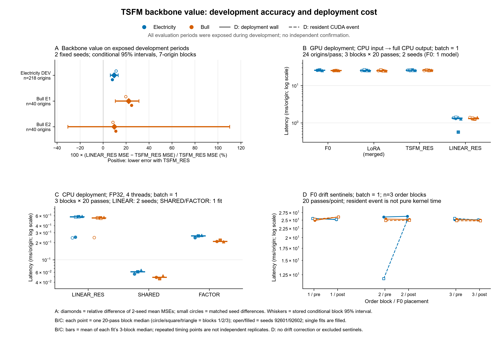

# 잔차 PEFT v3 — TSFM 대체 대조와 비용 진단

상태: 승인된 직접 비교·제한된 RAW 후속·비용 측정·검산 완료. **TSFM 경로 조건부 유지, 잔차 PEFT 주력 논문 주제 확보는 보류.** 비용 변동의 근본 원인은 미확정이다. 게시 확인은 STATUS에 기록한다.

## 판단

[확인] 같은 E/D·G 구조에서 동결 Chronos-Bolt-small 경로 `F0`를 학습형 시간 선형 예측기 `T_phi`로 바꾼 `LINEAR_RES`는 세 노출 개발 평가 구간 모두에서 기존 `TSFM_RES`보다 MSE가 높았다. 상대 손해는 Electricity DEV +9.72%, Bull E1 +22.31%, Bull E2 +9.86%였다. Electricity DEV와 Bull E1은 두 seed와 7-origin block bootstrap 조건부 구간에서 일관되게 `TSFM_RES`가 유리했다. Bull E2는 seed별로는 `TSFM_RES`가 유리했지만 조건부 구간이 0을 포함해 기간 변동 불확실성이 크다.

[확인] RAW 입력 후속 분기 `LINEAR_RAW = D(T_phi(E(X))) + G(X)`는 `LINEAR_RES`보다 좋지 않았다. Electricity DEV에서 RAW는 RES보다 +2.47% MSE가 높았고, Bull E1은 +108.13%, Bull E2는 +5.10%였다. 따라서 이번 한정 레시피 안에서는 “선형 대체가 약했던 이유가 잔차 입력 제한 때문”이라는 설명은 지지되지 않는다.

[확인] 그러나 이 결과는 `TSFM_RES` 잔차 PEFT 자체를 다음 논문 주제로 확보했다는 뜻은 아니다. 같은 기존 비교표에서 미적응 F0와 LoRA가 세 평가 구간 모두에서 선택 `TSFM_RES`보다 MSE가 낮다. v3가 지지하는 것은 더 좁다. 현재 E/D·G 잔차 구조 안에서, `F0`를 작은 학습형 `T_phi`로 직접 대체하면 정확도 손해가 남는다는 조건부 backbone 가치다. 이 근거는 “동결 TSFM 경로를 완전히 버리고 선형 대체로 가도 충분하다”는 결론을 막지만, “잔차 PEFT가 새 주력 논문 방법으로 충분하다”는 결론까지는 지지하지 않는다.

현재 판단: 정확도 중심의 backbone 비교에서는 TSFM 경로 조건부 유지, 잔차 PEFT 방법론 주제 확보는 보류다. 실용 비용과 측정 제한을 합친 최종 판정은 아래에 남긴다.

## 실제로 대체한 부분

```text
TSFM_RES   = D(F0(E(X)))    + G(X - D(E(X)))
LINEAR_RES = D(T_phi(E(X))) + G(X - D(E(X)))
```

F0는 동결 Chronos-Bolt-small이다. T_phi는 잠재 채널에 공유하는 `Linear(512,48,bias=True)`로 24,624개 파라미터를 TRAIN 정답에서 새로 학습했다. G는 T와 독립된 bias·활성화 없는 512→32→48 시간 예측기이며 17,920개 파라미터다. Electricity는 C32/K8, E/D/T/G 공동학습이고 Bull은 C16/K4, TRAIN PCA E/D 고정·T/G 학습이다. 고정 D를 지나 T까지 gradient가 흐른다. 선형 모델은 Chronos 가중치를 로드하지 않는다. [구현](model.py), [승인 계획 원문](PLAN.md)

T의 입력은 각 잠재 문맥512개의 평균과 모집단 표준편차로 정규화하고 출력에 역변환한다. loc/scale을 detach하지 않는다. 정확히 0인 scale은 Bolt와 같은 1e-5로 바꾸며, 최초 합성 검사에서 발견한 sqrt(0)의 역전파 문제는 같은 forward를 유지하는 경계 처리로 수정했다. 결측 위치는 평균/분산 계산에서 제외하고 정규화 입력은 0으로 채운다. 실제 실험 입력은 기존 TRAIN 결측 처리로 finite다. 이는 **문맥 정규화를 포함한 선형 대체 경로**이며 전역적으로 순수 선형 함수라고 부르지 않는다. 원본·수리 diff는 [repairs](repairs/normalization_fix.patch)에 보존했다.

E/D/G는 TSFM과 학습한 최종값을 물려받지 않았다. TRAIN PCA와 해당 seed/K의 v2 학습 전 초기 checkpoint를 사용했고 G 출력층은 0이다. T는 별도 CPU RNG(`seed+3,000,000`)로 초기화해 E/D/G 난수 순서를 바꾸지 않았다. 두 T 학습률과 RES/RAW 사이 실제 초기 tensor와 TRAIN 원점 순서를 맞췄다. Electricity v1 초기 G의 bitwise 동등성은 원본 부재로 확인하지 못했다. F0 경로와 T 경로의 초기 출력·용량·탐색 기회가 동일하다고 주장하지 않는다.

잠재 어댑터·PCA·예측 목적에 따른 E/D 공동학습은 [AdaPTS, ICML 2025](https://proceedings.mlr.press/v267/benechehab25a.html)의 기존 원리다. 작은 선형 대조의 근거는 [AAAI 2023 LTSF-Linear](https://ojs.aaai.org/index.php/AAAI/article/view/26317)이며 이번 T는 그 논문의 전체 재현이나 새 PEFT 제안이 아니다. 읽은 깊이와 설치 구현 확인 범위는 승인 PLAN에 기록했다.

## 사용한 평가와 선택 계약

[확인] 결과 출처는 다음 파일이다.

- `research/tsfm_peft_backbone_value_v3_20260927/final_development.json`: `LINEAR_RES`와 기존 v2/v1 prediction receipt를 맞춘 평가.
- `research/tsfm_peft_backbone_value_v3_20260927/linear_raw_development.json`: 고정 레시피 `LINEAR_RAW` 후속 평가와 `final_development.json`의 `LINEAR_RES` prediction receipt 비교.
- `research/tsfm_peft_backbone_value_v3_20260927/selected_linear.json`: `LINEAR_RES` LR 선택 기록.
- `research/tsfm_peft_backbone_value_v3_20260927/selected_linear_raw.json`: RAW 후속 레시피 선택 기록.
- `research/tsfm_peft_backbone_value_v3_20260927/branch_decision.json`: 첫 8 fit 이후 RAW 분기를 선택한 이유.
- `research/tsfm_peft_backbone_value_v3_20260927/runs/*/result.json`: 학습, 갱신, checkpoint, restart receipt.
- `research/tsfm_peft_backbone_value_v3_20260927/provenance.json`: 기준 commit, 계획 hash, v1/v2 보존 hash.

[확인] `LINEAR_RES` 선택은 DEV/E1/E2를 보지 않고 각 자료별 두 seed의 best VAL MSE 평균으로 했다. 두 자료 모두 `t_lr=0.001`이 `0.0001`보다 VAL 평균이 낮아 선택됐다. Electricity 평균 best VAL MSE는 0.173429, Bull은 0.438929다.

기존 시간당 자료·분할·mask·TRAIN 표준화/PCA를 유지했다. Electricity는 TRAIN17,853/VAL108/DEV218 원점, Bull은 TRAIN1,945/VAL30/E1 40/E2 40 원점이다. L512/H48, 평가 원점 간격24시간, FP32이며 AdamW·weight decay0·clip1·최대120epoch·patience6·epoch당 위상균형512 TRAIN 원점·batch4를 사용했다. E/D/G 초기 LR은1e-3, T는1e-3/1e-4를 각각 두 seed로 적합했다. plateau scheduler와 실제 LR 비율은 각 curve에 남겼다. step0 포함 최소 VAL을 선택하며 동률은 먼저 나온 상태다. [프로토콜](protocol.json), [재사용 경로·hash](reuse_manifest.json)

[확인] RAW 후속은 새 전면 탐색이 아니라 branch B 한정 보완이다. `branch_decision.json`은 “잔차 입력 제한이 선형 대체를 약하게 만들었는가”를 확인하기 위해 `G` 입력만 `X-D(E(X))`에서 `X`로 바꾼다고 기록한다. seed, 초기 E/D/G/T, E/D mode, 학습 목적, sampling, patience, `t_lr=0.001`은 선택된 `LINEAR_RES`와 맞췄고, RAW에 별도 LR 탐색 기회를 주지 않았다. 그러므로 RAW 결과는 best-selected 대결이 아니라 대응 레시피 비교다.

## 정확도 결과

주 지표는 원채널 미래 관측 mask의 채널 동일 가중 MSE다. 아래 평균은 seed별 손실의 산술 평균이며 prediction ensemble이 아니다.

```text
평가 구간        기존 TSFM_RES MSE   LINEAR_RES MSE   LINEAR-TSFM 상대차
Electricity DEV  0.165850           0.181972         +9.72%
Bull E1          0.210365           0.257305         +22.31%
Bull E2          1.246580           1.369494         +9.86%
```

[확인] seed별 `LINEAR_RES - TSFM_RES` MSE 차이는 다음과 같다.

```text
Electricity DEV
  seed 92601: 0.181669 - 0.163157 = +0.018512
  seed 92602: 0.182276 - 0.168544 = +0.013732

Bull E1
  seed 92601: 0.254651 - 0.212515 = +0.042135
  seed 92602: 0.259960 - 0.208215 = +0.051745

Bull E2
  seed 92601: 1.353298 - 1.246700 = +0.106598
  seed 92602: 1.385690 - 1.246461 = +0.139229
```

[확인] `final_development.json`의 연속7원점·2,000회 non-circular block bootstrap 조건부 구간은 다음과 같다. 모든 채널을 함께 움직여 겹친48시간 목표를 개별 독립 표본처럼 세지 않았다. 학습 seed를 고정한 구간이므로 seed 재학습 및 반복 선택의 불확실성을 포함하지 않는다. 이 구간은 노출 개발 자료 위의 조건부 요약이지 독립 확증이 아니다.

```text
평가 구간        상대차 95% 조건부 구간
Electricity DEV  +6.35% .. +13.16%
Bull E1          +10.63% .. +31.26%
Bull E2          -30.70% .. +110.24%
```

[확인] `LINEAR_RAW` 후속은 `LINEAR_RES` 대비 다음 결과를 보였다.

```text
평가 구간        LINEAR_RES MSE   LINEAR_RAW MSE   RAW-RES 상대차
Electricity DEV  0.181972        0.186463        +2.47%
Bull E1          0.257305        0.535527        +108.13%
Bull E2          1.369494        1.439333        +5.10%
```

[확인] `LINEAR_RAW - LINEAR_RES` seed별 MSE 차이는 Electricity DEV에서 +0.007137, +0.001844, Bull E1에서 +0.272123, +0.284319, Bull E2에서 +0.091545, +0.048133이다. Bull E2의 조건부 상대차 구간은 -0.09% .. +76.88%로 0 근처를 포함하지만, seed별 평균과 두 seed 모두 RAW가 더 나쁘다.

[확인] 기존 단순/TSFM 대조와의 위치는 다음과 같다.

```text
Electricity DEV
  LoRA 0.161096, F0 0.164537, TSFM_RES 0.165850, FACTOR 0.178457, SHARED 0.180795, LINEAR_RES 0.181972

Bull E1
  LoRA 0.162050, F0 0.164367, TSFM_RES 0.210365, LINEAR_RES 0.257305, FACTOR 0.273212, SHARED 0.278177

Bull E2
  LoRA 1.191976, F0 1.201383, TSFM_RES 1.246580, SHARED 1.323947, LINEAR_RES 1.369494, FACTOR 1.368564
```

이 위치가 중요하다. `TSFM_RES`는 `LINEAR_RES`보다 낫지만, 미적응 F0와 LoRA보다 낫지 않다. Bull E1에서는 `LINEAR_RES`가 기존 SHARED/FACTOR보다 나은 반면, Electricity와 Bull E2에서는 기존 단순 선형 대조와 비슷하거나 더 나쁘다.

## 학습과 구현 정상성

[확인] synthetic CPU check는 2회 중 1회차에서 constant-input gradient 검사가 실패했고, 2회차에서 수리 후 통과했다. 통과한 `cpu_checks_02.json`은 구조/정규화, masked loss, current/fixed_ed update 범위, checkpoint/restart를 통과로 기록한다. `checkpoint_includes_T=true`, restore exact와 optimizer/scheduler restart exact도 기록됐다.

[확인] 첫 `LINEAR_RES` 8run과 후속 `LINEAR_RAW` 4run 모두 complete이며 checkpoint replay error가 0.0이고 restart roundtrip의 model/optimizer/scheduler/rng가 모두 true다. 모두 step0 이후 checkpoint가 선택됐고 최대120epoch에 도달하기 전에 patience6으로 종료했다. 선택된 LINEAR_RES 4run의 상세값은 아래와 같다.

[확인] 갱신 범위는 의도와 맞다. Electricity current E/D에서는 encoder와 decoder가 갱신됐고, Bull fixed_ed에서는 encoder/decoder changed scalar가 0이다. 두 자료 모두 `temporal.weight`, `temporal.bias`, `residual.down.weight`, `residual.up.weight`는 갱신됐다. 즉 `T_phi`와 `G`가 서로 다른 학습 파라미터로 실제 학습됐고, Bull fixed_ed에서 E/D 고정 조건은 지켜졌다.

[확인] run별 선택 epoch와 best VAL은 다음과 같다.

```text
LINEAR_RES
  Electricity 92601: epoch 40, VAL 0.173834, trainable 43056/43056
  Electricity 92602: epoch 38, VAL 0.173024, trainable 43056/43056
  Bull 92601:        epoch 25, VAL 0.437455, trainable 42544/42672
  Bull 92602:        epoch 16, VAL 0.440403, trainable 42544/42672

LINEAR_RAW
  Electricity 92601: epoch 20, VAL 0.181745, trainable 43056/43056
  Electricity 92602: epoch 38, VAL 0.177152, trainable 43056/43056
  Bull 92601:        epoch 25, VAL 0.481838, trainable 42544/42672
  Bull 92602:        epoch 12, VAL 0.490336, trainable 42544/42672
```

[확인] 학습 probe도 초기보다 선택 checkpoint에서 크게 낮아졌다. 예를 들어 `LINEAR_RES` Electricity seed 92601은 train probe MSE 1.052297에서 0.183517로, Bull seed 92601은 1.309414에서 0.747232로 내려갔다. 이는 “전혀 학습되지 않은 선형 대조”와는 구분된다. 단, train probe는 고정 probe일 뿐 충분한 최적화 증명이나 test 성능 보증이 아니다.

[확인] v3 새 run들은 initial checkpoint hash와 best checkpoint hash를 result receipt와 evaluation script가 확인하도록 되어 있다. 반면 v1에서 재사용한 legacy TSFM/RAW run들은 `reuse_manifest.json`에 `legacy_record_has_no_initial_checkpoint`로 표시되어 있다. 따라서 v3 선형 후보 내부에서는 초기/복원 추적이 강하지만, v1 TSFM 선택 run과 v3 후보 사이의 모든 초기값 동일성을 완전하게 재검증할 수는 없다. 이 한계 때문에 결과를 “순수 backbone 인과 효과”로 쓰지 않는다.

## 해석 범위와 한계

[확인] 이번 비교의 질문은 `F0`를 작은 학습형 시간 예측기 `T_phi`로 바꿔도 같은 E/D·G 구조에서 충분한가다. 결과는 “충분하지 않았다” 쪽이다. 하지만 `F0`와 `T_phi`는 사전학습 여부, 함수군, 전체 파라미터, 선택 이력, pre/post-processing 세부가 다르다. 따라서 이 결과는 Chronos 사전학습 지식만의 순수 인과 효과도 아니고, 모든 선형 모델의 상한도 아니다.

[확인] `LINEAR_RAW`는 잔차 입력 제한이라는 한 가지 반론을 줄이는 데 도움은 된다. 같은 `t_lr=0.001`과 대응 레시피에서 RAW가 RES보다 나빠, “G 입력을 원자료로 주면 선형 대체가 TSFM 격차를 닫는다”는 설명은 이번 결과에서 지지되지 않았다. 그러나 RAW는 전체 LR/rank/구조 탐색을 받은 후보가 아니므로 “모든 raw-input 선형 대안이 약하다”로 확대하지 않는다.

[확인] 모든 정확도 평가는 노출 개발 평가다. Electricity DEV와 Bull E1/E2는 이번 주제 선택 과정에서 이미 사용된 자료다. 조건부 bootstrap 구간도 같은 노출 자료 위에서 산출됐다. 독립 확증이나 논문 test set 결과로 부르지 않는다.

선형 경로의 E/D 학습 여부와 K는 TSFM의 기존 자료별 선택에 맞췄다. 선형 모델에 최적인 모든 E/D 모드를 탐색한 비교가 아니다. 기존 TSFM 탐색 이력과 새 LINEAR의 2개 LR 선택 기회도 완전히 동일하지 않다. 이 제한을 숨긴 best-of-all 대결이나 비열등성 판정은 하지 않는다. 추가 학습을 종료한 근거는 첫 음성 자체가 아니라 정상 갱신·probe 개선·patience 종료·복원 확인과, 사전에 정한 RAW 분기가 격차를 줄이지 못했다는 관찰이다.

[확인] F0/LoRA가 선택 `TSFM_RES`보다 모든 구간에서 낮은 MSE를 보였다. 따라서 정확도 추가 가치만으로 현재 잔차 PEFT를 새 주력 방법으로 확정할 수 없다. 적은 학습 파라미터·전체 모델 크기·실측 추론 비용은 각각 따로 보아야 한다. 이번 회차는 새로운 방법적 모듈을 추가하지 않았고, “현재 잔차 구조에서 backbone을 선형으로 치환하면 정확도 손해가 남는다”는 범위의 근거를 제공한다.

## 비용과 자원

장치는 로컬 RTX4070 12GiB와 i7-13700F, Windows 환경이다. Torch2.10.0+cu128, PEFT0.21.0, Chronos2.3.2를 사용했다. FP32·TF32 off·CPU4 threads, 동일 VAL24원점, batch1/4, 예열10회, 24원점 전체20회 반복, 순서를 바꾼3블록이다. GPU는 14개 고유 구성의 주 측정168행과 F0 후반 기준24행, CPU는48행이다. LoRA는 설치 PEFT의 `merge_and_unload(safe_merge=True)` 반환값을 사용했으며 병합 전후 최대 절대차1.431e-6로 정합 허용오차 안이었다. [GPU 원자료](cost_gpu_01.json), [CPU 원자료](cost_cpu_01.json), [측정 코드](cost_v3.py)

**배포 범위**는 공통 표준화가 끝난 CPU FP32 입력→GPU 전송→원채널 전체48시간 출력의 CPU 반환이다. 모델 로드·disk·채점·원장 쓰기는 시간 구간에서 제외했다. **모델 실행 진단**은 입력/출력이 GPU에 상주하는 동일 전체 forward의 동기화 wall time 및 CUDA event다. 두 범위의 차이를 순수 전송시간으로 해석하지 않는다. 아래 중심값은 fit별 3블록 중앙값을 구한 뒤 seed 평균을 낸 것이며, 반복 timing을 독립 과학 표본으로 세지 않았다. F0 후반 기준값은 drift 확인에만 사용했고 원자료를 삭제하거나 보정하지 않았다.

```text
자료          구성           GPU 배포 batch1   batch4 처리량   GPU상주 batch1 wall
                            ms/origin        origins/s       ms/origin
Electricity  F0                25.549            125.59           25.499
             병합 LoRA        25.266            124.55           25.119
             TSFM_RES         25.657            152.34           25.581
             LINEAR_RES        1.335           2516.41            1.185
Bull         F0                25.232            155.78           24.842
             병합 LoRA        25.055            152.25           24.923
             TSFM_RES         25.933            154.08           25.351
             LINEAR_RES        1.303           2840.23            1.187

자료          CPU FP32 구성    batch1 ms/origin   batch4 origins/s
Electricity  LINEAR_RES          0.574               4264.90
             SHARED              0.061              46287.37
             FACTOR              0.264              11059.60
Bull         LINEAR_RES          0.548               4633.13
             SHARED              0.049              52340.97
             FACTOR              0.211              12843.79
```

LINEAR의 CPU 배포는 GPU 커널 성능 비교와 다른 실용 선택이다. 모델에 F0를 보관하지 않았고 기존 SHARED/FACTOR 가중치를 재적합하지 않았다. FP32 배포 출력은 기존 FP64 수식과 허용오차1e-5/1e-4 안에서 일치했다. 표의 큰 비용 차이와 앞선 정확도 손해를 함께 보아야 하며, 사용자의 배포 지연·오차 허용 조건이 없으므로 하나의 보편적 비용 정당화 기준을 만들지 않는다.

**블록 변동은 남았다.** Bull F0 배포 batch1은 블록 전후가 24.902→26.015, 25.307→25.190, 25.232→24.950ms였다. v2의 11.483/25.787/27.160ms 급변이 이 범위에서 그대로 재현되지는 않았다. 그러나 Electricity F0의 두 번째 블록에서는 GPU상주 wall/event가 전반11.886/11.880ms에서 후반 wall25.052ms로 변했고 IQR도 분리됐다. 같은 블록 배포 wall은25.990→26.215ms였다. LINEAR GPU 배포에도 Electricity seed92602의0.561ms 블록이 있었고 나머지는 대체로1.28~1.40ms였다. CPU LINEAR도 초기 일부0.24~0.25ms에서 나머지0.54~0.59ms로 변했다. 중심값만으로 이 예외를 숨기지 않는다.

온도·clock·사용률·전력·P-state는 행 전후에 읽기만 했다. 빠른 Electricity 상주 구간 전후 SM clock1785→2805MHz와 P3→P2 변화가 있었지만 다른 구간에서도 clock이 바뀐다. 이것으로 온도·clock·Windows 중 하나를 원인으로 확정할 수 없다. 순서·장치 상태·CPU 호출과 장치 실행의 기여를 완전히 분리한 인과 실험은 아니다.

**작은 profile의 확인 범위:** Bull batch1의 F0·TSFM_RES(seed92601)·LINEAR_RES(seed92601)만 warmup 후3회 trace했다. 첫 profile의 상위 CPU 구간에는 예산 조회가 섞여 모델 CPU 시간 해석에 사용하지 않았다. [원본](cost_profile_01.json), [수리 diff](repairs/profile_scope_fix.patch)를 보존하고, 원장 검사를 trace 밖으로 옮겨 `v3_model_forward` 구간을 표시한 [수정 profile](cost_profile_02.json)을 사용했다. 이 변경은 측정 범위 수리이며 모델 최적화가 아니다. 실제 CUDA kernel 및 memcpy trace가 존재한다.

```text
Bull 구성     1 forward당 launch/kernel 수   profile CPU forward   kernel duration 합   memcpy duration 합
                                          ms/forward             ms/forward           ms/forward
F0                      662                    43.199                 4.353                0.006
TSFM_RES                639                    44.169                13.884                0.013
LINEAR_RES               41                     2.366                 0.410                0.010
```

위 합은 trace의 `cat=kernel`/`gpu_memcpy`, `ph=X` duration만 합해3으로 나눈 것이다. CPU 연산 귀속 CUDA 시간과 GPU kernel 행을 중복 합산하지 않았다. 프로파일러는 실제 지연을 바꾸었으며 kernel 합도 동시 실행을 고려한 wall time/FLOPs가 아니다. 따라서25ms에서 kernel 합을 빼 CPU 병목 비율을 만들지 않는다. [확인] 압축 후에도 launch 수가662→639에 머물렀고 전송 커널 구간만으로 관측 시간을 설명할 수 없다. [추정] 많은 작은 연산의 host 호출·제출 및 장치 스케줄링이 batch1 비용을 제한하는 후보이나, v2 변동의 근본 원인까지 확인한 것은 아니다. 출력 동등 최적화는 의사결정을 바꿀 구체적 근거가 부족해 추가하지 않았고, 안정적으로 보일 때까지 반복 측정하지 않았다.

**파라미터와 메모리를 구분했다.** 아래 allocated/reserved는 GPU 배포 batch4에서 블록·seed 전체의 최대 bytes다. 모델 교체 직후 allocated=0을 확인하고 해당 shape의 예열 후 peak를 초기화했다. 보통 cuBLAS 작업공간과 활성 tensor가 포함된다.

```text
자료          구성          학습 가능 수    배포 전체 수     배포 parameter bytes   peak allocated / reserved bytes
Electricity  F0/병합 LoRA    0 / 294912      47718016           190872064             344641536 / 392167424
             TSFM_RES       18432          47736448           190945792             236830208 / 247463936
             LINEAR_RES     43056             43056              172224               9609728 /  23068672
Bull         F0/병합 LoRA    0 / 294912      47718016           190872064             272018944 / 301989888
             TSFM_RES       17920          47736064           190944256             218771968 / 228589568
             LINEAR_RES     42544             42672              170688               9149952 /  23068672
```

LoRA의 병합 전 전체 수는48,012,928이고 표의 학습 가능 수는 병합 전이다. LINEAR의 마지막 학습 상태에서 실제 값이 바뀐 scalar는 Electricity43,056, Bull42,544이며 Bull 고정 E/D128개는 불변이었다. TSFM adapter FP32 tensor payload는 Electricity73,728/Bull72,192bytes이고 고정 E/D도 저장한다. LINEAR 전체 상태 payload는172,224/170,688bytes다. 실제 best.pt는 LINEAR175,921/174,385bytes, TSFM_RES228,721/220,693bytes, LoRA 약3.614MB다. 기존 TSFM/LoRA best에는 optimizer 등도 있어 파일 크기를 순수 adapter 용량의 동등 비교로 쓰지 않는다. 각 checkpoint 경로·hash는 run/재사용 manifest에 있다.

새 선택 LINEAR 학습의 peak allocated/reserved는 Electricity19,109,376/25,165,824bytes, Bull18,331,136/23,068,672bytes였다. 초기 probe·TRAIN update·VAL을 포함하고 동시 복원 검증 instance 생성 전 값이다. 선택한 두 fit의 실제 정지 epoch/시간은 Electricity46/44epoch와68.43/68.71초, Bull31/22epoch와39.53/30.09초다. 기존 선택 TSFM_RES 원본 기록의 peak allocated는 Electricity386,669,568, Bull229,295,104bytes이며, LoRA는 Electricity740,230,656~932,685,824, Bull566,772,736~567,428,096bytes다. 기존 기록은 reserved가 없고 실행 시점·길이·목적함수·microbatch/복원 scope도 같지 않아 통제된 학습 속도비나 메모리비를 주장하지 않는다.

프로세스 CPU RSS는 Python·자료·이전 allocator 영향을 포함한 별도 기록이다. GPU 측정 프로세스의 batch4 RSS는 약1.454~1.478GB 범위였으며 모델 weight 메모리와 같지 않다. WDDM의 per-process GPU 메모리는 N/A여서0으로 기록하지 않았고 전체 GPU 프로세스 메모리 절감은 미측정이다. SHARED/FACTOR는 buffer로 적재했어도 이미 적합한 계수가 있으며, 등록된 trainable parameter0을 “학습하지 않은 모델”로 해석하지 않는다.



[SVG](comparison.svg) · [그림의 수치·행·hash 연결](comparison.caption.json). 점수는 seed 손실 평균이며, 비용 점은 원본 블록 중앙값이다. 그림의 Bull E2 넓은 구간과 빠른 비용 블록도 모두 표시했다.

## 예산·검산·재현

[확인] 실자료12/16attempt(첫8+RAW4), 실자료 실패0; 합성 optimizer2/6세션(각8step, 첫 검사 실패 포함); GPU 총2,094.124854초=34.902분/180분이다. 학습·선택/복원·평가·벤치마크·두 profile을 포함했다. CPU 검사 총8.310051초/900초이며 저장 결과 검산은 optimizer0이다. 별도 CPU 비용/그림 분석31.406370초도 원장에 남겼다. real_fit 행의 시간은 GPU job 안에 포함되므로 GPU 합계에 중복 가산하지 않는다. 최종 검산 시 신규 저장42,669,260bytes(약40.69MiB)였으며 문서 마무리 후 최종값은 STATUS에 남긴다. [원장](ledger.json)

v2의22/20attempt 위반은 원본대로 보존했다. 이번 새 예산으로 소급 승인하지 않는다. 새 서버·설치·전역 환경 변경·다른 작업 종료·신규 데이터·보호평가는 없었다. 상한 안에서 필요한 비교를 끝냈으므로 남은4fit를 쓰지 않았다.

[최종 검산](final_checks.json)은 PASS다. 승인 PLAN과 v1/v2 추적327파일 hash, 12fit 초기/선택/restart tensor, 실제 갱신·동결·표본 순서·VAL 선택, 저장 예측 점수·seed/기간 차이·RAW 대응 레시피, GPU192/CPU48행의 원본 반복값과 요약, 원장 상한을 확인했다. 저장 bootstrap은 설정과 구간 형태만 검사하고2,000회 분포를 재실행하지 않았다. 이는 실행팀의 자체 검산이며 독립 재현이나 별도 LLM의 동의를 과학적 증거로 부르지 않는다.

재현 명령은 각 `runs/*/result.json`의 `environment.command`, 비용의 `*_attempt.json`, 그림 caption에 보존했다. 데이터 계약·hash·원점은 protocol/reuse_manifest/평가 JSON, initial/best/restart 위치·hash·seed·source hash는 run receipt에 있다. 선택 가중치와 예측 배열, 전체 trace는 `.cache/tsfm_peft_backbone_value_v3_20260927/`에 보관하며 공개하지 않는다. 기존 F0/LoRA/TSFM_RES/SHARED/FACTOR는 경로와 조건이 맞는 가중치·점수를 재사용했다. 완료된 명령은 같은 이름으로 덮어쓰지 않으며, 새 적합·재시도에는 별도 승인 잔여범위와 원장 예약이 필요하다.

## 현재 의사결정

[확인] v3 정확도 결과만 보면 TSFM backbone 경로를 완전히 버리기는 어렵다. `LINEAR_RES`는 세 평가 구간 모두에서 `TSFM_RES`보다 높았고, RAW 후속도 격차를 닫지 못했다.

[확인] 동시에 잔차 PEFT를 주력 논문 방법으로 확정하기에는 근거가 부족하다. F0와 LoRA가 선택 `TSFM_RES`보다 강하고, 모든 결과는 노출 개발 자료다.

**결정은 TSFM 경로 조건부 유지다.** 기존 E/D 모드·자료·레시피에서 정확도를 우선하면 TSFM의 추가 예측 가치는 남고, 현재 LINEAR가 같은 정확도를 유지하는 대체라고 보기는 어렵다. 반면 작은 모델·CPU 배포·낮은 지연을 우선하면 LINEAR가 명확한 비용 대안이며 관측된 정확도 손해를 감수할지 사용 조건에 따라 결정해야 한다. 이 결론은 모든 TSFM PEFT의 필요성이나 모든 선형 모델에 대한 우위를 뜻하지 않는다.

Electricity TSFM_RES의 batch4 처리량 중심값은 병합 LoRA보다 높지만 batch1 이점은 없고 MSE도 높다. Bull에서는 LoRA 대비 작은 처리량 차이를 변동을 넘어선 우위로 주장할 수 없다. 그러므로 현재 잔차 PEFT 자체의 새 주력 논문 주제는 **미확보·보류**다. 대조 실험 완료를 주제 확보로 바꾸지 않는다.

**다음 결정 한 가지:** TSFM 경로의 정확도 가치를 새 자료에서 확인할 필요가 있다면, 사용 이력을 먼저 검증한 BDG2 비-Bull 사무동 한 곳을 대상으로 고정 TSFM_RES·LINEAR_RES·미압축 LoRA의 한 번의 후속 확인을 승인할지 결정한다. 이 회차에서는 건물 선택·데이터 확보·새 평가를 수행하지 않았다. 해당 자료의 미사용 이력이 확인되지 않으면 독립 확증이라 부를 수 없다. 이번 결과를 보고 새 모듈·데이터·사후 라우팅을 찾아 양성이 나올 때까지 계속하지 않는다.
