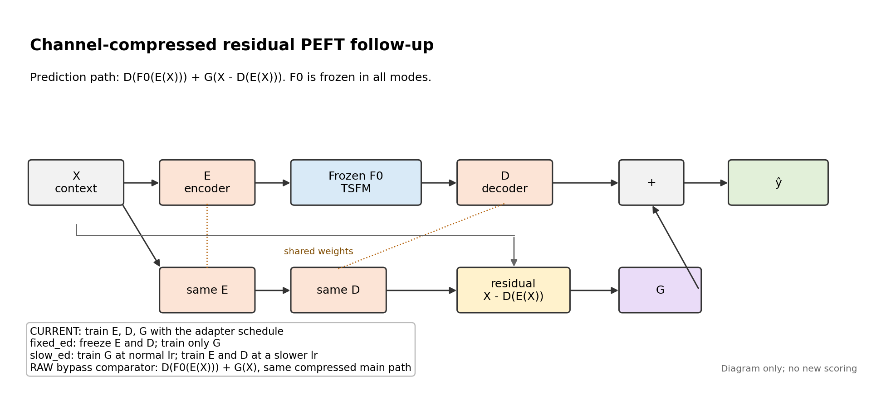
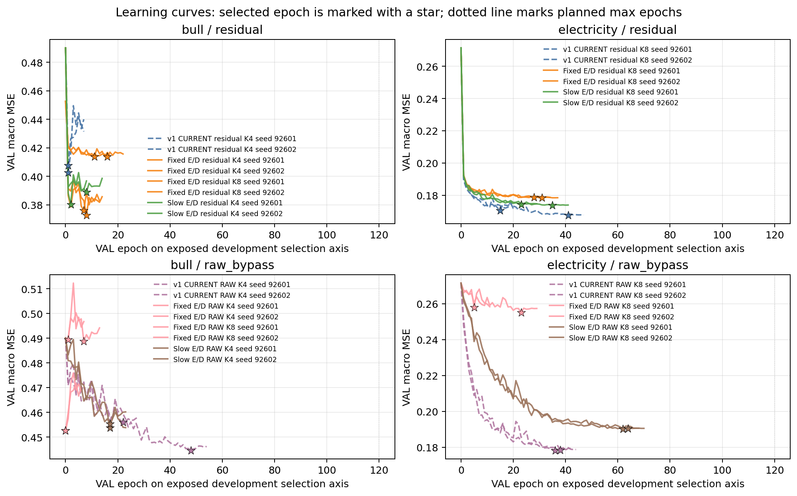
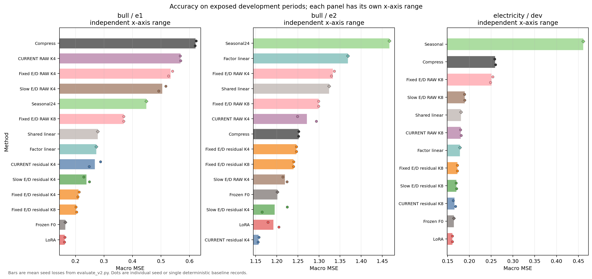
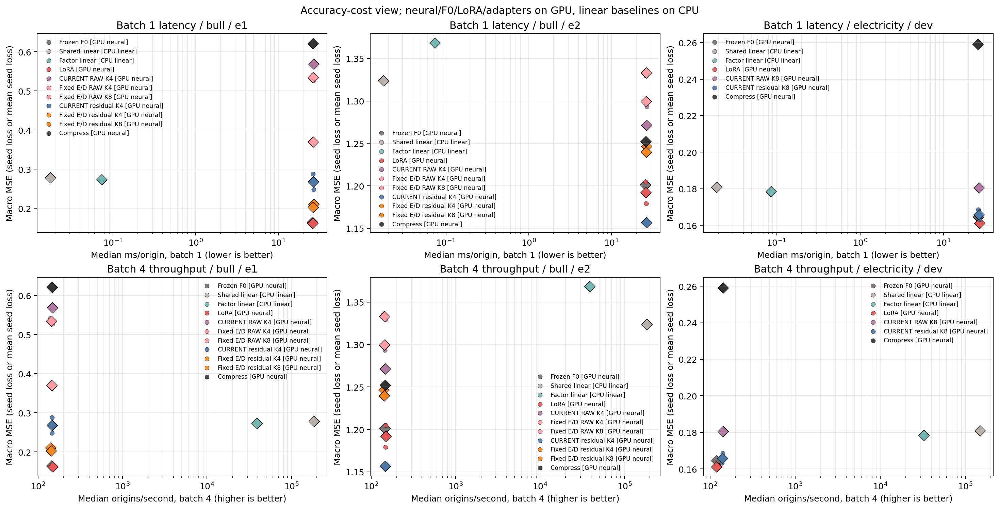
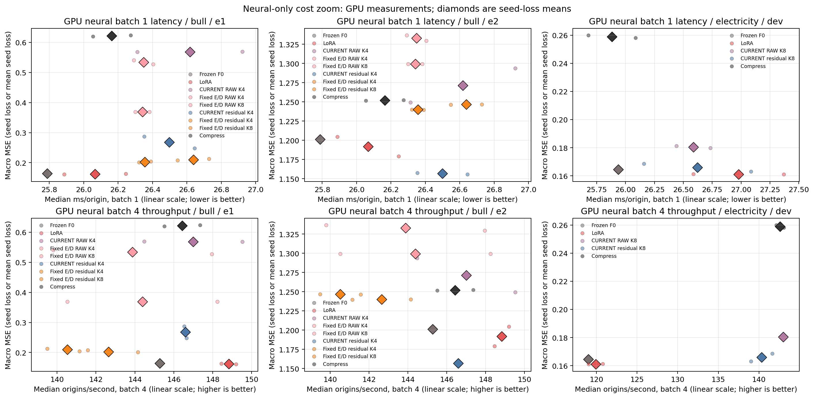

# TOPIC_DECISION.md — 채널 압축 잔차 PEFT 후속 개발 v2

문서 상태: 신규20fit, 최종 개발 평가, 반복 비용 측정, 저장 예측·checkpoint의 CPU 검산을 완료했다. 첫 비용 측정과 최종 검산 코드의 실패 기록도 보존했다. 이 보고서는 실행팀의 개발 결과이며 독립 재현이나 새 보호 확증이 아니다.

## 판정

[확인] **판정: 정확도 개발에는 부분 진전이 있으나, 논문 주력 방법으로 확대할 근거와 배포상의 추가 가치는 아직 미확보다.** Bull E1 MSE는 CURRENT `0.267849`에서 FIXED `0.210365`로 21.46% 감소했고, Bull E2는 `1.156667`에서 `1.246580`으로 7.77% 증가했다. Electricity에서는 새 fixed/slow E/D가 기존 current residual을 넘지 못했다. Bull의 선택 FIXED는 같은 FIXED RAW보다 E1 MSE가 60.60% 낮아 잔차 입력의 가치가 남지만, F0·LoRA보다 오차가 크고 반복 측정에서 추론 속도 이점도 확보하지 못했다. E/D 고정 자체나 v1의 조건부 주제 선택을 새 성과로 재명명하지 않는다.

[확인] 현재 유지할 중심 가설은 “compressed TSFM path의 출력에 원 입력과 복원 입력의 잔차를 `G`로 보정하면, RAW bypass와 비교해 일부 조건에서 추가 가치가 생긴다”이다. 수정할 초점은 Bull에서 `fixed_ed:k4` residual을 주력 변형으로 두고, Electricity는 기존 `current:k8` residual을 유지하는 것이다. 보류할 항목은 K8을 주력 선택으로 올리는 주장, LoRA/F0 전면 우위 주장, 독립 확증 주장, 비용 기반 배포 가치 주장이다.

```
구성      현재 판정
유지      residual input G vs RAW bypass라는 핵심 질문, same-variant/selected 비교 병행
수정      Bull 주력 변형은 current가 아니라 fixed_ed:k4; E1 개선과 E2 손해를 함께 보고
유지      Electricity는 v2 fixed/slow 변경보다 current:k8가 선택됨
보류      Bull K8은 개발 MSE 개선 관찰은 있으나 VAL 선택 탈락
미확보    Bull FIXED의 추론 속도 이점; peak allocated 절약과 작은 학습부만 확인
보류      LoRA/F0 대비 범용 우위와 새 독립 확증 주장
```

## 방법과 가장 가까운 선행

[확인] 가장 가까운 선행은 AdaPTS, ICML 2025다. PLAN.md에서 저자 원문 §3–5와 공식 코드의 예측 목적함수·E/D 공동학습을 확인했으며, 잠재 압축, PCA 초기화, E/D 공동학습 자체는 차별점이 아니다. 공식 근거는 [논문집](https://proceedings.mlr.press/v267/benechehab25a.html)과 [확인한 공식 코드](https://github.com/abenechehab/AdaPTS/blob/8bf57c7ee3b97bfd3f1852ad8dc8d0695a806278/src/adapts/adapts.py#L373)다. 이번 방법의 차이는 AdaPTS식 compressed path를 그대로 새 기여로 삼는 데 있지 않고, compressed TSFM forecast와 별도 residual path를 분리하고 RAW bypass로 잔차 입력의 가치를 직접 대조한 데 있다.

[확인] 구현된 residual adapter는 `D(F0(E(X))) + G(X - D(E(X)))`이다. RAW bypass 대조는 **같은 압축 TSFM 경로를 유지한** `D(F0(E(X))) + G(X)`다. 두 방법은 같은 K·E/D 모드에서 초기값·용량·표본 순서·선택 기회를 맞추고 G의 입력을 달리한다. CURRENT/SLOW에서는 이 차이가 E/D에 흐르는 gradient에도 영향을 준다. `G`는 모든 채널이 공유하는 bias 없는 선형 `512 → 32 → 48` 구조다. 출력층을 0으로 초기화하므로 초기 함수는 COMPRESS이며, 미압축 F0 정확도 보존은 보장하지 않는다. 전체 미래 예측의 48 step masked macro MSE로 학습하며 G만의 별도 미래 잔차 정답은 없다. 근거: [실제 두 경로](model.py).



[확인] `E`와 `D`는 bias 없는 채널 선형층이고 TRAIN PCA로 초기화된다. FIXED는 E/D를 고정하고 G만 학습한다. CURRENT는 E/D/G의 초기 LR이 모두1e-3, SLOW는 G 1e-3·E/D 1e-4로 시작한다. 동결 F0를 통과하는 E의 gradient는 CURRENT/SLOW에서 유지된다. 공유 선형 G이므로 `Yhat = G(X) + D(F0(E(X)) - G(E(X)))`가 성립하지만 원인을 증명하는 식은 아니다. 학습된 DE는 일반적으로 직교투영이 아니다. CURRENT의 학습된 D와 FIXED의 PCA D 각각에서 `Q = D D+`를 계산하고, 해당 D의 Q를 비교군에도 공통 적용했다. 관측 마스크가 있는 전체 지표를 Q-space 오차가 자동 분해한다고 해석하지 않는다.

[확인] 기반 모델은 동결 `amazon/chronos-bolt-small`이다. 각 잠재 계열의 native64 출력 중 median의 앞48을 복원해 점예측으로 평가한다. 잠재 median을 채널 선형 혼합한 값이 원채널 분포의 median이라는 보장은 없다. LoRA는 기존 native quantile 목적함수로, 후보는 MSE로 학습했으므로 LoRA와의 비교는 실제 대안 비교이며 구조만의 인과 절제가 아니다. 확률예측 calibration이나 CRPS 우위는 주장하지 않는다.

[확인] COMPRESS는 G가 없는 공동 E/D 학습 대조(Electricity K8, Bull K4)이며 AdaPTS 전체 재현이나 K8 FIXED의 완전 절제가 아니다. 기존 강화된 FACTOR-LINEAR와 SHARED-LINEAR도 재사용했다. 학습형 E/D를 유지하면서 F0만 학습형 시간 선형 경로로 바꾸는 대조는 이번 마지막4fit에서 K 증가를 택했으므로 미실행이다. 따라서 같은 계산 구조에서 사전학습 F0의 고유 추가 가치는 아직 분리하지 못했다. Deep Factors의 공통·개별 성분 결합과 L2-SP의 초기값 주변 적응은 기존 원리이며 새 기여가 아니다. 발표 상태와 읽은 범위는 [승인 계획](PLAN.md)에 남겼다.

## 데이터와 선택 계약

[확인] protocol은 L512/H48, seed `92601`과 `92602`, residual rank32, 최대 120 epoch, patience 6, epoch당 TRAIN 512 origins, effective batch 4, float32를 기록한다. 모델 업데이트, 정규화·PCA·입력 결측 처리 통계는 TRAIN만 사용한다. checkpoint와 mode/K 선택은 VAL만 사용하며, DEV/E1/E2 점수로 선택을 바꾸지 않는다. VAL 선택 기준은 두 seed의 best validation MSE 평균이고, step0도 후보이며 동률이면 먼저 나온 checkpoint를 고른다.

[확인] 자료 범위는 Electricity 첫32채널과 Bull 적격16채널이다. PLAN 기준 origin 수는 Electricity TRAIN/VAL/DEV `17,853/108/218`, Bull TRAIN/VAL/E1/E2 `1,945/30/40/40`이다. `final_development.json`의 scope는 “v2 exposed development only; Bull E1/E2 are not a new confirmation”이다. Bull E1/E2는 반복적으로 본 노출 개발 구간이며 독립 보호 평가가 아니다. 로컬 Jena MPI roof 2024는 단일 후보로 확인했지만 과거 TEST 예측·평가 노출 이력이 있어 새 확인 자료로 쓰지 않았다. 이를 Weather류 전체의 부재나 실패로 일반화하지 않는다.

[확인] 평가 MSE/MAE의 분모는 channel별 관측 mask 수다. `evaluate_v2.py`는 `[origin, horizon, channel]` prediction/target/mask에서 channel별 count `mask.sum(axis=(0, 1))`로 MSE와 MAE를 계산한 뒤 channel 평균을 낸다. 따라서 결측이 있는 target은 분모에서 제외되고, macro 점수는 모든 선택 채널을 같은 가중치로 평균한다.

[확인] 집계는 “mean of individual seed losses; never forecast-ensemble score”다. 시각화에서 seed 예측 평균을 겹쳐 볼 수는 있지만, 점수는 forecast ensemble이 아니라 개별 seed loss의 평균이다.

## 실행 검증

[확인] `final_verification.json`은 `status: pass`, complete fits `20`, other attempts `[]`, v1 preserved files `191`을 기록한다. 모든 row에서 schedule verified가 true이고 checkpoint replay error가 0이다. 이 검증은 실행 agent의 CPU artifact check이지 독립 재현은 아니다.

[확인] [최종 검산](final_artifact_checks_retry1.json)은 저장 예측68행과 seed 평균40그룹을 별도 scalar 합산으로 재계산했다. 지표 최대 차이는 `5.385e-14`다. 비용156행·3,120패스의 요약 오차는0이며 VAL 선택 기회도 일치했다. 신규20fit의 초기/선택 checkpoint를 직접 비교했다. 최종 Bull FIXED K4 RES는 두 seed 모두 학습 가능17,920개 scalar가 변경됐고 E/D는 변경0이다. Bull K8 RAW 두 fit은 epoch0 선택으로 최종 변경 scalar가0이며 나머지18fit은 등록된 학습 scalar가 모두 변경됐다. 기존 v1 16fit은 저장 초기 checkpoint가 없어 scalar별 변경 수를 재구성하지 않았다. 최초 검산의 seed grouping 오류는 [실패 원본](final_artifact_checks.json)과 retry receipt에 보존했으며 실험 결과는 바뀌지 않았다.

[확인] backbone identity는 `backbone_verification.json`에서 `status: pass`, revision `772f3d25d38aec6d914c8949dab4462e2d46f5d8`로 기록됐다. `protocol.json`의 data hash는 Electricity `65b3e7dbb89433a75b26e6ad7071702dcb81b259dd33ab74dc6eea0d9b7d2bb5`, Bull `a11d826ac01de745765c5f30d88201b3176efe239216cb7ef12f6250a9542ed3`이다. 실행 환경은 result 기록 기준 Python 3.11.16, torch 2.10.0+cu128, chronos-forecasting 2.3.2, peft 0.21.0, transformers 5.17.0, numpy 2.4.6이다. `final_specs.json`은 실행 설정 목록이다. checkpoint 경로·hash는 `runs/*/result.json`, result hash는 `final_selection.json`과 `final_development.json`에 남아 있다.

## VAL 선택

[확인] 최종 VAL 선택은 다음과 같다.

```
dataset     arm         selected       VAL MSE     available variant VAL MSE
bull        residual    fixed_ed:k4    0.374377    current:k4 0.405068 / fixed_ed:k4 0.374377 / slow_ed:k4 0.384531 / fixed_ed:k8 0.413678
bull        raw_bypass  current:k4     0.450272    current:k4 0.450272 / fixed_ed:k4 0.489047 / slow_ed:k4 0.454473 / fixed_ed:k8 0.452608
electricity residual    current:k8     0.169076    current:k8 0.169076 / fixed_ed:k8 0.178522 / slow_ed:k8 0.174004
electricity raw_bypass  current:k8     0.178276    current:k8 0.178276 / fixed_ed:k8 0.256521 / slow_ed:k8 0.190256
```

[확인] Bull에서는 residual과 RAW가 서로 다른 variant를 선택했다. residual은 `fixed_ed:k4`, RAW는 `current:k4`다. 따라서 Bull 주장은 selected-vs-selected와 same-variant matched comparison을 함께 보고해야 한다. Electricity는 residual과 RAW가 모두 `current:k8`를 선택했다.



모든 신규 fit은 최대120epoch 이전에 정체 종료했고 가장 긴 실행은70epoch였다. Bull CURRENT의 epoch1 선택도 저장 초기/선택 TRAIN·VAL 진단에서 개선이 확인돼 학습 실패로 간주하지 않았다. 모든 epoch의 가중치가 저장된 것은 아니므로 없는 TRAIN 곡선을 재구성하지 않았다.

## 노출 개발 MSE/MAE

[확인] 아래 값은 `final_development.json`의 period별 `mean_scores`에서 읽은 macro MSE/MAE다.

```
period          method                       MSE       MAE
electricity/dev f0                         0.164537  0.253276
electricity/dev lora                       0.161096  0.250419
electricity/dev shared_linear              0.180795  0.280748
electricity/dev factor_linear              0.178457  0.280475
electricity/dev compress                   0.259022  0.370212
electricity/dev residual:current:k8        0.165850  0.270891
electricity/dev residual:fixed_ed:k8       0.172642  0.279140
electricity/dev residual:slow_ed:k8        0.170440  0.276743
electricity/dev raw_bypass:current:k8      0.180489  0.290333
electricity/dev raw_bypass:fixed_ed:k8     0.251046  0.358815
electricity/dev raw_bypass:slow_ed:k8      0.189298  0.300607
bull/e1         f0                         0.164367  0.208166
bull/e1         lora                       0.162050  0.204935
bull/e1         shared_linear              0.278177  0.306779
bull/e1         factor_linear              0.273212  0.311221
bull/e1         seasonal24                 0.448674  0.384197
bull/e1         compress                   0.621560  0.454482
bull/e1         residual:current:k4        0.267849  0.300735
bull/e1         residual:fixed_ed:k4       0.210365  0.266240
bull/e1         residual:fixed_ed:k8       0.202656  0.275289
bull/e1         residual:slow_ed:k4        0.238778  0.284244
bull/e1         raw_bypass:current:k4      0.568600  0.418279
bull/e1         raw_bypass:fixed_ed:k4     0.533867  0.457103
bull/e1         raw_bypass:fixed_ed:k8     0.369480  0.426495
bull/e1         raw_bypass:slow_ed:k4      0.504522  0.413276
bull/e2         f0                         1.201383  0.378239
bull/e2         lora                       1.191976  0.404467
bull/e2         shared_linear              1.323947  0.555172
bull/e2         factor_linear              1.368564  0.574888
bull/e2         seasonal24                 1.467093  0.548864
bull/e2         compress                   1.251933  0.547117
bull/e2         residual:current:k4        1.156667  0.462436
bull/e2         residual:fixed_ed:k4       1.246580  0.443757
bull/e2         residual:fixed_ed:k8       1.239798  0.435943
bull/e2         residual:slow_ed:k4        1.194882  0.452049
bull/e2         raw_bypass:current:k4      1.271360  0.542819
bull/e2         raw_bypass:fixed_ed:k4     1.333000  0.551685
bull/e2         raw_bypass:fixed_ed:k8     1.299422  0.503724
bull/e2         raw_bypass:slow_ed:k4      1.219259  0.542292
```

[확인] 표의 중심 해석은 다음이다. Electricity에서는 `residual:current:k8`가 v2 fixed/slow보다 낫고, LoRA와 F0보다 낮지는 않다. Bull E1에서는 `residual:fixed_ed:k4`가 CURRENT, RAW, linear/factor/seasonal/compress보다 좋아졌지만 LoRA와 F0보다 낮지는 않다. Bull E2에서는 selected `residual:fixed_ed:k4`가 selected RAW보다 조금 낮지만 `residual:current:k4`, `residual:slow_ed:k4`, LoRA, F0보다 높다. 이 때문에 주장은 RAW bypass 대비 residual 구조의 조건부 가치로 좁혀야 한다.



## 핵심 비교

[확인] gain은 reference 대비 MSE 감소율이다. conditional block 95% 범위는 paired non-circular time block, channels together, trained seeds fixed 조건이며, 개발 선택 불확실성은 포함하지 않는다.

[확인] Bull FIXED 대 CURRENT의 E1 개선은 두 seed·두 시간 절반 모두 같은 방향이며 조건부 블록구간은 +16.44% .. +30.29%다. E2 MSE는 두 seed 모두 악화됐고 두 절반의 gain은 -9.06%/+16.35%, 조건부 구간은 -26.11% .. +11.31%다. E2 MAE는 0.462436→0.443757로 좋아졌으나 주 지표 MSE의 악화를 대신하지 않는다. 블록 길이는7원점, 재표본2,000회이며 선택·데이터셋 간 불확실성까지 나타내는 구간은 아니다.

```
period          comparison                         gain     seed gains           half gains           conditional block95
electricity/dev selected RES vs selected RAW           +8.11   +9.22 / +7.01      +7.97 / +8.27      +6.46 .. +9.85
bull/e1         selected RES vs selected RAW          +63.00   +62.59 / +63.42      +60.95 / +64.22      +55.82 .. +72.46
bull/e2         selected RES vs selected RAW           +1.95   +0.20 / +3.64      -2.99 / +55.14      -54.37 .. +52.25
electricity/dev same current:k8 RES vs RAW            +8.11   +9.22 / +7.01      +7.97 / +8.27      +6.46 .. +9.85
bull/e1         same fixed_ed:k4 RES vs RAW           +60.60   +60.70 / +60.49      +58.60 / +61.79      +53.80 .. +70.00
bull/e1         same fixed_ed:k8 RES vs RAW           +45.15   +45.47 / +44.84      +43.14 / +46.32      +39.17 .. +55.27
bull/e2         same fixed_ed:k4 RES vs RAW            +6.48   +6.72 / +6.25      +1.32 / +59.28      -0.09 .. +56.56
bull/e2         same fixed_ed:k8 RES vs RAW            +4.59   +4.58 / +4.60      +2.05 / +43.63      +2.07 .. +38.86
```

[확인] residual input의 직접 효과는 RAW bypass 대조에서 가장 잘 보인다. Electricity selected comparison은 +8.11%이고 conditional block 범위도 양수다. Bull E1 selected comparison은 +63.00%로 크며, same `fixed_ed:k4`에서도 +60.60%다. Bull E2 selected comparison은 +1.95%에 그치고 block 범위가 -54.37% .. +52.25%로 넓다. 따라서 E2는 안정적 성공 근거가 아니라 적용 범위와 tradeoff를 보여 주는 구간이다.

[확인] LoRA/F0 대비 전면 우위는 지지되지 않는다. Electricity selected residual은 LoRA보다 2.95% 나쁘고 F0보다 0.80% 나쁘다. Bull E1 selected residual MSE `0.210365`는 LoRA `0.162050`, F0 `0.164367`보다 높다. Bull E2 selected residual MSE `1.246580`도 LoRA `1.191976`, F0 `1.201383`보다 높다. 이 결과는 방법론 주장을 폐기할 근거라기보다, 현재 주장의 범위를 좁히고 독립 확증 전까지 정확도 우위를 과장하지 말아야 한다는 한계다.

## K4→K8 branch

[확인] Bull fixed E/D의 K8 branch는 개발 MSE만 보면 K4보다 낮았다. E1은 `residual:fixed_ed:k4` `0.210365`에서 `residual:fixed_ed:k8` `0.202656`으로 낮아졌고, E2는 `1.246580`에서 `1.239798`로 낮아졌다. 그러나 VAL 선택에서는 K8 residual `0.413678`이 K4 residual `0.374377`보다 불리해 선택되지 않았다.

```
bull/e1  residual   K8 vs K4 gain   +3.66   seed +5.19 / +2.11   halves +6.71 / +1.69   block95 -2.51 .. +8.48
bull/e1  raw_bypass K8 vs K4 gain  +30.79   seed +31.68 / +29.88   halves +32.08 / +30.02   block95 +25.92 .. +36.64
bull/e2  residual   K8 vs K4 gain   +0.54   seed +0.54 / +0.55   halves +0.27 / +7.45   block95 +0.10 .. +8.42
bull/e2  raw_bypass K8 vs K4 gain   +2.52   seed +2.77 / +2.26   halves -0.47 / +33.14   block95 -2.10 .. +34.00
```

[확인] Bull K8 RAW fixed는 두 seed 모두 best epoch 0에서 선택됐고 stop epoch 6에서 종료됐다.

```
v2_bull_k8_raw_bypass_fixed_ed_92601   best_epoch 0  stop_epoch 6  best_VAL 0.452608
v2_bull_k8_raw_bypass_fixed_ed_92602   best_epoch 0  stop_epoch 6  best_VAL 0.452608
```

[확인] RAW K8의 선택 checkpoint가 epoch0인 것은 이 K8 fixed RAW 레시피의 관찰이지, 모든 RAW 레시피의 실패가 아니다. RAW `current:k4`는 Bull의 최종 RAW 선택이고, RAW `slow_ed:k4`도 별도로 학습됐다. 또한 K8에서는 RAW fixed도 크게 개선됐으므로 K8 개선을 residual 구조만의 성과로 주장하면 안 된다. [초기값 확인](initial_pairing_checks.json)에서 K4 basis는 K8 first4와 exact match이고 G up 초기값은 같지만 G down RNG는 K 간 다르다. 그러므로 K4/K8 차이를 순수 latent 차원의 인과 효과로 강하게 단정하지 않는다.

## 진단 해석

[확인] `fixed_diagnostics.json` 기준으로 Bull fixed_ed:k4는 E1에서 CURRENT보다 MSE가 `0.057484` 낮고 factor보다 `0.062846` 낮지만, LoRA보다 `0.048315` 높다. fixed_ed:k4와 LoRA의 E1 gap은 같은 fixed decoder `D`로 계산한 Q-space에서 common `+0.001608`, orthogonal `+0.046707`로 대부분 orthogonal 쪽에 있다. 이 관찰은 K 확장이나 residual subspace 보정 실험의 동기를 주지만, 원인을 확정하지 않는다.

[확인] E2에서는 fixed_ed:k4가 CURRENT보다 `0.089913`, LoRA보다 `0.054605` 높다. complete observed vector만 사용한 Q-space 진단에서는 fixed-current 차이가 common `+0.106914`, orthogonal `-0.027636`로 나타났다. E2 Q-space 진단은 complete vectors 1910개만 사용하고, masked macro MSE는 부분 관측 channel target도 포함하므로 Q total과 전체 MSE가 다르다. 이 진단은 subspace 설명 단서이지 전체 점수의 대체 지표가 아니다.

## 반복 비용과 제한

[확인] [비용 요약](cost_summary.json)은 neural26구성×batch1/4×순서3블록의156행과 CPU linear24행을 포함한다. 각 블록은 공통 VAL24원점 전체를20회 처리했다. 표의 값은 각 fit의 블록별 중앙값3개 중 중앙값을 구한 뒤 두 학습 seed를 평균한 값이다. 원래20패스의 IQR, 블록별 수치와 seed별 수치를 JSON에 각각 보존했다. 합쳐진 신뢰구간을 만들지 않았다.

RTX4070, FP32, CPU thread4, TF32 off, 예열10회 조건이다. neural은 공통 CPU 표준화 입력→H2D→모델→전체 `[B,48,C]` CPU 출력·동기화까지 측정했고 모델 로딩·디스크·채점은 제외했다. F0 출력을 사전 캐시하지 않았다. LoRA 네 checkpoint 모두 safe merge 전후 검사에 통과했으며 최대 절대차는 `1.431e-6`이다. 선형은 별도로 CPU FP32 배포 경로를 측정하고 변환 정합성을 확인했다.

```
자료         구성                     batch1 ms/origin   batch4 origins/s
Electricity  F0                              25.937             119.006
             병합 LoRA                       26.979             119.910
             선택 RES CURRENT K8             26.623             140.334
             선택 RAW CURRENT K8             26.587             142.977
Bull         F0                              25.787             145.274
             병합 LoRA                       26.066             148.828
             기존 RES CURRENT K4             26.499             146.596
             선택 RES FIXED K4               26.638             140.529
             선택 RAW CURRENT K4             26.618             147.003
             대응 RAW FIXED K4               26.348             143.880
             미선택 RES FIXED K8             26.356             142.650
```

[확인] Electricity 선택 RES는 병합 LoRA 대비 처리량 중심값이17.03% 높고 latency는 유사하지만 MSE가2.95% 높다. 이 구성은 기존 CURRENT이며 v2에서 새로 개선된 구성은 아니다. Bull 선택 RES는 병합 LoRA보다 latency 중심값이2.19% 높고 처리량은5.58% 낮다. Bull FIXED의 추론 속도 이점은 확보하지 못했다. 채널 처리 수가32→8 또는16→4라는 사실이4배 속도나4배 전체 메모리 절약을 뜻하지 않는다.

[확인] **블록 간 시간 변동이 있어 작은 속도 차이를 안정적 우열로 단정할 수 없다.** 예를 들어 완료된 측정의 Bull F0 batch1은 블록별11.483/25.787/27.160ms이고 batch4는234.332/142.467/145.274 origins/s다. Bull FIXED RES seed92602도 batch1 26.547/29.663/26.516ms, batch4 141.573/125.086/143.028로 변했다. 이 값은 실패 partial이 아니라 최종 유효 기록에 포함돼 있다. 원인은 확인하지 못했으며 중앙값으로 숨기거나 유리한 블록만 골라 쓰지 않는다. 아래 그림의 seed 점과 중심값은 블록 변동 전체를 표시하지 않으므로 세부 범위는 비용 JSON을 함께 읽어야 한다.

Electricity batch4에서는 RES의 모든 fit×block 중앙값137.452–150.834 origins/s가 LoRA118.890–121.011보다 높았다. RAW도138.685–149.144였으므로 이는 잔차 입력에 고유한 속도 이점이 아니라 압축 경로의 공통 이점이다. 같은 K의 RAW와 RES는 측정 peak allocated도 같았다. 이 범위는 관측 최솟값–최댓값이며 신뢰구간이 아니다.





[확인] CPU SHARED/FACTOR의 batch1 중심값은 Electricity 0.018973/0.085994ms, Bull 0.017538/0.073244ms였다. 정확도는 위 표에 함께 있으며 CPU 경로와 GPU 경로의 실제 대안 비교다. 같은 장치 kernel 속도 비교로 해석하지 않는다.

학습 파라미터·배포 크기·메모리는 다음처럼 구분한다. allocated/reserved는 batch4에서 세 블록·두 seed 중 최댓값이며 전체 프로세스 GPU 메모리가 아니다.

```
자료         구성                 학습 가능 수   배포 parameter bytes   peak allocated   peak reserved
Electricity  병합 LoRA                294,912          190,872,064        344,641,536      392,167,424
             선택 RES                 18,432          190,945,792        236,830,208      247,463,936
Bull         병합 LoRA                294,912          190,872,064        272,018,944      301,989,888
             선택 FIXED RES           17,920          190,944,256        218,771,968      228,589,568
```

[확인] 압축 후보의 관측 peak allocated는 줄었지만 백본 전체를 보관하므로 배포 parameter bytes는 오히려 조금 크다. Bull FIXED의 저장 adapter18,048개 중128개 E/D는 고정이고17,920개 G만 학습한다. 프로세스 CPU RSS는 Python·자료 등을 포함하며 별도 JSON에 기록했다. Windows WDDM의 nvidia-smi per-process GPU memory는 N/A여서 전체 GPU 프로세스 메모리 절약은 측정됐다고 주장하지 않는다.

[확인] 학습 실행 기록상 Bull FIXED RES는 두 seed13/14epoch,27.13/30.05초, peak allocated229,295,104bytes였고 기존 CURRENT는7/7epoch,25.88/25.79초,299,483,648bytes였다. LoRA는10/9epoch,61.28/52.25초,566,772,736/567,428,096bytes였다. 서로 다른 시점·정지 길이·목적함수·microbatch의 기록이므로 통제된 학습 속도비로 쓰지 않는다. 작은 학습부와 해당 실행에서의 메모리 절약은 확인했지만, 그 자체로 논문 주력의 추가 가치를 입증하지는 못한다.

[확인] 첫 비용 측정은 모델 해제 후 cuBLAS workspace9.125MiB가 남아 검사에서 중단됐다. [최소 진단](cost_cleanup_check.json)으로 workspace 해제 후0을 확인하고 모델 교체·예열 전 정리만 수정했다. [diff](cost_cleanup_fix.patch)와 원본 attempt/partial을 보존했고 실패 두 측정행은 최종 근거에서 제외했다. 최종 모든 모델 교체의 allocator 기준점은0이었다. 예열 후 정상 workspace 비용은 포함했다. [PyTorch workspace 설명](https://docs.pytorch.org/docs/2.10/notes/cuda.html#cublas-workspaces)을 따랐으며 패키지·전역 환경 변경은 없다.

## 예산과 종료 이유

[확인] 신규 실자료 신경망 학습은20완료, 학습 실패0이다. GPU 작업 점유는 [원장](gpu_jobs.json) 합계3,489.449초(58.157분, 0.969시간)/상한14,400초다. 학습·진단·평가·비용 측정뿐 아니라 비용 실패23.076초와 정리 진단6.088초도 포함했다. 실자료 CPU 추가 fit은0이다. 자원 충돌 대기나 다른 프로세스 종료는 없었다.

**승인 attempt 계상 이탈:** PLAN은 별도 optimizer 업데이트 검사도 attempt에 포함하도록 했으나 실행 시 CPU 합성 단위검사를 제외했다. [기존 테스트 기록](training_tests.json)은 두 번째 성공1회만 기록했지만 실제 세션 출력을 확인하니 성공 실행은2회였고 각각 `test_optimizer_updates_g_and_keeps_fixed_ed`의 optimizer2step을 포함했다. 따라서 실자료20fit+별도 검사2회=**22/20attempt**로 승인 상한을2회 초과했다. [계상 정정](attempt_accounting_correction.json)에 두 실행의 시간·종료코드·근거를 남겼다. CPU 검사이므로 GPU 시간은 추가되지 않고 과학적 성능 근거에도 쓰지 않지만, 이것이 승인된 예외는 아니다. 원본 계획·테스트 기록은 보존하고 잘못된 계상을 정정한다. 추가 실험은 하지 않는다.

[확인] 종료 시 새 캐시는30,423,573bytes(약29.01MiB), 공개 후보 파일은 약8MiB로 저장 상한10GiB보다 작다. 원자료·대용량 백본·예측 배열은 공개하지 않는다.

CPU 집계·진단의 개별 기록은 기존 진단0.638초, FIXED 진단0.059초, 선형 비용0.919초, 최종 검산 wall4.150초/CPU4.000초다. GPU 평가를 포함한 평가기 wall time과 이 시간을 합쳐 GPU 예산으로 중복 계산하지 않았다. 기록하지 않은 편집·그림 재생성 시간을 실측 합계로 꾸미지 않는다.

## 재현 명령과 보존 규칙

[확인] 이번 회차의 실제 실행 계열은 아래 명령 형태로 기록된다. 여기의 명령은 재실행 요청이 아니라 재현 기록이다.

```
python research/tsfm_peft_followup_v2_20260926/run.py fits --specs research/tsfm_peft_followup_v2_20260926/first_specs.json
python research/tsfm_peft_followup_v2_20260926/run.py fits --specs research/tsfm_peft_followup_v2_20260926/raw_specs.json
python research/tsfm_peft_followup_v2_20260926/run.py fits --specs research/tsfm_peft_followup_v2_20260926/branch_specs.json
python research/tsfm_peft_followup_v2_20260926/verify_results.py --name final --cohort research/tsfm_peft_followup_v2_20260926/final_specs.json
python research/tsfm_peft_followup_v2_20260926/evaluate_v2.py --name final --cohort research/tsfm_peft_followup_v2_20260926/final_specs.json --reuse research/tsfm_peft_followup_v2_20260926/all_modes_development.json
python research/tsfm_peft_followup_v2_20260926/measure_cost.py --name neural_cost_corrected --specs research/tsfm_peft_followup_v2_20260926/cost_specs.json
python research/tsfm_peft_followup_v2_20260926/summarize_cost.py
python research/tsfm_peft_followup_v2_20260926/verify_final_artifacts.py --name final_artifact_checks_retry1 --prior-failed research/tsfm_peft_followup_v2_20260926/final_artifact_checks.json
```

[확인] 기존 artifact 보존 규칙 때문에 같은 이름의 attempt/evaluation/cost 측정은 그대로 덮어써 재실행할 수 없다. `run.py`는 기존 attempt를 덮어쓰지 않고, `evaluate_v2.py`는 named evaluation과 selection을 overwrite하지 않으며, `measure_cost.py`는 completed/failed/partial cost attempt가 있으면 새 이름을 요구한다. 새 승인 회차에서 같은 계산을 다시 해야 한다면 별도 고유 name과 별도 예산 기록이 필요하다.

실제 Python은 프로젝트 `.venv/Scripts/python.exe`였다. 데이터/분할 준비는 기존 [v1 data contract](../tsfm_peft_development_20260926/data_contract.json), 정확한 모델·입력·checkpoint hash는 각 실행 receipt를 따른다. 로컬 `.cache` 자료와 가중치는 게시 대상이 아니므로 보고서만 내려받아 명령을 실행하면 준비 단계가 필요하다. 위 명령은 수행한 작업의 기록이며 기존 결과를 덮어쓰는 재실행 지시가 아니다. [전체 채널 손해 그림](plots/diagnostic_bull_e1_channel_excess.png), [Q-space 진단](plots/diagnostic_qspace_residual_vs_lora.png), [Mai/Marco 시계열 사례](plots/diagnostic_bull_e1_mai_marco_curves.png)는 기존 CURRENT의 진단 자료다. 시계열의 겹친 예측 평균은 설명용이며 ensemble 점수로 사용하지 않았다.

## 다음 연구 판단

[확인] 이번에는 Bull E1의 큰 정확도 손해를 줄이고 대응 RAW 대비 차이를 확인했다. 따라서 방법을 시험하지 않았거나 구현 오류 때문에 멈춘 회차는 아니다. 동시에 E2 악화, Electricity 신규 변경의 이득 부재, K8 VAL 탈락, 추론 속도 이점 미확보가 남았다. 이는 **부분 개선이 있는 개발 결과**이며, 더 유효한 범용 정확도–비용 구성이나 논문 주력 확보로 보고하지 않는다. 다른 모델보다 모든 조건에서 이겨야 한다는 추가 합격 규칙도 두지 않았다.

[판단] 이 연구를 더 진행할지 가르는 남은 결정 한 가지는 **같은 E/D·G 구조에서 F0만 학습형 시간 선형 경로로 대체한 대조를 다음 별도 회차에서 할 것인가**다. 현재 RAW 대조는 잔차 입력의 가치를 보여 주지만 사전학습 TSFM의 필요성까지 분리하지 못한다. 기존 SHARED/FACTOR를 이 대조의 완전 대체라고 볼 수 없다. 이 대조가 충분하면 TSFM 기반 방법론의 중심성은 약해지고, 차이가 남으면 그 적용 범위를 고정해 새 보호 자료 확인으로 이어갈 근거가 생긴다. 이 추가 대조는 이번 회차에서 실행하지 않았으며 새 주제 탐색이나 임의 데이터 교체로 넘어가지 않는다.

[확인] 새 독립 확증 자료는 확보하지 못했다. 모든 이번 점수는 노출 개발 근거다. Bull E2의 넓은 기간 변동, 두 seed만의 비교, LoRA와 후보의 목적함수 차이, 비용 블록 변동과 전체 GPU 메모리 미측정이 남은 한계다. 비용을 본 뒤 정확도 주 지표나 VAL 선택을 바꾸지 않았다.

## 근거 파일

```
research/tsfm_peft_followup_v2_20260926/PLAN.md                       승인 계획, AdaPTS/DeepFactors/L2-SP 근거 링크
research/tsfm_peft_followup_v2_20260926/protocol.json                  L512/H48, seed, loss, data hash, selection contract
research/tsfm_peft_followup_v2_20260926/final_development.json         최종 개발 평가, schema v2, status complete
research/tsfm_peft_followup_v2_20260926/final_verification.json        20 fit CPU artifact check, status pass
research/tsfm_peft_followup_v2_20260926/backbone_verification.json     pinned Chronos-Bolt weight identity
research/tsfm_peft_followup_v2_20260926/final_specs.json               final cohort fit settings
research/tsfm_peft_followup_v2_20260926/fixed_diagnostics.json         Bull fixed_ed:k4 Q-space 및 채널 진단
research/tsfm_peft_followup_v2_20260926/existing_diagnostics.json      기존 v1 CURRENT/LoRA/factor 저장 예측 진단
research/tsfm_peft_followup_v2_20260926/branch_decision.json           Bull K4→K8 branch pre-fit 결정 기록
research/tsfm_peft_followup_v2_20260926/linear_cost.json               CPU FP32 linear baseline cost, status complete
research/tsfm_peft_followup_v2_20260926/neural_cost_corrected.json     corrected neural cost, 156 rows complete
research/tsfm_peft_followup_v2_20260926/cost_summary.json              3-block/seed cost summaries and memory scopes
research/tsfm_peft_followup_v2_20260926/final_artifact_checks_retry1.json  CPU arithmetic/checkpoint audit, pass
research/tsfm_peft_followup_v2_20260926/plots/final_figure_sources.json    figure source/version provenance
```
