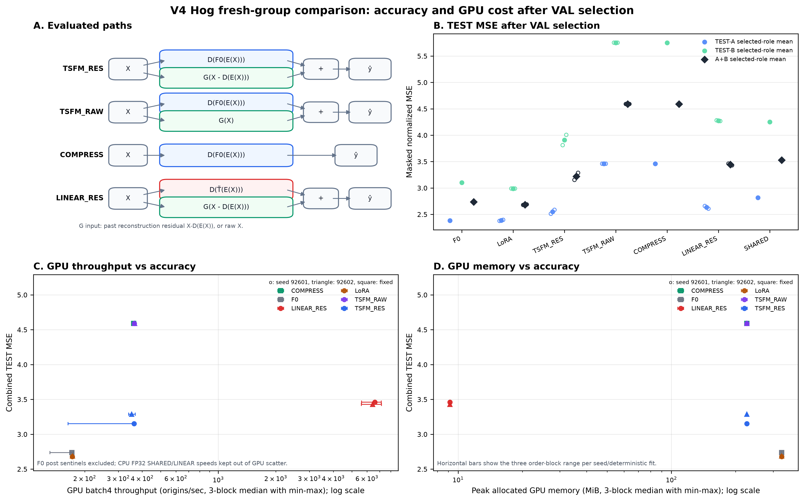

# 잔차 PEFT v4 — Hog 새 집단 고정 확인

완료 판정: **잔차 입력 설계는 후속 방법으로 유지한다. 현재 구성은 GPU 메모리와 정확도의 절충을 위한 조건부 선택지이며, 다음에는 알려진 정확도 손해를 줄이는 개발을 우선한다.** 신경망16+CPU ridge3 적합, 고정 TEST, 비용 측정과 저장 증거 검산을 완료했다. 이번 확인의 완료와 논문 전체의 신규성·검증 완료는 구분한다.

이번에 새로 지지된 것은 **Hog 사무용 전력 집단의 고정 압축 구성에서 재구성 잔차 입력이 유용하다는 것**이다. RES의 전체 MSE는 VAL 선택 RAW/COMPRESS보다 29.86% 낮았다. 반면 미압축 F0보다 17.61%, LoRA보다 20.00% 높았다. 잔차 구조의 추가 가치와 최고 정확도는 다른 판단이다.

**자료와 노출 범위**

- BDG2 Hog의 여러 사무용 건물 전력 계열을 동일 시간축으로 정렬했다. 한 단변량 계열의 복제가 아니다. TRAIN 적격 69/73개 중 사전 ID 정렬의 앞32개, C32/K8로 고정했다. 채널 목록·품질·source/hash는 [data_contract.json](data_contract.json), 결과 비의존 제외 순서와 조사 범위는 [승인 PLAN](PLAN.md)에 있다.
- Bobcat/Cockatoo/Gator는 적격 채널 부족, Eagle/Fox는 실제 과거 평가 노출 때문에 제외했다. Hog는 지정한 네 로컬 저장소의 연구·결과·기록 파일 제한 검색에서 이번 방법 선택에 사용한 직접 예측/성능 흔적을 찾지 못했다. 전체 이력 무사용 증명은 아니다. 전체 CSV의 기존 보관과 해당 site의 성능 사용을 구분했다.
- 기존 공식 원천 revision `9b97ccbe90096aff42ed4fd6493bf7ae692d7118`의 raw electricity/metadata를 재사용했다. raw도 원천에서 통합·초기 정제를 거친 자료다. clean variant로 교체하거나 0을 결측으로 바꾸지 않았다. 추가 다운로드0. 시간별 kWh, Hog metadata `US/Central`, CSV의 local-naive 시간 격자를 유지했다. UTC/DST 재매핑 없음. [BDG2 원문](https://www.nature.com/articles/s41597-020-00712-x), [저자 저장소](https://github.com/buds-lab/building-data-genome-project-2).
- GIFT 사전학습 목록 메모에 Hog가 등장한다. 현재 Bolt revision의 사전학습 중복은 미확정이다. 이 결과를 사전학습과 완전히 분리된 집단의 확증이라고 부르지 않는다. 실행팀의 검산 역시 독립 재현이 아니다.

**먼저 고정한 정보와 선택**

```text
구간        반개방 날짜                         원점
TRAIN       2016-01-23 ~ 2016-04-15             1,945 (stride 1)
VAL         2016-04-17 ~ 2016-05-18                30 (stride 24)
TEST-A      2016-05-20 ~ 2016-06-30                40 (stride 24)
TEST-B      2016-06-30 ~ 2016-08-10                40 (stride 24)
```

과거 문맥은2016-01-01부터 확보했다. L512/H48이며 모든 미래48개가 해당 구간 안에 들어가는 원점만 사용했다. TEST 후속 원점은 당시 관측 가능한 과거를 입력으로 쓰지만 가중치를 업데이트하지 않았다. TRAIN 평균/표준편차·PCA·결측 입력 처리만 사용하고, 미래 정답은 원래 관측 mask로 채점했다.

주 지표는 TRAIN 표준편차로 정규화된 관측 미래의 채널 동일 가중 MSE다. 채널별 TEST-A/B 오차합과 관측수를 먼저 합친 다음 채널 평균, 그다음 개별 seed 손실 평균을 계산했다. 기간 MSE 단순 평균이나 예측 ensemble이 아니다. TEST-A/B의 채점 항은 각각61,320/60,904개, 합계122,224개다. 이는 겹친 목표를 포함한 오차 항 수이며 독립 관측 수가 아니다. 80개 원점은 같은 site의 두 연속 기간이고 두 독립 데이터셋이 아니다.

CURRENT/FIXED_ED 두 모드를 RES/RAW/LINEAR에 각각 제공했다. seed92601/92602별 최소 전체 VAL checkpoint(step0 포함, 동률이면 최초)을 고른 뒤 두 seed best VAL 평균으로 모드를 선택했다. 정확한 모드 동률은 FIXED_ED 우선이다. SHARED penalty는0.001/0.1/10 중 VAL 최소, 동률은 기재 순서로 선택했다. TEST 뒤 선택 변경은 없었다. [protocol](protocol.json), [선택](selected.json), [TEST 전 봉인](evaluation_seal.json), [최초 노출](test_exposure.json).

**실제로 학습한 구조**

```text
TSFM_RES   = D(F0(E(X))) + G(X - D(E(X)))
TSFM_RAW   = D(F0(E(X))) + G(X)
COMPRESS   = D(F0(E(X)))
LINEAR_RES = D(T_tilde(E(X))) + G(X - D(E(X)))
```

F0는 revision `772f3d25d38aec6d914c8949dab4462e2d46f5d8`의 동결 Chronos-Bolt-small이다. 실제 기존 config/가중치 hash는 [model_source.json](model_source.json)에 기록했다. E/D는 채널 선형층, G는 공유·무편향·무활성화512→32→48이며 출력층0으로 시작했다. T는 G와 별개인 affine512→48(24,624개 파라미터)에 v3 문맥 정규화·역변환을 적용한다. 따라서 LINEAR_RES 전체를 전역 순수 선형 함수라고 부르지 않는다. 선형 배포 인스턴스에는 F0가 없다.

기본 신경망16fit와 CPU ridge3fit를 모두 실행했다. 이전 site의 학습된 가중치를 복사하지 않았다. 새 TRAIN PCA와 동일 seed의 초기 E/D/G를 명시적으로 공유하고 hash·표본 순서를 기록했다. FP32, dropout/TF32 비활성, AdamW/weight decay0/clip1, epoch당512원점·batch4, 최대120epoch/patience6 및 기존 plateau scheduler를 유지했다. LoRA는r8/q,v/alpha16/LR1e-4의 native quantile loss, 나머지는LR1e-3의 원채널 masked macro MSE다. LoRA의 다른 학습 목적은 실용 비교의 제한이다.

```text
VAL 선택       모드       선택 epoch (92601 / 92602)  best VAL 평균
TSFM_RES       FIXED_ED      10 / 4                    0.795698
TSFM_RAW       FIXED_ED       0 / 0                    0.936231
LINEAR_RES     FIXED_ED      10 / 18                   0.800639
LoRA           고정 레시피    3 / 2                    0.759028
COMPRESS       FIXED_ED       무학습 참조               0.936231
SHARED         penalty0.001  결정론적 TRAIN ridge      별도 선택 기록
```

선택 RES는 E/D와 F0를 고정하고 G의17,920개만 학습했다. LINEAR의 학습 가능 파라미터는 T/G의42,544개, LoRA는294,912개다. 등록된 학습 가능 수와 실제 달라진 수는 구분한다. LoRA의 최종 상태에서 초기값과 달라진 scalar는 seed별245,759/245,760개였다. CURRENT 후보에서는 E/D도 실제 갱신했다. 합성 검사는 CPU 한 세션 총10update였고, 실제 데이터의 동결·갱신·선택 checkpoint 재생·optimizer/scheduler/RNG 복원도 각 실행에 기록했다. LINEAR FIXED의 VAL은 각 seed에서2.2271→0.7996, 2.4850→0.8017로 개선됐고 고정 TRAIN probe도 개선됐다. 학습되지 않은 선형 초기값과 비교한 결과가 아니다.

신경망16fit 모두 정체 규칙으로 종료되어 사전240epoch 연장 조건에 해당한 실행은0개였다. ridge3fit는 closed-form 적합이다. RAW도 각 seed에서768update를 했지만 VAL이step0을 선택했다. 따라서 선택 RAW는 COMPRESS와 같은 함수다. 이것을 미실행이나 구현 실패로 분류하지 않으며, 두 독립적인 기준선을 이긴 증거로 중복 집계하지 않는다. [TRAIN/VAL 종료 판단](pretest_training_check.json), [각 실행](runs/), [ridge 선택](shared_ridge_selection.json).

**세 비교가 지지하는 것**

아래는 사전 고정한 주 MSE이며, 학습 모델은 개별 두 seed 손실 평균이다. 모든 값이 낮을수록 좋다. 미선택 모드까지 포함한19개 모델의 전체 수치·MAE·채널별 값은 [고정 평가 원본](v4_test_01.json)에 있다.

```text
선택 방법          TEST-A      TEST-B      전체 A+B    전체 MAE
F0                 2.383852    3.100284    2.738044    0.636102
LoRA               2.386395    2.989048    2.683560    0.618902
TSFM_RES           2.548722    3.909009    3.220290    0.996522
TSFM_RAW           3.459547    5.752751    4.591135    1.340760
COMPRESS           3.459547    5.752751    4.591135    1.340760
LINEAR_RES         2.633281    4.275070    3.445439    0.990438
SHARED-LINEAR      2.815176    4.250597    3.526869    0.840297
```

```text
방법 / seed          TEST-A      TEST-B      전체 A+B
RES 92601            2.511488    3.811587    3.153404
RES 92602            2.585957    4.006431    3.287175
LINEAR 92601         2.658511    4.281942    3.461416
LINEAR 92602         2.608051    4.268198    3.429462
LoRA 92601           2.376394    2.989324    2.678683
LoRA 92602           2.396397    2.988773    2.688436
```

RAW 두 seed는 선택 함수가 동일하여 위 전체 표의 값과 같다. F0/고정 COMPRESS/SHARED는 결정론적 참조 한 개로 집계했다.

1. **잔차 입력의 추가 가치:** RES−RAW의 전체 절대차는−1.370845, RAW를 분모로−29.86%다(A−26.33%, B−32.05%). 7원점 블록의 조건부95% 구간은 전체 절대차[−1.695899, −1.208922], 상대차[−35.15%, −26.40%]다. RES가 고른 모드와 RAW 자체 선택 모드가 같아 동일 모드 비교와 선택 결과 비교가 일치했다. 이번 구조·레시피·VAL 정책에서 잔차 경로의 추가 가치가 새 집단에도 남았다는 근거다. 최적 튜닝된 모든 RAW보다 낫다는 주장이나 성공 원인의 순수 인과 증명이 아니다.
2. **TSFM 경로의 추가 가치:** RES−LINEAR의 전체 절대차−0.225149, LINEAR를 분모로−6.53%, 조건부 구간[−9.03%, −0.37%]다. 두 seed의 전체 차이는−8.90%/−4.15%다. 그러나 A/B 각각의 조건부 구간은0을 포함한다. SHARED 대비 전체−8.69%의 구간[−12.02%, +0.36%]도0을 포함한다. MAE는 LINEAR와 SHARED가 더 낮다. 따라서 TSFM 필요성의 근거는 이번 주 MSE·평가 범위에 한정되며 일반 선형 모델 전체의 상한이나 순수 사전학습 지식 효과가 아니다.
3. **강한 실용 대안 대비 정확도:** F0를 분모로 RES MSE는+17.61%, LoRA를 분모로+20.00%다. LoRA 대비 손해는 A+6.80%에서 B+30.78%로 커졌다. 압축 손해를 해결했다는 주장은 지지되지 않는다. 비용 이득을 확인하더라도 정확도 손해를 함께 제시해야 한다.

조건부 구간은 사전7원점·2,000회·seed9262026의 대응 블록 재표집이다. 모든 채널/모델을 함께 움직이고 A/B 안에서 별도로 뽑았다. 두 학습 seed를 고정한 기간 변동 요약이며 학습·모드 선택 불확실성을 모두 포함하지 않는다. 9개 비교 중 주 대조는 사전 RES 대 같은 모드 RAW이며, 중복 비교를 독립 확증으로 세지 않는다.

**방법 설명의 경계**

[AdaPTS(2025/ICML)](https://proceedings.mlr.press/v267/benechehab25a.html)의 잠재 입출력 어댑터·예측 목적 공동학습은 기존 원리다. PCA/E/D/공동학습을 새 기여로 주장하지 않는다. COMPRESS는 가까운 구조 대조이며 AdaPTS 전체 확률모형·최적 튜닝의 재현이 아니다. G는 과거 재구성 잔차를 입력으로 받고 최종 미래 오차로 학습했으며 별도 미래 잔차 정답으로 학습하지 않았다. 선형 G의 대수적 동치는 성공 원인 증명이 아니고, 학습된 DE의 직교투영을 가정하지 않는다. 초기 G=0은 COMPRESS를 보존할 뿐 미압축 F0의 정확도를 보존하지 않는다.

유한한 VAL 선택을 먼저 고정하고 TEST를 분리한 이유는 [모델 선택 편향 연구](https://jmlr.org/papers/v11/cawley10a.html)와 일치한다. 이제 Hog TEST-A/B는 노출된 자료다. 향후 그 결과에 반응해 수정한 방법을 이 동일 구간에서 다시 평가하면 새 확증으로 부르지 않는다.

**실제 비용과 측정 변동**

RTX4070, PyTorch2.10.0+cu128, PEFT0.21.0, Chronos2.3.2, FP32/TF32 off, CPU thread4를 사용했다. 공통 VAL24원점, batch1/4, 예열10회, 전체24원점20회, 순서3블록이다. GPU 배포 범위는 표준화 CPU 입력→H2D→전체 원채널 H48 CPU 출력이며 동기화했다. 로드·디스크·채점·원장은 시간 밖이다. 각 fit의 세 블록 중앙값을 취한 뒤 seed별 중심값을 평균했다. 아래 batch1은 원점당 ms, batch4는 초당 원점 수다. [GPU 원자료66행](v4_cost_gpu_02.json), [CPU 원자료18행](v4_cost_cpu_01.json).

```text
GPU 배포          batch1 ms   batch4 원점/초   batch4 peak allocated / reserved MiB
F0                   10.718          171.26        328.676 / 374
병합 LoRA            10.650          172.52        328.676 / 374
TSFM_RES             10.119          357.14        225.859 / 236
TSFM_RAW              9.886          364.57        225.859 / 236
COMPRESS             10.042          360.56        225.791 / 236
LINEAR_RES            0.549        6,516.27          9.165 / 22
```

RES의 batch4 처리량 중심값은 F0 대비+108.53%, LoRA 대비+107.01%(약2.07배)이고, peak allocated는 둘보다31.28% 낮다. **항상 두 배 빠르다는 결론은 아니다.** RES92601은 block0에서163.44원점/초로 당시 LoRA 약173보다 느렸고, 후속 블록은362.42/362.34였다. RES92602는351.94/368.00/340.00이었다. F0는131.59/171.26/173.67, LoRA 전체 범위는171.88~173.24였다. 유리하지 않은 첫 블록도 그대로 포함했다.

F0 block0의 batch1 전후 기준 측정은23.251→10.790ms로 IQR도 겹치지 않았다. batch4 원점당 지연은7.600→5.781ms였다. 후속 두 블록의 전후 IQR은 겹쳤다. RES batch1의 전체 블록 범위9.778~23.520ms와 F0의10.516~23.251ms를 고려하면 작은 batch1 우위는 안정적으로 확보됐다고 말할 수 없다. 압축 세 방법 사이의 작은 속도 순위도 설계의 확정적 이점으로 해석하지 않는다. 할당 메모리는 해당 블록에서 일정했으나, 이 결과는 실제12GiB 장치에서 OOM을 해결했다는 뜻은 아니다.

비용 첫 실행은 LINEAR의 저장 VAL 재생 검사에서 중단됐다. 36,864개 값 중2개가 당시atol1e-6/rtol1e-5를 넘었고 실패한 값의 최대 절대차는1.371e-6이었다. 원래30원점 grouping으로 재생하면 두 seed 모두 저장값과 완전히 일치했다. 24원점 재배치 진단의 최대차는1.907e-6이었지만 최초 허용오차 위반 자체를 그대로 재현하지는 못했다. 따라서 최초 원인을 단정하지 않는다. 후속 GPU/CPU 재생 기준만 기존 CPU·LoRA 병합과 같은atol1e-5/rtol1e-4로 통일하고, 최대차와 옛 기준 위반 수도 기록했다. 학습·선택·TEST 수치는 변경하지 않았다.

[원본 실패10행](v4_cost_gpu_01_partial.json), [재생 진단](cost_replay_diagnostic_01.json), [수리 내역](repairs/cost_replay_fix.json)과 [diff](repairs/cost_replay_fix.patch)를 보존했다. 완료10행은 hash를 확인해 그대로 재사용하고 나머지만 이어 측정했다. 따라서 block0는 실패·진단·재시작으로 중단된 블록이다. 연속된 정상 블록처럼 포장하지 않으며 이 중단이 시간 변동 원인 전체를 설명한다고도 주장하지 않는다.

사전 규칙에 따라 GPU 상주 진단을 한 번 추가했다. 원점당 wall/event ms는 F0 batch1 10.581/10.579, batch4 5.715/5.711; RES 9.645/9.642, 2.647/2.642; LINEAR0.432/0.428, 0.123/0.119였다. 이것은 전체 forward 진단이며 CUDA event도 CPU dispatch 사이의 유휴시간을 포함할 수 있다. 순수 kernel/FLOPs나 배포 측정과의 차이를 순수 전송 비용이라고 부르지 않는다. 최초 환경 변동의 근본 원인은 미확정이다. [진단6행](v4_cost_diagnostic_01.json).

LoRA는 병합 반환 모델을 사용했고 공통 VAL 병합 전후 최대 절대차3.815e-6으로 정합성을 확인했다. CPU 배포는 동일 i7-13700F/thread4/FP32에서 LINEAR batch1 0.220ms·batch4 9,795.43원점/초, SHARED0.020ms·85,320.61원점/초였다. CPU 실행도 블록 변동이 있으며, GPU 커널 속도와 섞지 않는다. 선형 대안의 훨씬 작은 비용과 더 낮은 MAE는 RES의 제한을 판단하는 중요한 근거다. 측정 범위는 [PyTorch benchmark 안내](https://docs.pytorch.org/tutorials/recipes/recipes/benchmark.html)와 [PEFT 병합 안내](https://huggingface.co/docs/peft/main/conceptual_guides/lora)를 참고하되 실제 설치 버전·실행 정합성으로 확인했다.

**파라미터·저장·학습 비용의 구분**

```text
배포 모델       전체 파라미터 수   파라미터+buffer bytes
F0/병합 LoRA       47,718,016             190,872,100
RES/RAW            47,736,448             190,945,828
COMPRESS           47,718,528             190,874,148
LINEAR_RES             43,056                 172,224
SHARED          buffer 계수24,624              98,496
```

RES의 작은 학습 파라미터 수가 전체 백본 저장 크기를 줄이지는 않는다. 어댑터·PCA·설정 등을 포함한 선택 checkpoint는 RES/RAW78,200bytes, LINEAR177,066bytes, LoRA1,204,059bytes, CURRENT COMPRESS6,086bytes다. 직렬화 크기를 순수 weight bytes나 전체 배포 크기와 혼동하지 않는다. GPU 비용 측정의 프로세스 RSS 약1.44~1.46GB에는 Python·자료 등도 포함된다. WDDM의 NVIDIA 프로세스 GPU 메모리N/A는0이 아니다. allocated/reserved와 별개다.

```text
학습군      fit 수   실행 epoch 범위   fit 시간 합(초)   학습 peak allocated MiB
RES             4          7~16             268.61          235.10~368.76
RAW             4          6                180.49          235.10~368.69
LINEAR          4          7~24             102.67           19.06~19.22
LoRA            2          8~9              227.84          889.98
COMPRESS        2          6                119.12          368.42
```

시간에는 각 실행의 학습·선택 확인이 들어가며 epoch·조기 종료 길이가 다르다. 통제된 학습 속도비가 아니다. RAW의 실제 마지막 상태 갱신과 VAL이 고른step0 무갱신 상태도 구분한다. 모든 파라미터 갱신·동결·checkpoint 위치와 hash는 각 [run 기록](runs/)에 있다.

**검산·예산·재현 기록**

[final_checks.json](final_checks.json)은PASS다. 승인 PLAN/protocol·이전406개 파일·백본 hash,16신경망fit/3ridge, 초기값·표본 순서·갱신/동결·저장/복원,19개 모델의80원점 저장 예측과VAL/TEST 수치, 채널별 오차합/관측수와seed 손실 평균, 비용 원자료66+18행과 재사용10행을 확인했다. bootstrap은 다시 실행하지 않았다. 실행팀의 저장 증거 검산이며 독립 재현은 아니다. 이후 그림의 겹친 글자·범례만 정리했고 모델·점수·비용 값은 바꾸지 않았다.

- 실자료19/24attempt: 신경망16+ridge3. 적합 실패·재시도·학습상한 연장0. 추론/비용 실패1은 fit가 아니며GPU시간에 포함했다.
- 합성 optimizer1/6세션, 세션 전체10update; 게시 정적 검사 포함 CPU검사7.264초/900초. TRAIN 통계 준비0.942초와 CPU집계·그림84.836초는 별도다.
- GPU 작업점유1,292.008초=21.533분/240분. 상위job/하위fit를 중복 가산하지 않았다. 학습·추론·복원·예열·실패·진단을 포함한다.
- 신규 저장은 게시 정적 검사 시36,859,653bytes(약35.15MiB)/10GiB다. [게시 검사](publication_checks.json), [ledger](ledger.json)와 [STATUS](STATUS.md)에 시점별 수치를 연결한다. 추가다운로드0, 자원충돌 대기0. v2의22/20회 위반은 그대로 보존했다.

실제 CLI·환경 버전·코드 hash는 각 `*_attempt.json` 및run의 `environment.command`, 실행 분류·PID·시작/종료·update·소요시간은[원장](ledger.json), 자료/분할·원점·모델 hash는 계약과봉인에 있다. 실행 흐름은 `prepare_v4.py → train_v4.py --prepare-initial → check_models_v4.py → train_v4.py → fit_shared_v4.py → evaluate_v4.py --seal → --evaluate → cost_v4.py → verify_v4.py → plot_v4.py`였다. 정확한 인수는 각 원기록을 따른다. 기존 완료 경로에서 같은 fit/TEST를 중복 시작하지 않는다. raw·가중치·예측 배열은 무시된 `.cache/tsfm_peft_fresh_group_v4_20260927/`의 기록된 위치에 보존하며 게시하지 않는다.

**최종 판단과 남은 결정 하나**

1. **잔차 입력 설계 유지:** Hog에서 RAW와 같은 FIXED_ED/K8/G용량·정보 조건으로 전체 및 두 기간 MSE 이득이 남았다. 기존 Electricity/Bull 개발만 반복한 상태에서 벗어나, 사전 고정된 새 방법선택 집단에서 추가 근거를 얻었다. 다만 RAW의 step0 선택과 이번 유한 레시피 범위를 포함하는 결과다.
2. **현재 TSFM 구성은 조건부 유지:** 선택 LINEAR보다 주 MSE가6.53% 낮고, 미압축 LoRA보다 측정된 peak allocated가31.28% 낮다. 그러나 LoRA 대비 MSE20.00% 손해, 훨씬 싼 선형 대안, 비용 블록 변동이 남는다. 선형 대안에 비해서는 제한된 MSE 이득을 위해 훨씬 큰 비용을 지불하는 선택이다. 처리량 중심값만으로 안정적 배포 우위·최고 정확도·최저 지연을 선언하지 않는다. 허용 가능한 오차 손해나 임의 합격선도 새로 만들지 않는다.
3. **다음 단일 결정:** 확증 범위를 즉시 넓히기보다, **현재 확인된 미압축 F0/LoRA 대비 정확도 손해를 줄이는 개발 회차로 돌아갈지**를 결정한다. 이 보고서는 그 방향을 권고한다. 이번 회차에서 새 모듈이나 추가 site는 실행하지 않았다. 향후 개발은 Hog가 이미 노출됐음을 전제로 하고, 바뀐 방법의 확증에는 새로 보호한 자료가 필요하다.



그림 B는 각 기간과 전체를 모두 포함하고, 열린 점은 개별 seed·고정 모델이다. C/D의 가로 범위는 각 모델의 세 순서 블록 범위이며 통계적 신뢰구간이 아니다. RAW/COMPRESS의 일치점은 겹칠 수 있다. CPU 속도를 GPU 그림에 섞지 않았다. [SVG](figures_v4/comparison.svg), [정확한 수치·원본 hash·설명](figures_v4/caption.json).
