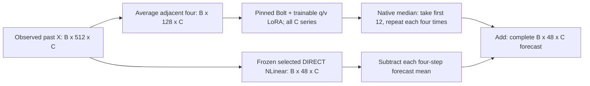

# Temporal allocation: what changed and what would count as evidence

The question is whether moving the expensive model's reduction from channels to time creates a useful accuracy-cost choice. Previous models obtain TSFM forecasts from K channel directions/coordinates and use a cheap full-channel bypass. They do not all restrict the final output to rank K, and they do not all use a linear residual head. Their normal negative results do not by themselves prove which information was missing.

V16 preserves every original channel as a separate TSFM series but averages each consecutive four historical observations. The TSFM forecasts twelve coarse observations from128 inputs. Repeating each future value four times supplies a block-constant48-step forecast. An already selected, frozen original-channel NLinear supplies its predicted variation within each future block. Only standard internal LoRA is newly trained. The original backbone and NLinear weights remain fixed.

Let A average adjacent groups of four and R repeat each coarse value four times. On future predictions P=RA and Q=I-P. For frozen direct forecast S and adapted backbone F_phi:

    f_phi(X) = R F_phi(A X)[:12] + Q S(X)
             = S(X) + R [F_phi(A X)[:12] - A S(X)].

The fine branch transforms predicted future values, not observed future targets. Only the LoRA variables in the upper branch are newly optimized. The native64-step head still executes before cropping.

All grouping is relative to the forecast origin. Q operates on predicted values, never on observed future targets at inference. The point forecast is the native inverse-scaled median. This is not a claim that a median of averages equals an average of medians. The pin's native64-point head still runs; only its first12 outputs enter the final forecast.

This allocation keeps channels, not all information. Fine historical structure discarded by A can matter for future block means. S's Q contribution cannot change those means. With complete targets, coarse and fine errors are orthogonal in future-time coordinates. With within-block missing targets the original masked loss need not decompose. Channel-wise constant weights alone do not invalidate this temporal orthogonality. We retain the original masked macro objective and all target observations.

The zero-LoRA initial model is R F0(A X)+Q S(X), not DIRECT or full-resolution F0. Its accuracy may be worse. Standard LoRA's zero-update initialization preserves that initial function only. Keeping all channels or reducing encoder tokens from33 to9 does not guarantee accuracy preservation, a fourfold speedup or low total model size. All C rows, the full backbone, native decoder/head and direct predictor remain in deployment.

Comparisons have distinct roles:

- TEMPORAL_LORA versus TEMPORAL_F0: internal adaptation within this fixed allocation.
- TEMPORAL_LORA versus same-checkpoint COARSE_ONLY: contribution of the fixed fine prediction after the prescribed joint-output training. This is not a best-trained no-fine alternative.
- DIRECT: whether the cheap complete predictor is enough.
- Full-resolution MSE-LoRA/native LoRA/F0: accuracy and ordinary/chunked execution alternatives.
- Earlier A: the channel-compressed internal-LoRA alternative. A and v16 differ in parent and information allocation; their contrast is not a pure axis-only causal intervention.

The close principles are established: LoRA, NLinear, multiscale forecasting and frozen-model residual wrappers. PLAN records the actually read TimeMixer abstract and SMR2 method. Single-scale temporal shortening, internal adaptation and complementary predicted-detail composition define this experiment; their combination is not automatically an original paper contribution.

All16 fits, fixed selection and60 evaluation instances are complete. The candidate improves its own zero-update temporal allocation but remains worse than full-resolution MSE-LoRA on pooled MSE and MAE in all four datasets. Jena improves the earlier channel-compressed A model's point MSE/MAE, with a period-dependent MSE difference; its fixed fine prediction is worse than the same-checkpoint coarse-only output. Complete-block temporal diagnostics locate the larger excess error in P on every dataset. That locates the remaining error without isolating information loss, pretrained time-scale mismatch or optimization as its unique cause. TOPIC_DECISION.md retains the numeric evidence and same-session cost outcome.

All588 GPU and48 CPU measurements are complete. Jena temporal deployment trades MSE0.248391 for218.68MiB and280.14origins/s at batch4, versus full MSE-LoRA0.232892/281.94MiB/206.70origins/s. The same stronger LoRA chunked to4K rows reaches218.34MiB and81.43origins/s. This is a restricted accuracy-throughput choice, not unique memory savings. Batch1 latency is worse in point estimates on all four datasets; sentinel drift and all raw blocks remain visible. The fine branch's adverse Jena contribution is not removed from this reported system.

Four repeatedly used datasets remain development evidence. No unit-test success, source review or agreement between agents is an independent reproduction or evidence of scientific improvement. The common accuracy problem is not solved by this fixed temporal allocation. The campaign ends without additional fitting, a new stride or a changed selection policy.
