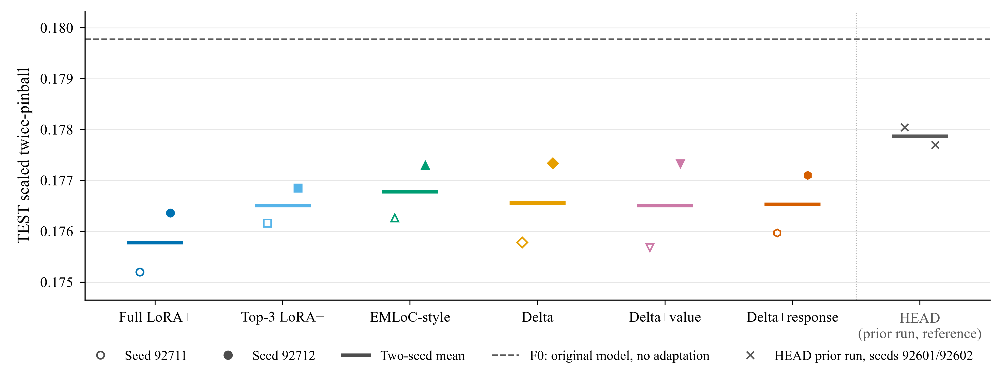
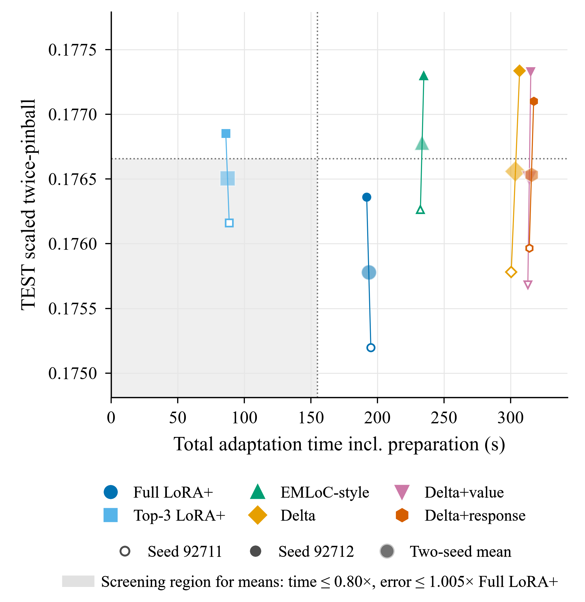
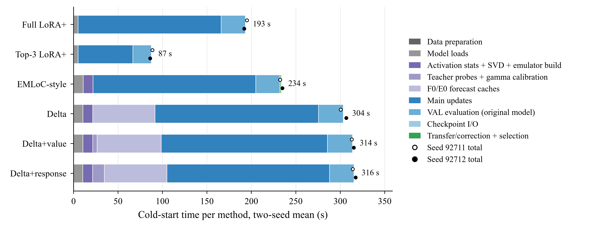
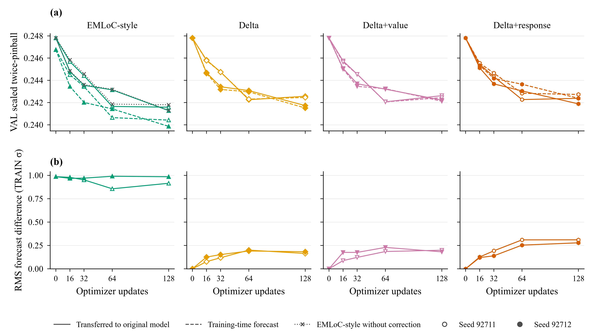
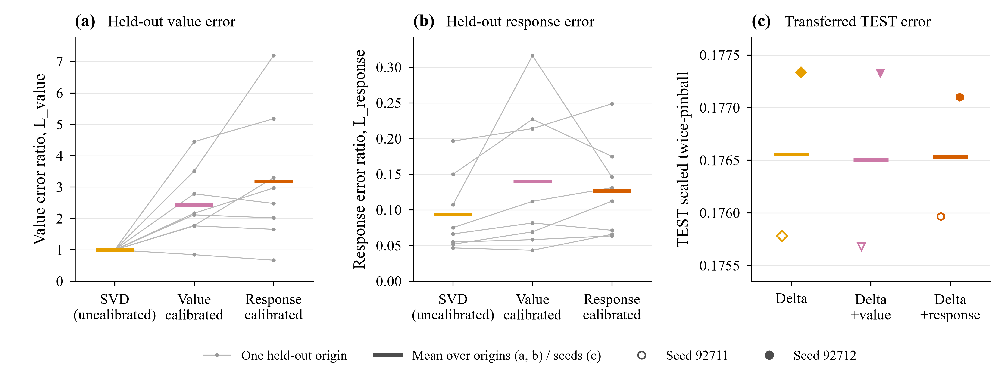

# Figure captions — emulator_response_gonogo_v1_20260922

Generated by `experiments/emulator_response_gonogo_v1_20260922/figures.py` from the CSV files in this folder. Every number below is computed from those files; plotted values are listed in [FIGURE_VALUES.csv](FIGURE_VALUES.csv).

## Figure 1. Transferred TEST quality

Fig. 1. TEST error of the original Chronos-2 model after the LoRA of each method is placed on it. Open and filled markers are seeds 92711 and 92712; horizontal strokes are two-seed means. Each seed uses its own validation-selected checkpoint (selected update, seed 92711/92712: Full LoRA+ 64/128; Top-3 LoRA+ 128/128; EMLoC-style 128/128; Delta 64/128; Delta+value 64/128; Delta+response 64/128). The dashed line is the unadapted original model (F0, 0.1798). Mean error reduction relative to Full LoRA+ (0.1758; positive = lower error): Top-3 LoRA+ -0.41%, EMLoC-style -0.57%, Delta -0.44%, Delta+value -0.41%, Delta+response -0.43%. Crosses on the right are the output-head adaptation (HEAD) of an earlier run with other seeds (92601, 92602; mean 0.1779); it is shown for orientation only and is not part of this comparison. The y-axis does not start at zero. Jena only, seeds 92711 and 92712, a fixed 128-update budget. Errors are quantile twice-pinball losses scaled by the TRAIN standard deviation of each series (lower is better). Two seeds are not a significance test. Methods: Full LoRA+ (F_FULL) trains LoRA+ on 97 modules of the original Chronos-2; Top-3 LoRA+ (F_TOP3) on 25 modules in the last three encoder blocks and the output projection; EMLoC-style (E_EMLOC) trains on the SVD emulator and applies an EMLoC-style correction when moving the LoRA to the original model; Delta (E_DELTA), Delta+value (E_VALUE_DELTA) and Delta+response (E_RESPONSE_DELTA, the candidate) compute the training loss on the frozen original-model forecast plus the forecast change that the LoRA causes in the uncalibrated, value-calibrated or response-calibrated emulator, respectively, and copy the LoRA to the original model unchanged. All scores are of the original model carrying the transferred LoRA.

Files: [PDF](figures/fig1_transferred_quality.pdf) · [SVG](figures/fig1_transferred_quality.svg) · [PNG](figures/fig1_transferred_quality.png)

## Figure 2. Total adaptation time and transferred TEST error

Fig. 2. Total adaptation time versus TEST error of the original model carrying the transferred LoRA. Total time charges each method its full cold-start cost: data preparation, every compression, calibration and cache stage it depends on (charged in full even when physically shared between methods), all 128 updates, checkpoint I/O, transfer or correction and original-model VAL at every checkpoint, and final selection/export; diagnostic-only computation is excluded. Small open and filled markers are seeds 92711 and 92712; large markers are two-seed means, joined to their seeds by thin lines. Dotted lines are the pre-registered screening thresholds relative to the Full LoRA+ means (193.5 s, 0.1758): total time at most 154.8 s (20% saving) and TEST error at most 0.1767 (+0.5%). The shaded region satisfies both for the means only; the screening decision also requires both seeds to satisfy the conditions and requires timing-reliability checks, which are not drawn. Methods whose means fall in the shaded region: Top-3 LoRA+. Mean total-time saving relative to Full LoRA+ (positive = faster): Top-3 LoRA+ +54.8%, EMLoC-style -20.7%, Delta -56.9%, Delta+value -62.3%, Delta+response -63.1%. The x-axis starts at zero; the y-axis does not. Jena only, seeds 92711 and 92712, a fixed 128-update budget. Errors are quantile twice-pinball losses scaled by the TRAIN standard deviation of each series (lower is better). Two seeds are not a significance test.

Files: [PDF](figures/fig2_total_cost_frontier.pdf) · [SVG](figures/fig2_total_cost_frontier.svg) · [PNG](figures/fig2_total_cost_frontier.png)

## Figure 3. Cold-start cost breakdown

Fig. 3. Where the cold-start time of each method goes (two-seed mean, seconds only). Components are those charged in Fig. 2: grey = data preparation and model loads (the original-model load for compression, the model load at the start of each fit and the original-model reload for transfer); purple = emulator-only preparation (activation statistics, SVD and emulator construction; teacher probe forecasts, initial error and gamma calibration; F0/E0 training and VAL forecast caches); blue = the fixed 128-update procedure (updates, original-model VAL at every checkpoint, checkpoint I/O); green = transfer or correction plus final selection/export. Open and filled black markers are the per-seed totals of seeds 92711 and 92712; numbers are two-seed mean totals (Full LoRA+ 193.5 s, Top-3 LoRA+ 87.4 s, EMLoC-style 233.5 s, Delta 303.6 s, Delta+value 314.0 s, Delta+response 315.6 s). For every method and seed the components sum to the total used in Fig. 2 (checked when this figure is generated). Main updates account for 83%, 70%, 78%, 61%, 60%, 58% of the mean totals, in the order above. Jena only, seeds 92711 and 92712, a fixed 128-update budget. Two seeds are not a significance test.

Files: [PDF](figures/fig3_cost_breakdown.pdf) · [SVG](figures/fig3_cost_breakdown.svg) · [PNG](figures/fig3_cost_breakdown.png)

## Figure 4. Training-time versus transferred forecasts

Fig. 4. Forecast used during training versus the forecast actually obtained after transfer, for the four emulator-trained methods at every recorded checkpoint (0, 16, 32, 64, 128 updates). (a) VAL error of the training-time forecast (dashed; for EMLoC-style the emulator's own forecast, for the Delta methods the frozen original forecast plus the emulator's change) and of the original model carrying the transferred LoRA (solid). For EMLoC-style the dotted grey line is the same LoRA transferred without correction (diagnostic). (b) Root-mean-square difference between the training-time and transferred forecasts over VAL origins, series, quantiles and horizon, in units of the TRAIN standard deviation. Only the transferred VAL error is used to select checkpoints; the other curves are diagnostics. Open and filled markers are seeds 92711 and 92712. At update 128, the two-seed mean transfer gap (transferred minus training-time VAL error) is EMLoC-style +0.0013, Delta +0.0002, Delta+value +0.0001, Delta+response -0.0004; the mean RMS difference is EMLoC-style 0.9500, Delta 0.1733, Delta+value 0.1901, Delta+response 0.2942. Panels in a row share the y-axis. Jena only, seeds 92711 and 92712, a fixed 128-update budget. Errors are quantile twice-pinball losses scaled by the TRAIN standard deviation of each series (lower is better). Two seeds are not a significance test.

Files: [PDF](figures/fig4_transfer_mismatch.pdf) · [SVG](figures/fig4_transfer_mismatch.svg) · [PNG](figures/fig4_transfer_mismatch.png)

## Figure 5. Response versus value calibration

Fig. 5. Response calibration versus value calibration of the emulator, and what it changes after transfer. (a, b) Calibration diagnostics on 8 held-out TRAIN origins that were not among the 16 calibration origins and use a different probe seed: (a) L_value, the emulator's output error relative to that of the uncalibrated SVD emulator on the same origin; (b) L_response, the error of the emulator's response to a small LoRA probe relative to the original model's response magnitude. Grey points joined by lines follow one origin across the three emulators; coloured strokes are means over origins (L_value: SVD (uncalibrated) 1.000, Value calibrated 2.427, Response calibrated 3.184; L_response: SVD (uncalibrated) 0.094, Value calibrated 0.140, Response calibrated 0.127). Both seeds use the same calibrated emulators, so (a, b) have no seed dimension. (c) TEST error of the original model carrying the transferred LoRA of the three Delta methods (open and filled markers: seeds 92711 and 92712; strokes: two-seed means). Mean error reduction of Delta+response relative to Delta+value is -0.02% (seed 92711 -0.16%, seed 92712 +0.13%; positive = lower error) and relative to Delta +0.01%. Proxy improvement is not forecast success: a lower calibration error in (a, b) does not by itself imply a lower forecast error, and (c) is the outcome that counts. Jena only, seeds 92711 and 92712, a fixed 128-update budget. Errors are quantile twice-pinball losses scaled by the TRAIN standard deviation of each series (lower is better). Two seeds are not a significance test.

Files: [PDF](figures/fig5_response_ablation.pdf) · [SVG](figures/fig5_response_ablation.svg) · [PNG](figures/fig5_response_ablation.png)
