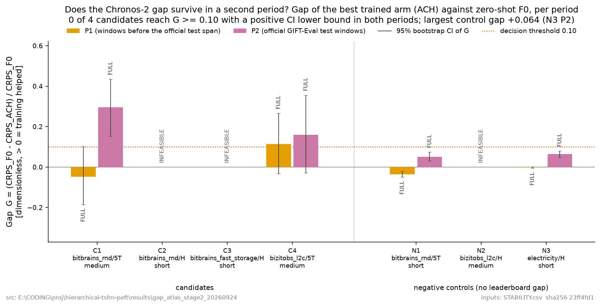

# 격차 지도 Stage 2 — 보고서

## 1. STABILITY

| id | 설정 | 역할 | G_P1 | P1 CI | G_P2 | P2 CI | P1 ACH | P2 ACH | 판정 |
| --- | --- | --- | --- | --- | --- | --- | --- | --- | --- |
| C1 | bitbrains_rnd/5T/medium | candidate | -0.0475 | [-0.1851, 0.1018] | 0.2959 | [0.1521, 0.4354] | FULL | FULL | UNSTABLE_GAP |
| C2 | bitbrains_rnd/H/short | candidate | — | — | — | — | — | — | INFEASIBLE |
| C3 | bitbrains_fast_storage/H/short | candidate | — | — | — | — | — | — | INFEASIBLE |
| C4 | bizitobs_l2c/5T/medium | candidate | 0.1144 | [-0.0327, 0.2665] | 0.1599 | [-0.0286, 0.3559] | FULL | FULL | NO_GAP |
| N1 | bitbrains_rnd/5T/short | control | -0.0367 | [-0.0495, -0.0207] | 0.0500 | [0.0312, 0.0744] | FULL | FULL | NO_GAP / CONTROL_OK |
| N2 | bizitobs_l2c/H/medium | control | — | — | — | — | — | — | INFEASIBLE |
| N3 | electricity/H/short | control | -0.0026 | [-0.0053, 0.0019] | 0.0644 | [0.0478, 0.0800] | FULL | FULL | NO_GAP / CONTROL_OK |

격차 G = (CRPS_F0 − CRPS_ACH)/CRPS_F0. 양수면 학습이 도움이 된 것이다. 기준은 두 기간 모두 G ≥ 0.10 이고 부트스트랩 CI 하한 > 0 (봉인 전 고정).

## 2. 판정

`ATLAS_NO_STABLE_GAP` — 후보 중 두 기간 모두 격차가 유지된 설정이 없음. GIFT-Eval에서 격차 우선 경로 종료. 다음은 사전학습 분포 밖 데이터로 Stage 1을 다시 하는 것.

근거: 후보 중 두 기간 모두 격차가 유지된 설정이 없다. GIFT-Eval에서 격차 우선 경로는 여기서 종료하고, 다음은 사전학습 분포 밖 자료로 Stage 1을 다시 하는 것이다.

## 3. 계획자 전제 중 틀린 것

- [확인] Chronos-2의 기본 context 길이는 8192이다 (`config.json`의 `chronos_config.context_length`). 계약 §5.2는 가능성 조건을 "context 길이 + 5·H"로 쓰는데, 이 값을 그대로 넣으면 가능한 설정이 ['C4', 'N3'] 뿐이라 §4의 후보 목록과 모순된다. 실용값 2048를 써서 ['C1', 'C4', 'N1', 'N3']를 실행했고, 두 해석을 모두 기록했다.
- [확인] 공식 노트북이 쓰는 `predict_batches_jointly` 인자는 chronos-forecasting 2.3.2에 그 이름으로 없다. `cross_learning`의 폐기 예정 별칭이고 내부에서 그대로 매핑된다 (`chronos/chronos2/pipeline.py:570-577`). 의미는 같다.
- [확인] 계약 §2가 지목한 `gift_eval` 패키지는 설치하면 numpy를 1.26으로, datasets를 2.17로 내려 이 환경을 깬다. 패키지 대신 공식 로더 파일을 그대로 가져다 썼다 (sha256 5a3ddfd9701418a4).
- [확인] Toto arm은 실행하지 않았다. 가중치는 공개지만 추론 패키지가 torch를 2.7로, numpy를 1.26으로 되돌린다. 계약 Q6이 허용한 대로 생략하고 기록했다(원래 보고 전용).
- [확인] statsforecast 2.1.1은 공식 래퍼가 분위수 0.5에 대해 만드는 level 0을 거부한다. level 0은 점예측과 같아서 그 항만 모델 점예측 열에서 가져오도록 고쳤다. 분위수 값은 바뀌지 않는다(E0b가 리더보드와 0.00% 일치).

- [확인] 계약 §5.2 가능성 조건으로 7개 중 3개가 제외됐다: C2, C3, N2. §8이 대체 설정 추가를 금지하므로 그대로 뒀다. Stage 1에서 "견고"로 꼽힌 후보 셋 중 둘이 여기서 빠진다.

## 4. E0 — 공식 점수 재현

| id | 설정 | F0 CRPS | 리더보드 | 상대차 | SNAIVE CRPS | 리더보드 | 상대차 |
| --- | --- | --- | --- | --- | --- | --- | --- |
| C1 | bitbrains_rnd/5T/medium | 1.00457 | 1.00457 | 0.000% | 1.16929 | 1.16929 | 0.000% |
| C2 | bitbrains_rnd/H/short | 0.80355 | 0.80355 | 0.000% | 1.24322 | 1.24322 | 0.000% |
| C3 | bitbrains_fast_storage/H/short | 0.66352 | 0.66352 | 0.000% | 1.02224 | 1.02224 | 0.000% |
| C4 | bizitobs_l2c/5T/medium | 0.24721 | 0.24721 | 0.000% | 0.52039 | 0.52039 | 0.000% |
| N1 | bitbrains_rnd/5T/short | 0.41575 | 0.41575 | 0.000% | 1.10159 | 1.10159 | 0.000% |
| N2 | bizitobs_l2c/H/medium | 0.23594 | 0.23594 | 0.000% | 0.90421 | 0.90421 | 0.000% |
| N3 | electricity/H/short | 0.06793 | 0.06793 | 0.000% | 0.10566 | 0.10566 | 0.000% |

E0a 기준 2%, E0b 기준 5%. 최대 상대차는 각각 0.0000% 와 0.0000% 다. 판정 E0_PASS.

설정은 공식 노트북 그대로다 — 분위수 0.1–0.9, cross-learning, float32, batch 100, 창 하나씩 예측. 누설 감사(E0c)는 기간별 학습·검증·선택 구간을 인덱스로 적어 `E0_REPORT.json`에 남겼다.

## 5. 우리 참조 대 리더보드 참조 (계약 §9 첫째)

| id | 설정 | 우리 최선 DL | P2 CRPS | 리더보드 최선 DL | 그 모델 | 상대차 |
| --- | --- | --- | --- | --- | --- | --- |
| C1 | bitbrains_rnd/5T/medium | DL-NHITS | 0.62657 | 0.61350 | xLSTM-Mixer | 0.021 |
| C4 | bizitobs_l2c/5T/medium | DL-PatchTST | 0.32161 | 0.19055 | xLSTM-Mixer | 0.688 |
| N1 | bitbrains_rnd/5T/short | DL-NHITS | 0.42326 | 0.39518 | xLSTM-Mixer | 0.071 |
| N3 | electricity/H/short | DL-NHITS | 0.07360 | 0.07303 | xLSTM-Mixer | 0.008 |

리더보드 값은 Stage 1 의 gDL_crps 로 되돌린 것이다(F0 CRPS × (1 − gDL)). 상대차가 0에 가까우면 우리 딥러닝 참조가 리더보드 수준이라는 뜻이고, 크게 양수면 계약 §9 첫째대로 "격차가 없다"가 아니라 "우리 참조가 약하다"로 읽어야 한다. 하이퍼파라미터가 공개돼 있지 않아 같은 조건은 아니다.

- [확인] C1(bitbrains_rnd/5T/medium) 에서 우리 DL 은 리더보드 최선과 거의 같은 자리에 선다. 즉 P2 에서 리더보드가 보고한 격차 자체는 재현된다. 문제는 그 격차가 바로 앞 기간(P1)에서 사라진다는 것이다.

## 5b. 검증으로만 고른 결과 (평가 창으로 골랐다면)

| id | 기간 | 검증이 고른 arm | 그 격차 | 평가 창 최선 arm | 그 격차 |
| --- | --- | --- | --- | --- | --- |
| C1 | P1 | FULL | -0.0475 | DL-NHITS | 0.1420 |
| C1 | P2 | FULL | 0.2959 | DL-NHITS | 0.3763 |
| C4 | P1 | FULL | 0.1144 | LORA | 0.1640 |
| C4 | P2 | FULL | 0.1599 | LORA | 0.1837 |
| N1 | P1 | FULL | -0.0367 | LORA | -0.0065 |
| N1 | P2 | FULL | 0.0500 | FULL | 0.0500 |
| N3 | P1 | FULL | -0.0026 | LORA | -0.0018 |
| N3 | P2 | FULL | 0.0644 | FULL | 0.0644 |

계약 §5.3 은 선택을 검증 블록으로만 하게 한다. 오른쪽 두 열은 만약 평가 창으로 골랐다면 나왔을 값이라 판정에 쓰지 않는다 — 다만 격차의 상당 부분이 "어느 arm 을 고르느냐"에 달려 있고 그 선택이 기간을 건너 옮겨가지 않는다는 것을 보여 준다.

## 6. 하지 않은 것, 이탈, 자원

- 새 PEFT 모듈은 만들지도 학습하지도 않았다(계약 §8). 학습은 §5.3의 LORA·FULL·DL 뿐이다.
- Stage 3(난이도 검증)은 이번 계약 범위가 아니다.
- 학습 32회, 합계 72분, peak VRAM 6.47 GiB.
- [추정] 미해결: N1(창 18 × 500계열, 추론 context 8192)에서 arm 별 평가 소요가 F0 909초 / FULL 636초 / LORA 2816초였고, LORA 는 두 기간 모두 정확히 2816초였다. OOM 재시도는 0건이고, chronos 가 어댑터를 로드할 때 이미 merge_and_unload 를 부르므로(`chronos/chronos2/pipeline.py:1177`) LORA 의 모델 구조는 F0·FULL 과 같다. 원인을 특정하지 못했다. 예측값과 판정에는 영향이 없고 wall-clock 만 늘어난다.
- 이탈: (1) `gift_eval` 패키지 대신 공식 로더 파일 사용 (2) `gluonts`·`neuralforecast` 설치 (3) statsforecast level 0 등가 처리 (4) TOTO arm 생략 (5) §5.2의 context 길이를 실용값으로 해석.
- 봉인: SEAL.json 2026-09-24 22:11:29 (selection digest 2d3bce0ae599). 평가 창 채점은 봉인 뒤에만 했고, 채점 스크립트는 봉인 해시가 다르면 실행을 거부한다.
- 독립 재계산: 최대 차이 0.000000000000 (104개 항목, 기준 1e-9, PASS).

## 7. 그림

캡션 전문은 [CAPTIONS.md](CAPTIONS.md), 그림 안의 모든 좌표는 [FIGURE_VALUES.csv](FIGURE_VALUES.csv) 에 있다.

## 8. 산출물

[전제 감사](PREMISE_AUDIT.json) · [E0](E0_REPORT.json) · [기간](PERIODS.json) · [봉인](SEAL.json) · [격차 표](GAP_TABLE.csv) · [안정성](STABILITY.csv) · [재계산](VERIFY_RECOMPUTE.json) · [위치 분석](LOCALIZATION/) · [난이도 가설](GAP_HYPOTHESES.md)
