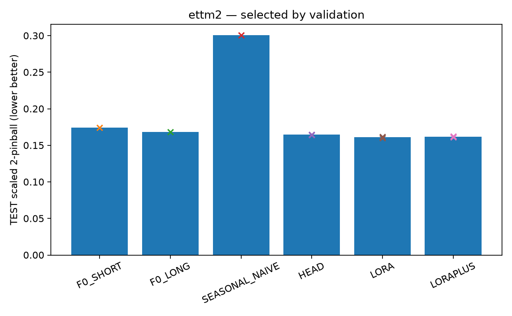
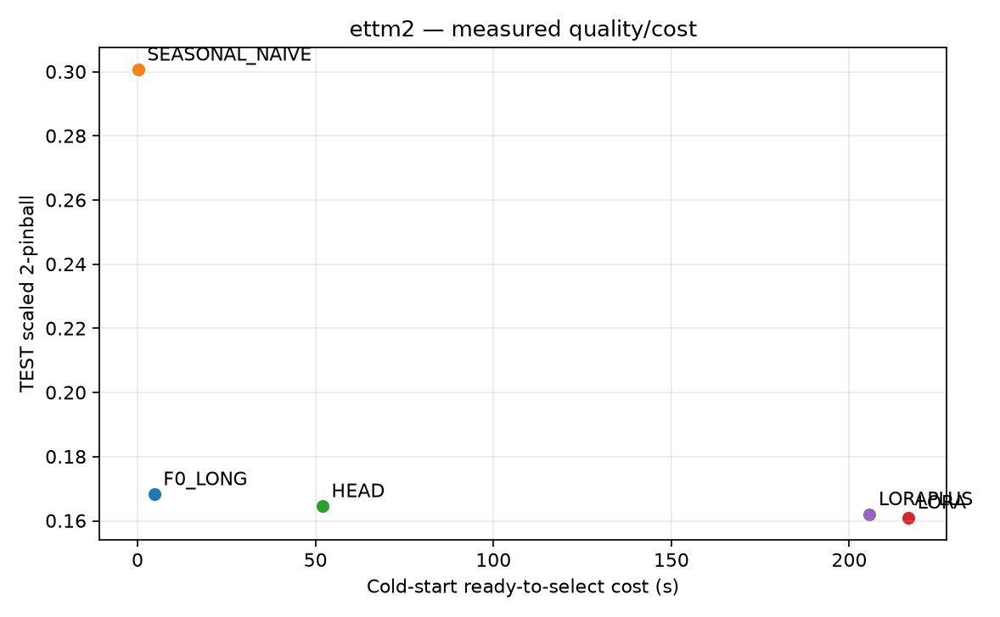
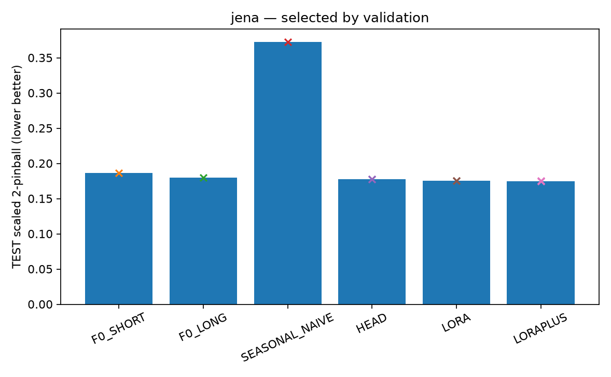
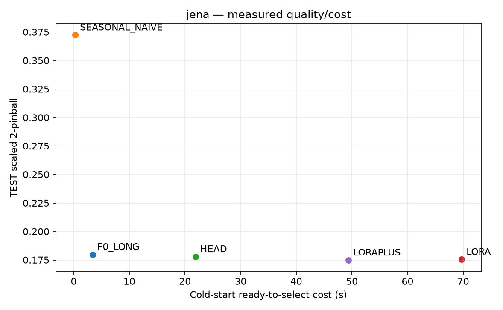

# 내부 적응 격차 재확인 — 통합 보고서

[목적] 단순한 출력 보정 뒤에도 실제 내부 적응의 정확도 이득과 비용 문제가 함께 남는지 판단한다. 새 방법론 성공 보고서가 아니다.

| panel | status | gain_pct | cost_ratio |
| --- | --- | --- | --- |
| ettm2 | QUALITY_GAP_BUDGET_LIMITED | 2.172 | 4.172 |
| jena | INTERNAL_GAP_WORTH_FOLLOWUP | 1.695 | 2.256 |

## ettm2

[전체 보고서](ettm2/REPORT_KO.md) · [판정](ettm2/DECISION.json)

## jena

[전체 보고서](jena/REPORT_KO.md) · [판정](jena/DECISION.json)

## 판정 경계

두 자료를 합쳐 우승 점수 하나로 만들지 않는다. 출력 보정으로 충분한 설정은 별도로 남긴다. 격차가 남아도 해당 고정 recipe에서의 개발 근거이며 LoRA+·HEAD의 충분한 튜닝이나 새로운 PEFT 기여가 입증된 것은 아니다.

[환경](ENVIRONMENT.json) · [소스 봉인](SOURCE_SEAL.json) · [검산](VERIFICATION.json) · [학습 장부](UPDATE_LEDGER.jsonl)
