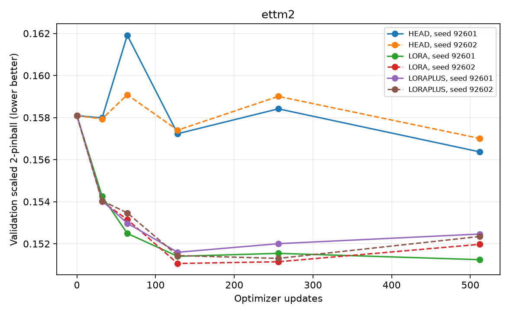
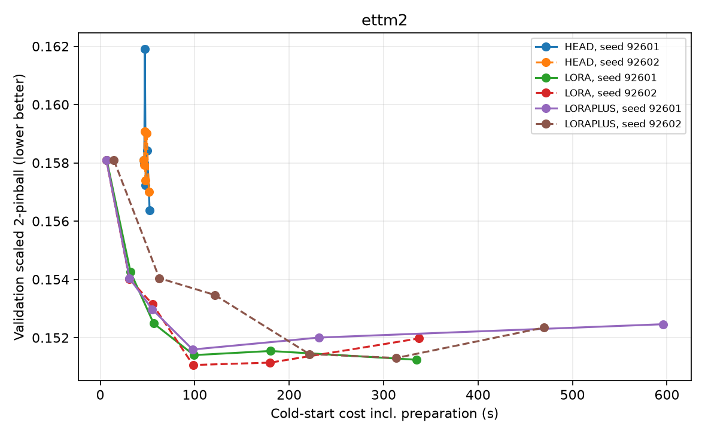
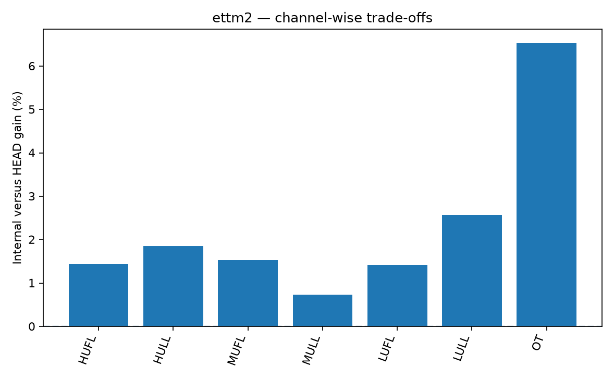

# ettm2: 내부 적응의 정확도–비용 격차 확인

[확인] 이 보고서는 실행 후 저장된 예측·선택·자원 기록에서 자동 작성됐다.

## 1. 질문과 판정

**QUALITY_GAP_BUDGET_LIMITED**

같은 8일 과거와 같은 원자료를 사용했을 때, 고정된 출력 보정으로 얻지 못하는 예측 이득이 내부 LoRA에 남는지 확인한다.
새 어댑터의 성능이나 논문 PASS를 판정하는 실험이 아니다. 검증으로 고른 내부 기준은 **LORA**다.
검증으로 선택한 저비용 대조 **HEAD** 대비 오차 감소는 **2.1718%**, 선택 모델까지의 준비비 포함 비용비는 **4.172배**다.
양수 개선이 없거나 간단한 방법으로 충분하면 새 모듈을 자동 생성하지 않는다.

## 2. 실제 설정

- 데이터: 2016-07-01 00:00:00 ~ 2018-06-26 19:45:00; 7개 계열, 원 간격 900초.
- 입력 768개(8일), 미래 96개(1일). F0_SHORT만 4일이며 비교상의 유리한 기준선으로 대체하지 않는다.
- TRAIN/VAL/TEST의 합법적 원점: 1705/145/145.
- HEAD는 과거 S1에서 선택됐던 **mlp**를 사전 고정. 이번 TEST로 구조를 고르지 않았다.
- 모든 군에 같은 native 훈련 손실, 같은 반복 seed·표본 순서·512-update 상한을 제공한다.
- LoRA+는 A/B 학습률 비 16.0를 적용한 기존 방법이며 우리의 새 기법이 아니다.
- TEST는 모든 선택을 고정한 뒤 예측·저장하고 채점했다. 이전에 사용된 데이터의 개발 재점검이며 독립 외부 확증이 아니다.

## 3. 점수: 낮을수록 좋음

주지표는 원단위 예측을 TRAIN 표준편차로 나눈 평균 2-pinball이다. native 훈련 공간의 손실과 구분한다.
정렬 전 분위수 교차율도 CSV에 보존한다. 각 원점·계열은 모든 군에서 같다.

| arm | primary | nmae | selected_steps | cold_ready_s | train_peak_mib |
| --- | --- | --- | --- | --- | --- |
| F0_SHORT | 0.174561 | 0.248659 | 0 | — | — |
| F0_LONG | 0.168266 | 0.239664 | 0 | 4.648 | — |
| SEASONAL_NAIVE | 0.300662 | 0.300662 | 0 | 0.128223 | — |
| HEAD | 0.164539 | 0.234488 | 512/512 | 51.912 | 458.535 |
| LORA | 0.160965 | 0.230604 | 512/128 | 216.565 | 591.668 |
| LORAPLUS | 0.162026 | 0.231704 | 128/256 | 205.666 | 591.668 |

| candidate | baseline | mean_gain_pct | seed1_gain_pct | seed2_gain_pct | ci_low | ci_high |
| --- | --- | --- | --- | --- | --- | --- |
| LORA | HEAD | 2.172 | 2.660 | 1.682 | 1.294 | 3.053 |
| LORAPLUS | HEAD | 1.527 | 1.245 | 1.810 | 0.701887 | 2.480 |
| LORAPLUS | LORA | -0.659083 | -1.454 | 0.129517 | -1.268 | -0.061689 |
| HEAD | F0_LONG | 2.215 | 2.106 | 2.324 | 1.307 | 3.090 |

## 4. 학습곡선과 비용

HEAD는 각 독립 적용의 cold-start 비용에 전체 TRAIN/VAL 표현 캐시를 청구한다. 캐시는 물리적으로 공유해도 무료로 취급하지 않는다.
모델 로딩, 데이터 준비, 캐시, 역전파·optimizer, 각 선택 시점까지의 검증·체크포인트 I/O를 분리한다.
full_job_wall에는 장부 fsync 등도 포함된다. 테스트용 캐시는 평가 비용이며 적응에 쓰지 않는다.
GPU peak는 훈련 구간만 집계하고 캐시 구축 peak는 별도 receipt에 둔다. 파라미터 수만으로 속도를 주장하지 않는다.

## 5. 목표 품질 도달

목표는 검증으로 고른 내부 기준의 두 seed 평균 마지막 VAL 점수 × 1.010다.
동일한 목표를 모든 군에 적용한다. 첫 도달은 저장 checkpoint의 상한이며 정확한 연속 시점을 추정하지 않는다.
F0가 이미 만족하면 NO_ADAPTATION_HEADROOM, 미도달이면 CENSORED로 기록한다.

| arm | seed | status | step | time_s | lower_step | lower_time_s |
| --- | --- | --- | --- | --- | --- | --- |
| HEAD | 92601 | CENSORED | — | — | — | 52.292 |
| LORA | 92601 | REACHED_AT_RECORDED_CHECKPOINT | 64 | 56.505 | 32 | 32.015 |
| LORAPLUS | 92601 | REACHED_AT_RECORDED_CHECKPOINT | 64 | 54.978 | 32 | 30.960 |
| HEAD | 92602 | CENSORED | — | — | — | 51.532 |
| LORA | 92602 | REACHED_AT_RECORDED_CHECKPOINT | 128 | 98.300 | 64 | 55.220 |
| LORAPLUS | 92602 | REACHED_AT_RECORDED_CHECKPOINT | 128 | 221.321 | 64 | 121.190 |

## 6. 계열별 손익

## 7. 한계와 다음 결정

[판단] 현재 결과는 고정된 head 종류·학습률·시간 분할에서의 제한된 비교다. 완전한 HPO나 충분한 수렴을 보장하지 않는다.
HEAD가 마지막까지 의미 있게 개선 중이면 품질 격차를 OUTPUT이 본질적으로 부족하다는 증거로 확정하지 않는다.
두 seed·일주일 블록 구간은 새로운 도메인·모델·seed 모집단 전체의 불확실성을 보장하지 않는다.
시간 측정은 실제 순차 실행이며 측정 편차가 크면 알고리즘적 가속을 주장하지 않는다.
과거 S1의 절대 점수와 이번 점수를 직접 차감하지 않는다: 문맥, 전체 시간 범위, 분할, checkpoint가 달라졌다.
현재 판정은 **QUALITY_GAP_BUDGET_LIMITED**다. 후속 새 모델·데이터·학습은 자동으로 시작하지 않는다.

## 8. 재검산 링크

[설정·자료](DATA_AUDIT.json) · [실모델 점검](PREFLIGHT.json) · [모델](MODEL_RECEIPT.json) · [선택 봉인](SELECTION_SEAL.json)

[점수](SCORES.csv) · [차이](EFFECTS.csv) · [원점별 점수](ORIGIN_SCORES.csv) · [계열별 점수](CHANNEL_SCORES.csv) · [비용](RESOURCES.csv) · [학습곡선](CURVES.csv)

[목표 도달](TIME_TO_TARGET.csv) · [예측 hash](PREDICTIONS_MANIFEST.json) · [판정](DECISION.json)

원자료·가중치·전체 예측은 로컬 ignored cache에 있다. GitHub의 집계 CSV만으로 모든 원본을 재생할 수 있다고 주장하지 않는다.
