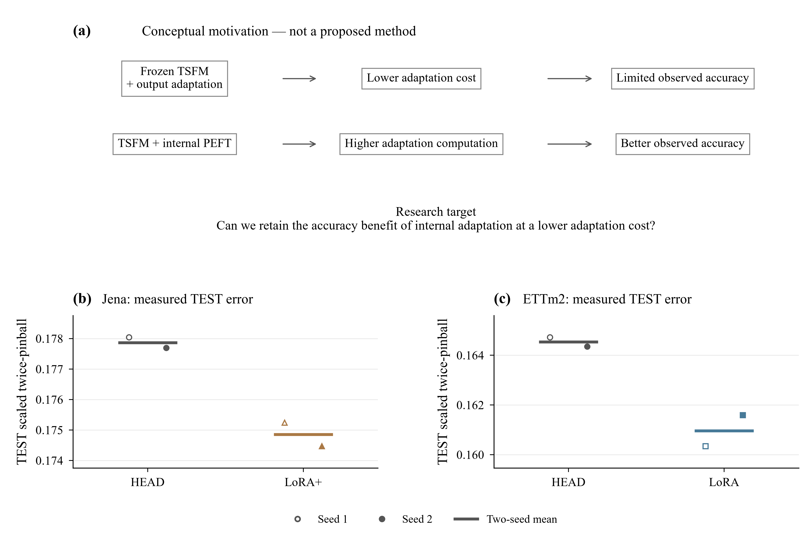
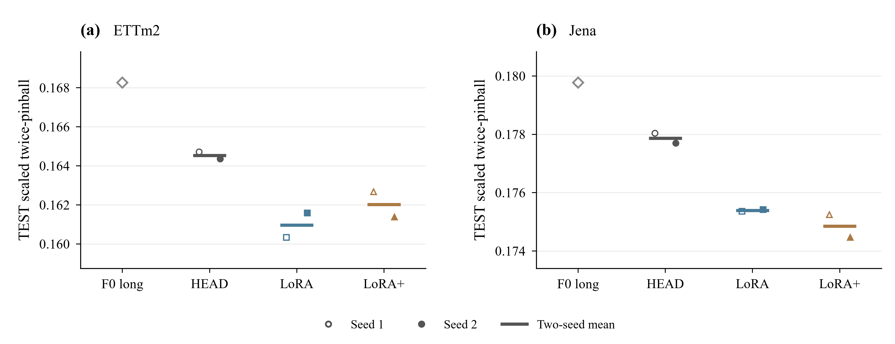
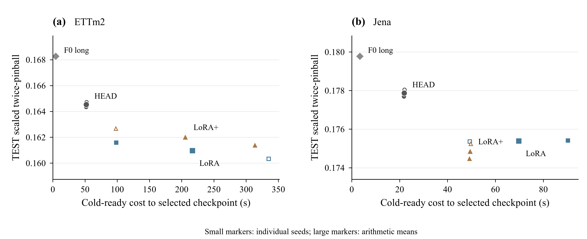
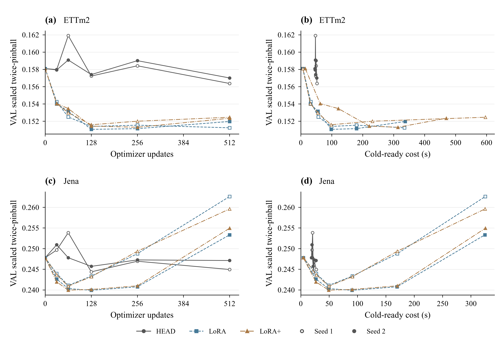
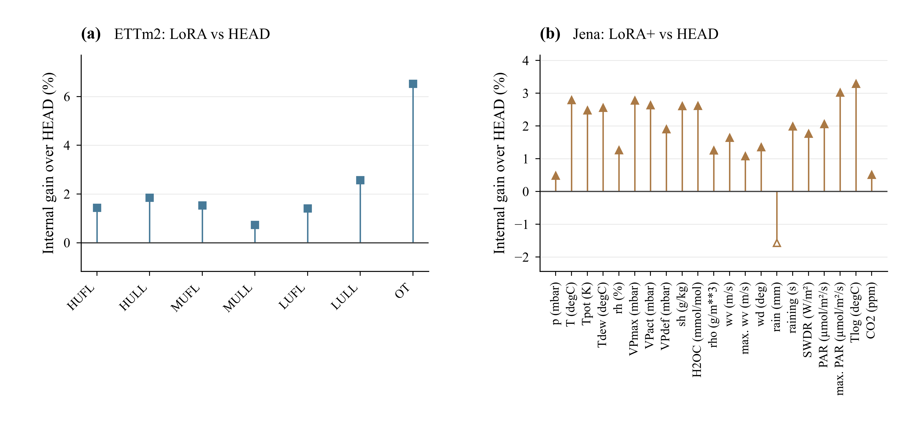
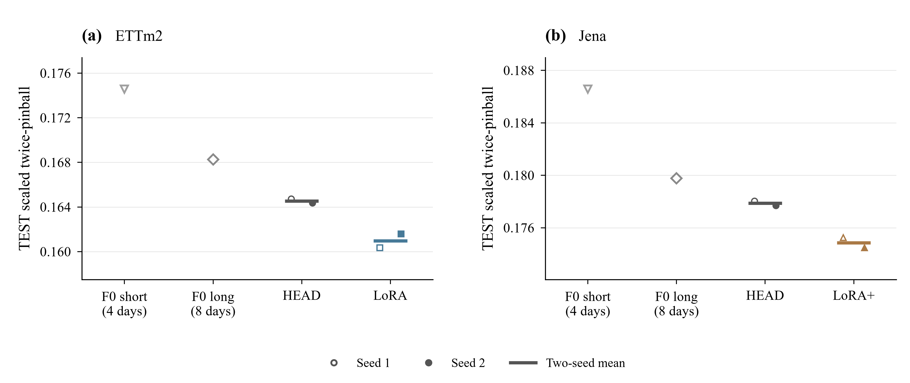

# Internal adaptation gap — paper figures

Visualization only; scientific decisions are unchanged. All figures are 7 inches wide, generated with Matplotlib from saved results, with editable-text SVG, embedded-font PDF and 600 dpi PNG. Font files are not distributed.

| Figure | Main message | Possible paper section | Files |
| --- | --- | --- | --- |
| Fig. 1 | Output-only vs internal accuracy | Motivation / Results | [PDF](fig1_internal_adaptation_gap.pdf) · [SVG](fig1_internal_adaptation_gap.svg) · [PNG](fig1_internal_adaptation_gap.png) |
| Fig. 2 | Accuracy–adaptation cost trade-off | Motivation | [PDF](fig2_quality_cost_tradeoff.pdf) · [SVG](fig2_quality_cost_tradeoff.svg) · [PNG](fig2_quality_cost_tradeoff.png) |
| Fig. 3 | Adaptation dynamics | Analysis | [PDF](fig3_validation_learning_curves.pdf) · [SVG](fig3_validation_learning_curves.svg) · [PNG](fig3_validation_learning_curves.png) |
| Fig. 4 | Channel-wise heterogeneity | Analysis | [PDF](fig4_channelwise_internal_gain.pdf) · [SVG](fig4_channelwise_internal_gain.svg) · [PNG](fig4_channelwise_internal_gain.png) |
| Fig. 5 | Research problem summary | Introduction | [PDF](fig5_problem_motivation_summary.pdf) · [SVG](fig5_problem_motivation_summary.svg) · [PNG](fig5_problem_motivation_summary.png) |
| Fig. 6 | Longer-context control | Ablation | [PDF](fig6_context_control.pdf) · [SVG](fig6_context_control.svg) · [PNG](fig6_context_control.png) |

## 미팅에서 보여줄 순서

1. Fig.5: 실제 정확도 격차에서 출발한 연구 질문이며 아직 제안 방법은 없다.
2. Fig.1과 Fig.2: 정확도 이득과 선택 시점 비용을 함께 보되 동일 품질 가속으로 해석하지 않는다.
3. Fig.3: ETTm2 HEAD의 예산 경계 개선과 Jena의 후반 악화를 확인해 주장의 범위를 제한한다.

## Reproduction and audit

Run `python results/internal_adaptation_gap_v1_20260922/paper_figures/generate_figures.py` from the repository root using its existing Python environment. This script reads CSV/JSON/Markdown only; it never loads data arrays, weights, predictions or checkpoints and performs no training/inference.

[Captions](CAPTIONS.md) · [All plotted values and provenance](figure_values.csv) · [Verification](FIGURE_VERIFICATION.json) · [Generation script](generate_figures.py) · [Original summary](../SUMMARY_KO.md)

## Previews

