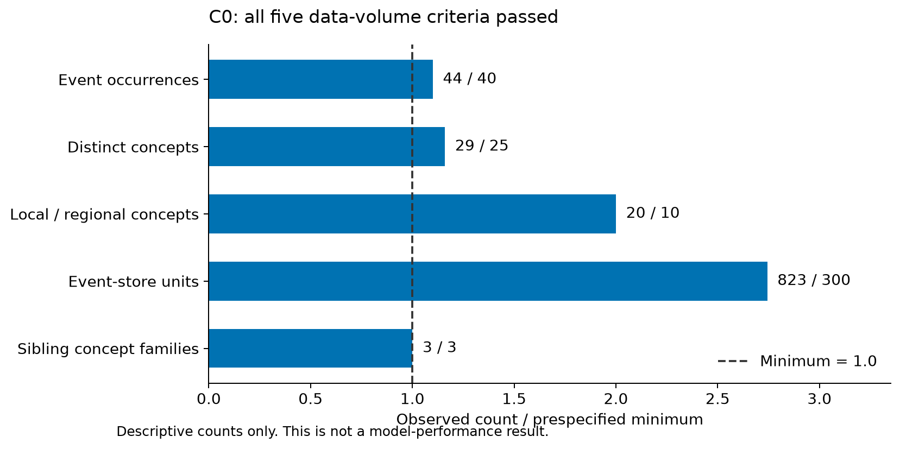
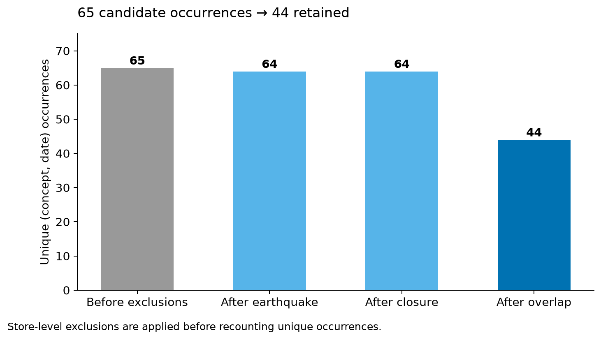
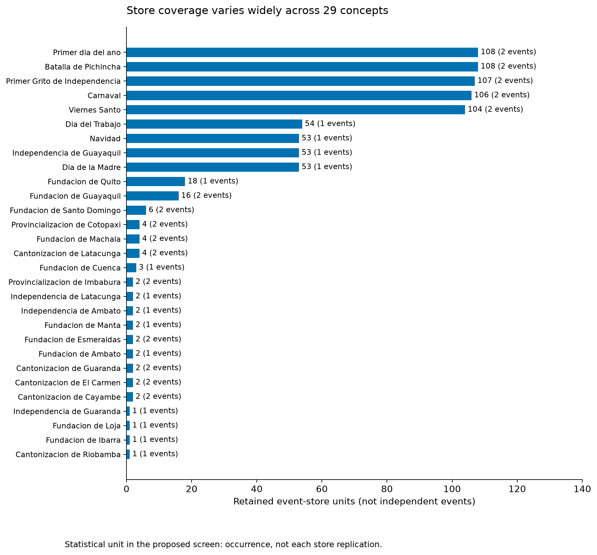

# A-FAV v2 실행 보고 — 2026-09-26

**[확인] STOP_DEBUG | UNICA_UNTESTED — T0 도구 검증 실패. 과학적 판정 없음.**

[확인] C0 사건 수는 통과했다. 중단 원인은 제가 새로 작성한 T0 코드의 API 호출 오류다. 공변량이 있는 입력과 없는 입력을 한 배치에 섞어 Chronos-2의 입력 검증에서 거부됐다. 텍스트 PEFT의 성능 실패나 Chronos-2가 미래 공변량을 사용하지 못한다는 결과가 아니다.

[확인] **제대로 완료된 범위는 자료 확보와 C0 사건 수 검산까지다. 전체 실험은 완료되지 않았다.** 이 보고서의 그림은 모두 C0 자료 집계이며 정확도·개선율 그림이 아니다. 보고서 보강 시 새 학습이나 모델 호출은 하지 않았다.

빠른 확인: [최종 상태](FINAL_DECISION.md) · [14개 게시 검산](PUBLICATION_AUDIT.json) · [원본 독립 재계산](VERIFY_RECOMPUTE.json) · [T0 오류 기록](T0_REPORT.json) · [전체 파일 SHA-256](ARTIFACT_MANIFEST.json).

```text
자료 확보     완료: ZIP 복사 및 원본/멤버 해시 검증
C0 세기       PASS: 5개 조건, 독립 구현과 823개 조합 일치
T0 검증       STOP_DEBUG: 검사 코드의 배치 구성 오류
G-A/G-B/G-C   미실행: 텍스트 이름·전이·학습 필요성 판정 없음
UniCA U-B     미실행: UNICA_UNTESTED
LoRA P        미실행: 승인 대상인 후속 단계
```

## 전제와 자료 확보

[확인] 원격은 `CanelE452/hierarchical-tsfm-peft`, 시작 HEAD는 `1055e55994ace7c94d80c4ed7b830adde9e71a22`다. 사용자가 다른 저장소의 관련 자료를 여기로 가져오라고 추가 지시하여 m5dataset 읽기/복사 예외로 해석했다. 그러나 정확한 GitHub 이름은404, 제한된 로컬 경로 탐색에서도 찾지 못했다. 설치된 GitHub 저장소 검색에는 `m5dataset-recovery`만 나왔고 size0 및 Favorita 검색 결과 없음이었다. 삭제 여부나 원래 결과의 진위를 단정하지 않는다. 이전 Stage1 GO/Stage2 TEXT_RECOVERY_GO는 이번 실행에서 **미확인**이며 재사용하지 않았다.

[확인] 대신 `C:/Users/User/Downloads/store-sales-time-series-forecasting.zip`의 원자료를 새 실험 경로 `.cache/`로 복사했다. archive SHA-256 `12e9c1dc4833cc804b3ff1515bd7b688f45fd8216fb2b340525036b006d625be`,22,416,355 bytes. 다운로드나 Kaggle 인증 시도는 없었다. 판매 CSV는 이미 store_nbr/family/sales/onpromotion 형식이다. holidays와 stores의 필수 컬럼도 존재한다. 원본·멤버·복사본 해시는 DATA_MANIFEST.json에 있다.

## C0: 최소 사건 수

```text
항목                          실측      최소     판정
제외 후 발생(개념·날짜)         44        40      PASS
서로 다른 개념                 29        25      PASS
Local/Regional 개념            20        10      PASS
발생–매장 조합                823       300      PASS
구성원2개 이상 형제 개념군       3         3      PASS
```

[확인] EVENT_COUNTS.json의 pass_all=true. 원본 CSV를 별도 구현으로 다시 읽은 C0_INDEPENDENT.json과 최종823개 (개념,날짜,매장) 튜플 집합까지 정확히 일치했다(VERIFY_RECOMPUTE.json). 동일 매장·개념의 연속일은 하나의 발생으로 묶었고, 다른 개념 겹침은 W={d−1,d} 전후3일인 [d−4,d+3]의 적용 날짜로 검사했다. 지진 효과는 다른 발생의 겹침 검사에도 남겨 오염을 제외했다.

[확인] EVAL 내 제외 플래그는 지진54·겹침410·휴무0 발생–매장 조합이다. 사유는 중복 가능하므로 합계로 순차 제외 수를 추정하지 않는다. 전체 event-level 단계는65→64→64→44다. 매장별 제외와 영향 매장 수는 C0_EVENT_STORE_DETAILS.csv, C0_EVENT_DETAILS.csv, C0_EXCLUSIONS.csv에 기록했다.

[확인] 대소문자가 다른 `Recupero puente ...`2건은 Work Day라 main count에 영향이 없었다. `Provincializacion Santa Elena`의 de 누락은 별도 flag로 남겼다. 독립 검산은 엄격한 `Provincializacion de ` 접두어만으로도 EVAL 형제군이2개라 전체3군 통과가 유지됨을 확인했다. 개념을 임의로 합치지 않았다.

[추정] 사건 수가 충분해 다음 검사를 시도할 수는 있지만,44발생이 통계적 독립성이나 텍스트 이득의 검정력을 보장하지는 않는다.



[확인] 그림1. 점선1.0은 각 기준의 최소치다. 숫자는 실측/최소치이며 다섯 조건 모두 통과했다. 형제 개념군은3/3으로 최소치에 정확히 걸쳐 있다. 서로 다른 단위의 크기를 비교하는 대신 각 기준에 대한 비율로 표시했다. [그림의 수치 CSV](figures/c0_gate_counts.csv) · [SVG](figures/c0_gate_counts.svg).



[확인] 그림2. 평가 기간의65개 후보 발생 중 지진 제외 후64개, 휴무 제외 후64개, 겹침 제외 후44개다. 매장 단위 제외 후 고유한 (개념,날짜)를 다시 센 값이다. 따라서 매장별 제외 플래그410개를44개 발생에서 빼면 안 된다. [그림의 수치 CSV](figures/c0_event_retention.csv) · [SVG](figures/c0_event_retention.svg).



[확인] 그림3. 개념별 남은 발생–매장 조합과 괄호 안 실제 발생 수를 표시했다. 전국 행사는 다수 매장에 적용되지만 지방 행사는1~수개 매장에만 적용된다.823개 조합을823개 독립 사건으로 해석하지 않는다. [그림의 수치 CSV](figures/c0_concept_coverage.csv) · [SVG](figures/c0_concept_coverage.svg).

## T0에서 멈춘 이유

[확인] `experiments/text_event_favorita_v2_20260925/t0_chronos.py:33`의 입력 배치가 `[covariate arm, target-only arm]`이다. 설치본 `chronos/chronos2/preprocess.py:588`은 배치 전체에 같은 공변량 키를 요구한다. 오류는 다음과 같다.

```text
ValueError: All past_covariates must have same keys.
Expected ['cov'], got [] at index 1. Heterogeneous lists are not supported.
```

[확인] 고정 revision의 Chronos-2 가중치1회 로드, 예측 API1회 시도, 완성 예측0회다. 입력 검증에서 중단되어 공변량 추종 점수는 없다. MASTER §9·§14의 실패 즉시 중단 규칙을 적용했다. 입력·seed·모델은 그대로 두고 두 arm을 별도 API 호출로 분리하면 되는 구현 수정이지만, 이번 중단 뒤 자동 수정·재실행하지 않았다. T0_REPORT.json에 진단을 남겼다.

[확인] T0a는 family-level schema만 확인했고 전체 검증은 미완료다. T0b 관련 범위 검사는 C0에서 수행했지만 전체 T0 완료로 세지 않는다. T0c/e/f/g/h는 미실행이다. PCA·fold·모델 선택·EVAL 봉인은 아직 없으므로 SEAL.json을 만들지 않았다.

## 하지 않은 것과 판정 한계

[확인] G-A/G-B/G-C, BEST-FREE, gain_A/R/T_B, DECISION 표, arm 점수와 그림은 모두 미산출이다. 실제 점수 없이0이나 실패로 채우지 않았다. C0 독립 검산을 모델 점수의1e-9 검산 통과로 바꾸어 주장하지 않는다.

[확인] UniCA clone/환경 설치/학습/공식 재현은 아직 시도하지 않았다. 환경 실패로 판정한 것이 아니라 T0 중단 때문에 **UNICA_UNTESTED**다. LoRA 파일럿P와2step smoke도 미실행이다. 지진은 CASE_EARTHQUAKE.md의 자료 집계만 남겼고 예측 사례를 만들어내지 않았다.

[확인] torch2.10.0+cu128, chronos2.3.2, Python3.11.16, RTX4070. lightgbm과 sentence-transformers는 미설치였다. pip dry-run은 추가 설치2개만 제안했지만 실제 설치하지 않았다. 모델은 기존 로컬 pretrained snapshot을 읽기만 했다. 초기 실험 종료 당시 commit/push는0이었다. 이후 사용자의 명시적 게시 요청에 따라 이 실험의 코드·보고서·검산·그림만 게시 범위에 포함했다. 새 패키지·새 학습·기존 다른 실험 변경은0이며 기존 dirty 항목은 보존한다.

[확인] 다음 단계는 새 후보나 설정 탐색이 아니라 T0 호출 배치 수정 및 동일 검사 재개다. C0 통과는 PEFT 방법론 성공을 뜻하지 않는다.

## 검토자가 확인할 근거와 재현 범위

- [실행 계약 원문](../../experiments/text_event_favorita_v2_20260925/00_MASTER_CLI_text_event_favorita_v2_20260925.txt): §6 C0 기준, §9 T0, §14 실패 시 중단.
- [원자료 manifest](DATA_MANIFEST.json), [환경](ENVIRONMENT.json), [전제 감사](PREMISE_AUDIT.json): 출처·정확한 해시·버전·기존 결과 미확인 범위를 기록했다.
- [개념 대응 전체](CONCEPTS.csv), [애매한 설명](C0_AMBIGUITIES.csv): 정규화가 어떤 설명을 바꿨는지 확인할 수 있다.
- [44개 발생](C0_EVENT_DETAILS.csv), [매장별 포함/제외](C0_EVENT_STORE_DETAILS.csv), [제외 사유](C0_EXCLUSIONS.csv): 집계 전 행을 제공한다.
- [C0 계산 코드](../../experiments/text_event_favorita_v2_20260925/c0_count.py), [독립 계산 코드](../../experiments/text_event_favorita_v2_20260925/independent_recount.py), [독립 계산 전체 결과](C0_INDEPENDENT.json): 두 구현의 최종 조합이 정확히 일치한다. 독립 계산은 C0 계산 함수를 import하지 않는다.
- [그림·게시 검산 코드](../../experiments/text_event_favorita_v2_20260925/publish_report.py), [게시 검산 결과](PUBLICATION_AUDIT.json): 원본/멤버 해시, 전이·근무일 제외, 고유 사건, 저장된 C0 파일의 해시를 검사한다. 이것은 전체 모델 검증 PASS가 아니다.
- [재현 안내](REPRODUCIBILITY_KO.md): 원본 데이터가 필요한 검사와 저장된 결과만으로 가능한 검사를 구별한다.

[확인] API 오류 원문은 T0_REPORT.json에 남아 있고 실패한 호출 소스도 그대로 보존했다. 원시 터미널 전체 로그 파일은 저장되지 않았으며 wall-clock·GPU peak도 실패 경로에서 수집되지 않았다. ENVIRONMENT.json의 GPU 사용량은 사전 순간값이므로 실험의 peak VRAM으로 보고하지 않는다. 마스킹·PCA·fold 누출 감사는 T0 미완료 항목으로 남아 있다.
